# Understanding the framework through CGB duration

Version note: this guide reviews the source framework and the earlier CGB baseline. The independent redesign that follows this review is derived and implemented in [document 10](10-structural-model-derivation.md). Source fidelity is a comparison tool, not a requirement to copy its numerical choices.

## The direct answer: how faithful is the current model?

The earlier baseline applied several research principles from the source framework. Its Kalman drift process, seven descriptive phases, direct future-price targets and logarithmic opinion pool were independent project choices. This guide compares that baseline with the source; document 10 describes the subsequent model.

That distinction matters more than whether the files run. Software consistency, faithfulness to a source, correctness of a mathematical interpretation and usefulness in the market are four different questions.

| Layer | Source essays and implementation | Earlier CAD baseline |
|---|---|---|
| Exposure and environment | Construct a regime-compatible basket/reference under the trading environment | Fix outright CGB; add contextual instruments through declared modules |
| Stationary reference | Distinguish return residuals and level spreads; investigate stationarity | Observe a lagged CAD–US return relationship; do not claim a stationary level spread |
| Physical population model | Exposure density, forcing, crowding kernel, diffusion, free energy | These motivate discussion; none is estimated as a full population model |
| Measurements | Moments, hybrid EVT, entropy and custom memory/propagation proxies | Price, scale, efficiency, curve, optional book/VWAP/context measurements |
| Environmental blocks | GAS/FLUIDE construction | Not implemented |
| State representation | Eleven tags in two blocks; 22 states and explicit grammar | Seven descriptive price phases |
| Structural transition laws | Seven 22-by-22 matrices participate in forecasting | Seven-phase empirical matrix is descriptive only |
| Supervised learning | XGBoost predicts future engineered tags | XGBoost predicts future CGB direction, endpoint and adverse path |
| Dynamic simulation | Price paths mapped through the source grammar | A separate Gaussian latent-drift model; optional current-path simulation |
| Final probabilities | Born/Zurek construction combining structural and learned scores | Calibration-fitted combination of two dependent forecast experts |
| Adaptation | Some active error-based training weights; some diagnostic-only methods | State updates with frozen parameters; separate training and calibration |

The strongest faithful summary is therefore: **we retained an environment-first research order and several measurement principles, while replacing major mathematical and algorithmic components.** A working prototype is useful, but it is not evidence that every lesson has been implemented.

The explanations below reconstruct the ideas in our own words. They are not quotations or claims about what the source author would personally endorse. They connect the six core essays, the eleven existing lessons, the audited code and selected relevant papers. The 272-entry paper catalog remains a bibliography; this chapter does not claim a fresh full-text reading of every paper in it.

## 1. Start with the object that changes, not the indicator that looks attractive

Your account carries Canadian duration. The forecast object is the price of a specified CGB contract. The system surrounding it includes other duration markets, the Canadian curve, swaps, policy expectations, liquidity and trading constraints.

Those are different roles. CGB is the object whose subsequent movement matters. A US future is a contextual measurement. A five-year swap is another contextual measurement. The account's ability to hold through a drawdown is a decision constraint.

The sentence connecting them is: **under the currently observed environment, what can cause the current duration adjustment to continue?**

One way to express the system before choosing an estimator is

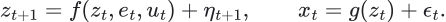

 is the relevant state, some of which may be hidden.  describes the environment.  is an action, if the model includes one.  is what we observe. The two noises summarize influences omitted from this representation; they need not literally be independent Gaussian disturbances until a particular model assumes that.

This separates three questions that are otherwise easily confused: what the market is doing, what we can infer from its measurements, and what the account should do.

**In the code:** `prepare_panel` and `build_features` define measurements. `fit_research` predicts outcomes. The execution helpers account for prices. The notebook does not estimate the full action-dependent system above.

## 2. Why look at an exposure distribution?

The source framework's population object is a density over exposure coordinates:

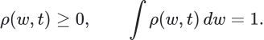

Imagine, for illustration, that  is duration exposure per unit of capital. Positive and negative values describe different signed exposures. A concentration of mass near one value says that much of the modeled population occupies that exposure region. It does not itself identify who is there or when they will trade.

The advantage is conceptual: many participants can be constrained in similar ways even when their identities differ. A duration shock may matter because it changes the incentives or feasibility of an entire group of positions.

The difficult part is observability. Prices, trades and depth are effects of many different underlying positions. They do not uniquely reveal the entire density. A snapshot of sell-side depth is not a census of short-duration investors.

Normalization also removes total scale. Two markets could have the same normalized exposure shape but very different gross leverage and available capital. A model requiring that scale must retain it separately.

**In the code:** we do not estimate . Our filtered drift is a much narrower statistical quantity. Calling it inferred crowd density would be inaccurate.

## 3. Read the Hamiltonian as a proposed landscape

The source author writes

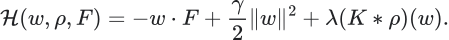

Read one term at a time. The first tilts the landscape toward or away from an exposure. The second penalizes moving far out in exposure. The third allows the distribution of other participants to change the landscape.

The convolution means

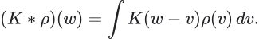

For each possible neighboring exposure 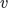, the kernel specifies how that part of the population affects the landscape at . A kernel concentrated near zero describes relatively local interactions in the chosen coordinate. A broader kernel spreads the interaction farther.

To understand the gradient, temporarily ignore crowding and use one dimension:

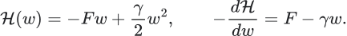

If  and  is fixed, the deterministic equilibrium is . Change  and the preferred exposure changes. This is the intuition of a landscape whose tilt changes under a new constraint.

For CGB, a hypothesized shift against duration could make reducing duration more attractive for relevant participants. But moving from that sentence to a forecast still requires a map from exposure adjustments into signed orders, liquidity response and price. The landscape alone does not supply that map.

The word Hamiltonian here names a proposed financial potential. It is not the exact same mathematical object as the Hamiltonian operator in the quantum section below. The shared word should not hide their different spaces, units and empirical requirements.

**In the code:** no  or interaction kernel is fitted. The corresponding market story is a hypothesis motivating observable features.

## 4. Drift and diffusion say different things

The proposed stochastic exposure dynamics are

Over a short interval, the gradient supplies a systematic expected displacement. The Brownian term supplies a stochastic displacement with variance proportional to elapsed time. In one dimension with locally fixed coefficients,

A strong directional tendency and large diffusion can coexist. A market can move mostly down while producing violent upward interruptions. High variability does not logically imply an absence of directional adjustment.

Conversely, low variability does not establish a useful trend. A market can be quiet because there is little pressure, because opposing pressures cancel, or because available observations miss activity elsewhere.

For the account, the question is whether expected directional displacement is useful relative to the possible path and the holding window. That is why we keep endpoint and adverse-excursion targets.

**In the code:** the drift expert has two noise parameters,  and . They are latent-drift innovation variance and observation variance. Neither is automatically the physical temperature  in the essay. The fitted  remain fixed during a frozen evaluation; this is a real limitation if the effective dynamics change.

## 5. The Fokker–Planck equation describes the population, not a price target

For the proposed dynamics with diffusion independent of ,

It becomes easier to read through a probability current:

The first component transports probability mass along the landscape. The second spreads it from concentrated regions toward less concentrated ones. The divergence measures whether more mass is leaving a small region than entering it.

Under suitable boundary conditions, total probability remains one. That is conservation of probability in the model. It is not a statement that market wealth, liquidity or leverage is conserved.

If crowding makes the landscape depend on , the density affects its own evolution. This captures the idea that participants' collective positioning can alter the conditions everyone faces.

**In the code:** we do not solve this partial differential equation. A three-class forecast vector is a distribution over future outcome categories, not a discretized solution for capital density.

## 6. Free energy explains a mathematical direction of relaxation

A compatible functional is

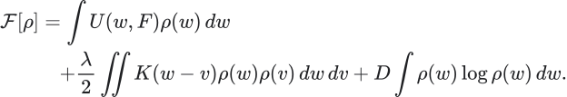

The terms combine the external landscape, interactions and concentration of probability. The functional derivative asks how the total changes if a small amount of density is moved. Under fixed coefficients, symmetric interactions, sufficient regularity and appropriate boundaries, the associated gradient flow yields

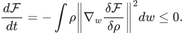

The sign follows because a squared norm is nonnegative. This is meaningful mathematics, with stated assumptions. If the forcing or diffusion changes explicitly with time, additional derivative terms appear and the simple inequality need not hold.

For your market question, the inspiring idea is to anticipate an unfinished reorganization. The unresolved financial question is which observations identify its direction and remaining duration. The derivative of a proposed functional is not automatically the P&L earned by a position. A trader can recognize a reorganization late, pay too much spread, or choose the wrong instrument.

**In the code:** we do not calculate financial free energy or identify alpha with its decay. We evaluate actual subsequent CGB outcomes.

## 7. Stationarity is about the chosen object

Suppose two price levels wander but their difference tends to recover after deviations. The difference may be a more stable reference than either price alone. That is the appeal of a stationary spread.

It is essential to distinguish

from

The first is a residual return. The second is a difference between levels. Stationary returns do not imply stationary prices or a mean-reverting level spread. Nor does subtracting a rolling mean prove stationarity.

If the hedge coefficient changes, even the level-spread increment is not simply a fixed-weight return difference:

That final term is why algebraic spread changes and a self-financing trading ledger must be distinguished.

For the current CGB design, a useful reference can remain stable while CGB falls: its relationship with US duration might remain coherent throughout the selloff. Stability of a relationship does not mean a stationary CGB price.

**In the code:** beta is a lagged reference slope; common movement and residual movement stay visible. We have not reproduced the source framework's macro basket construction or established a stationary CAD spread. That is one of the principal gaps in source faithfulness.

## 8. What a pointer state means in quantum physics

The physical idea is that a system interacts with an environment. Some system states preserve identifiable correlations under that interaction better than arbitrary superpositions do. These robust states are called pointer states. This is the environment-induced selection discussed in [Zurek's decoherence review](https://arxiv.org/abs/quant-ph/0105127).

The notation in the essay can be read concretely. A ket  is a state vector. A projector  selects its component. A commutator is ; vanishing commutators express compatibility of operations. Commutation with the interaction is an idealized stability condition, not a universal substitute for analyzing all the system dynamics.

For an illustrative entangled state,

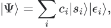

ignoring the environmental degrees of freedom gives reduced-system matrix elements

If the environmental records become nearly orthogonal for distinct alternatives, their overlap becomes small and the off-diagonal interference terms are suppressed. The amplitudes have not simply vanished, and this calculation by itself does not select one realized measurement outcome.

There is a small but substantive notation issue in the supplied essay: the overlap factor is , while the complete reduced-matrix element includes . Those two objects should not be equated without the coefficients. This chapter writes them separately; it leaves the source copy intact.

Also distinguish this matrix  from the classical exposure density . They share a letter but are different mathematical objects.

## 9. What would a financial pointer analogue need to mean?

The source author proposes a stable spread and its regime as a market analogue. The intuition is attractive: find a description that remains meaningful while individual observations fluctuate.

A candidate CGB description might be sustained duration liquidation. Small recoveries, changes of execution venue or temporary variation in displayed queues need not destroy that description. The relevant question is whether its conditional behavior remains recognizable.

But a label cannot earn that interpretation merely by being difficult to change. A state machine that forces a trend to persist will produce persistent labels even if the underlying market has changed.

A serious financial analogue would need at least three properties: an explicit measurement map, stability under irrelevant measurement perturbations, and a distinguishable subsequent outcome distribution. For example, nearby observations assigned to the same state should share economically relevant future behavior, while a changed response to similar incoming activity should be allowed to weaken the state.

That is different from demanding unchanging price. In a downside duration state, a temporary rally is compatible with continuation. The discriminating question is whether recoveries are becoming more effective and lasting.

**In the code:** the seven phases describe scaled price movement, efficiency and weakening. They have not been established as environment-selected pointer states. The original 22-state vocabulary is also explicitly engineered in code, although its construction is much richer.

## 10. Born probabilities, financial scores and Bayesian probabilities

In quantum theory, Born probabilities depend on amplitudes in a specified physical state and measurement structure. Zurek's [envariance paper](https://arxiv.org/abs/quant-ph/0405161) develops a symmetry-based route to that rule. That does not make every squared financial score an empirically justified probability.

The source includes constructions of the form

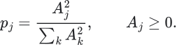

This gives nonnegative numbers summing to one. It also changes their sharpness. Scores 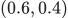 become approximately  after squaring and normalization. Nothing about that arithmetic alone establishes which vector better predicts market frequencies.

Indeed, any probability vector can be written this way by choosing . The financial substance therefore lies in how the amplitudes are constructed and validated, not in the final square.

A classical hidden-state Bayesian filter instead specifies a transition law and an observation likelihood:

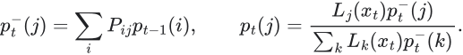

 means the probability density of the observation under state . A classifier typically returns a conditional class probability , which is a different object. Multiplying it by another prior can count existing information again. Correcting that requires a coherent probabilistic model, not simply renaming the classifier output likelihood.

For CGB, all these approaches still face the same question: when the model assigns a stated probability to a defined future event, do held-out observations support that probability?

## 11. What the original probability engine actually combines

The active source path is notebook 5, zero-based cell 145, called from cell 146. An abbreviated faithful representation is

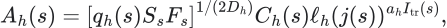

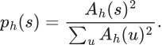

 comes from simulated paths or a grammar projection.  comes from structural transition laws.  measures the frontier contribution.  is current construction evidence.  is the learned head. The transition-state indicator means that the learned multiplier does not act uniformly on every state. The first horizon has special handling because its classifier information already enters the Monte Carlo proposal.

The source temperature is adjusted by disagreement between current construction evidence and the classifier, using their Bhattacharyya overlap. Thus different layers influence both state preference and forecast sharpness.

The intended intuition is clear: forecast structure should depend on current recognition, permitted evolution and learned evidence. The unresolved issue is dependence. Several factors reuse related observations. The formula is an implemented combination of scores; its factors do not automatically become independent measurements of the world.

**In our code:** the final operation is instead

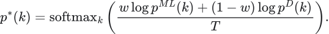

The weight and temperature are fitted on calibration data. Identical experts reproduce their original distribution when , so agreement does not automatically square their confidence. This is a deliberate alternative, not a reproduction of the source posterior. The original structural matrices do not drive our final forecast.

## 12. Entropy: always ask, entropy of what?

For a discrete outcome distribution,

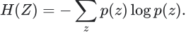

It measures uncertainty about the selected categories. Our code applies it to predicted down/neutral/up outcomes. A forecast concentrated on neutral can have low entropy and a directional indicator near zero. A forecast split between down and up can have a similar indicator but much more uncertainty.

Entropy of a price histogram is a different object. Entropy of a sequence conditional on its past is different again:

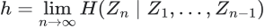

for an appropriate stationary process. A sequence with a randomly chosen first sign that then alternates deterministically has balanced marginal signs but no continuing uncertainty once the pattern is known. Independent fair signs have the same marginal balance and no such predictability.

That example explains why memory matters. It also explains why a single entropy number cannot tell us whether momentum exists: deterministic alternation is predictable but reverses direction every step.

The [thermodynamics-of-requisite-variety paper](https://arxiv.org/abs/1609.05353v1) analyzes information-processing engines and the usefulness of matching memory to environmental correlations. Its work bounds concern a physical engine and reservoir. The market extension is a question about useful temporal information; trading P&L is not the physical work variable in the theorem.

Differential entropy of a continuous variable introduces another issue:

Changing from decimal returns to basis-point returns changes differential entropy. Therefore comparing that entropy directly with the discrete action bound  is not a unit-invariant trading criterion.

**In the code:** predictive entropy is a diagnostic. It does not establish controllability or automatically veto trading under an Ashby theorem.

## 13. Cybernetics asks what is observed, what can be changed, and what feedback returns

A forecast system estimates what may happen. A controller adds a goal, actions and a feedback path. In this account the directly controlled quantity is the account's position or risk, not the entire Canadian yield curve.

Separate four operations:

Then distinguish two different kinds of update:

The first updates the state under a fixed model. The second changes the model itself. A flashing indicator is not evidence of the second operation. Changing a position is yet another operation.

For one-to-four-hour targets, feedback must mature before adaptation uses it. At 10:05 the system cannot learn from the completed four-hour outcome of a 10:00 forecast. It may observe immediate information, but that is not the same target.

**In the code:** the filtered state updates causally. Parameters are frozen after training/calibration. The notebook does not implement a live adaptive controller. In the original, some training weights really adapt to errors; some governor methods only record diagnostics. Those cases must be distinguished by the active call path.

## 14. Requisite variety does not mean “add every feature”

A useful controller needs to distinguish situations that require different responses. It does not necessarily need to distinguish every microscopic state of the market.

If two very different order-book configurations imply the same appropriate account action at the intended horizon, distinguishing them may not help the decision. Conversely, two charts that look similar may require different responses if one is a temporary liquidity gap and the other is a continuing broad duration adjustment.

A simple information condition illustrates the point. If a representation  perfectly distinguishes the environmental categories  that matter to the task, then

That is a necessary capacity statement under the declared categories. It does not guarantee that a large representation has learned the correct response.

The [multi-scale requisite-variety paper](https://arxiv.org/abs/2206.04896v2) formalizes distinctions across scales. Interpreting those scales as market holding horizons is our application. It suggests asking whether detailed second-by-second information improves the one-hour or four-hour question, instead of assuming that faster always means better.

For CGB, the useful challenge to a new module is whether it adds information about future movement given what we already know. In idealized information notation this is

In a short real dataset, that quantity is hard to estimate directly. A frozen, matched-period forecast comparison is a practical way to test the corresponding claim without pretending that an extra column is independent evidence.

## 15. The observer can become part of the dynamics

If predictions cause actions and those actions affect later observations, deployment can change the distribution being predicted. This is the subject of [Performative Prediction](https://arxiv.org/abs/2002.06673).

In its general notation,

The distribution depends on the deployed model. This is more specific than saying markets change: the model-driven response is part of why they change. Convergence results require assumptions on that response and the learning problem.

An individual small account may have little impact, but many accounts reacting similarly can affect liquidity and future returns. Separately, the observer's data pipeline changes which facts are available: delayed updates, revised rates and incomplete depth can alter the apparent state without altering the market itself.

These are two different observer effects: intervention in the market and selection/distortion of measurements. Both deserve explicit treatment.

**In the code:** availability timestamps address the measurement boundary. No strategy-to-market response law, endogenous impact kernel or performative equilibrium is estimated. That is not something a generic retraining loop would automatically supply.

## 16. How our drift filter actually reasons

Our added dynamics expert says

The hidden quantity is expected local movement, in ticks per grid interval. It is not a firm's remaining order or a thermodynamic force. Under the model, the observed return combines that tendency with observation noise.

The scalar Kalman update is

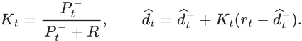

Suppose, purely for illustration, the prior drift estimate is −0.10 ticks per minute, the next return is −0.50 ticks, and . The updated estimate is −0.18 ticks per minute. The filter reacts, but does not declare that the whole observed move is persistent drift.

If , the model-implied cumulative expected movement is

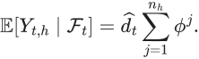

With that illustrative −0.18 estimate, it is about −6.20 ticks over 60 minutes and −8.75 ticks over 240 minutes. The four-hour expectation is not four times the one-hour expectation because the initial tendency decays. These are arithmetic examples, not fitted forecasts.

This makes an assumption visible: the process is expected to lose memory unless subsequent information refreshes the state. It can fail when a new shock sustains or reverses the pressure. The multi-horizon ML model is another conditional forecasting view, not a proof that the drift assumption is physically correct.

## 17. What ML is allowed to learn

The original XGBoost heads learn future source tags. Our heads learn actual future CGB outcome categories, endpoint movement and sampled adverse excursions. That is a material change in objective.

The reason to use ML is that relationships may be nonlinear and conditional. A negative CGB return could have a different subsequent distribution when accompanied by US weakness, a negative Canadian residual and curve repricing than when the surrounding markets are recovering.

We do not set that illustrative sign pattern as a theorem. XGBoost can learn that a proposed feature does not help. It can also learn an accidental pattern, which is why the separate chronological comparison matters.

The default configuration currently activates only the CGB module. The US, curve, swaps, futures, book, VWAP and context modules exist, but existence is not activation. Until they are enabled and fitted on adequate supplied history, the displayed design cannot claim to be a learned model of cross-market propagation.

The relevant distinction from [Deep Learning for Limit Order Books](https://arxiv.org/abs/1601.01987v7) is that a structured book model can use spatial depth information and forecast richer conditional outcomes. That paper does not establish that a best-level imbalance alone predicts four-hour Canadian duration. Our module currently compresses best-quote information; it is not that spatial neural model.

## 18. Walk the VWAP selloff through the whole chain

Start with the actual observations: lower CGB prices, observed recovery attempts, a trade-based VWAP reference, contextual US and Canadian rate movement, and whichever depth measurements are genuinely available.

The market-system interpretation asks whether the adjustment remains unfinished. Candidate explanations include ongoing directional activity, propagation across instruments, changed price sensitivity to activity and feedback from risk management. These can coexist.

The reference-frame interpretation asks how much movement coincides with broad duration and how much remains in the Canadian residual. The curve coordinates ask whether the move is broad or concentrated by tenor. A five-year payer may matter, but its identity does not reveal the entire mechanism.

The response interpretation asks whether recoveries produce durable changes. A large buying episode with little lasting recovery is different from a rebound that retains ground and changes the response to later selling. Comparing price response to activity is an observable research direction; inferring hidden intent from one event is stronger.

The current implementation computes movement, phase, optional references and optional book/VWAP features. The drift filter estimates persistent movement. XGBoost estimates future outcomes. The pool combines those two forecasting views. The result then exposes probabilities, magnitude/path estimates and data status.

It does **not** yet reconstruct event-level absorption, remaining institutional inventory, the full exposure density, a forcing field or a pointer-state stability theorem. Describing those mechanisms in a narrative does not mean the code measured them.

The [order-flow filtration paper](https://arxiv.org/abs/2507.22712v2), discussed in the existing lessons, is particularly instructive: contemporaneous association is different from forecasting future prices, and a filter based on an order's eventual lifetime is not available before that lifetime has completed. For a live CGB feature, use age-to-now and observed events so far, or explicitly completed histories.

## 19. What each existing lesson has and has not contributed

| Existing lesson | What we carried into the implementation | Remaining limitation |
|---|---|---|
| 1. Reference frame | Common/local coordinates; explicit CGB target | No demonstrated stable macro reference or causal US forcing |
| 2. Stationarity | Separate residual movement from level relationships | No estimated stationary level-spread trading model |
| 3. Information set | Available-at snapshots and current cutoff | Feed clocks and revision semantics still need real-data verification |
| 4. Entropy | Entropy of the predicted outcome distribution | No thermodynamic work identification or estimated entropy-rate model |
| 5. Scale | Explicit minute windows and separate horizons | Their predictive value is unmeasured |
| 6. Hidden state | An explicit filtered statistical drift | No identified crowd density, inventory or forcing |
| 7. Adaptation/control | Separate fit, state update and accounting | No live adaptive controller or automated policy |
| 8. Performativity | Recognized in the research contract | No estimated deployment-response relationship |
| 9. Order flow | Best-quote sizes and optional observed-trade VWAP | No full event reconstruction or causal flow identification |
| 10. Physics and estimates | Explicit assumptions and units | Full physical construction remains unimplemented |
| 11. Trading story | Observable targets and competing explanations | No evidence yet that the suggested configuration predicts continuation |

The implementation satisfies a narrower research contract than the entire philosophical program. That is the correct reading of what was built.

## 20. What a closer implementation would require

A closer translation would keep separate versions rather than silently rewrite the existing baseline. It would specify a Canadian reference environment, define the market meaning and observability of the environmental blocks and states, adapt the original transforms to actual sampling clocks, and make structural transition laws participate in forecasting.

It would also retain the source's future-state learning as a distinct task, then test whether those future states improve actual CGB endpoint and path forecasts. The source's full fusion would need a precise probabilistic interpretation and corrected temporal handling before its output could be called a valid live forecast.

This is not a matter of adding a function named thermodynamics or pointer state. The additional model would have to identify what survives environmental interactions, what observations measure that survival, what constitutes a change of effective law, and how those distinctions alter predictions before the outcome occurs.

The current baseline provides something against which that richer translation can be judged. If the richer state system improves explanation but not held-out forecasts, that is one result. If it improves forecasts but becomes unusable under missing feeds, that is another. If it mainly predicts its own persistent grammar, it has answered a different question.

## 21. How the paper collection fits together

| Paper family | The question it helps formulate | What should not be imported automatically |
|---|---|---|
| Quantum decoherence and envariance | What is stable under an interaction, and under which symmetry does a probability rule follow? | A financial Hilbert space, measured amplitudes or quantum causality |
| Thermodynamics and information | How does memory exploit structured sequences under specified physical conditions? | A direct work-to-trading-P&L identity |
| Cybernetics and requisite variety | What distinctions and feedback are necessary for a task? | “More indicators” or a universal entropy threshold |
| Observer and performative prediction | How do measurement and deployment affect the data-generating process? | Automatic convergence of arbitrary retraining |
| Market microstructure | How do trades, queues, information and liquidity relate to price formation? | A known one-to-four-hour CGB law from another market and horizon |
| ML and algorithmic trading | How are conditional outcomes estimated and decisions evaluated? | Proof of causal mechanism from predictive accuracy |
| Reinforcement learning | How could actions be chosen when they affect rewards and possibly the environment? | A trustworthy action-value function without a credible environment model |
| Cosmology and generalized physical constructions | How do alternative symmetries, coordinates and coupled sectors change a mathematical model? | An empirically identified duration feature merely because an analogy is imaginative |

The useful reading order is reference frame and measurement first; state and probability second; dynamics and thermodynamics third; cybernetics and feedback fourth; market microstructure and ML alongside the actual observations. Reading every item as if it supplied a component to the same trading algorithm would manufacture connections rather than discover them.

## 22. Questions that reveal whether the intuition is becoming precise

- Can I say what the state is, in observable or explicitly latent terms?
- Can I distinguish the exposure density, the quantum density matrix and the forecast probability vector?
- Can I explain the landscape's gradient without claiming to have measured the landscape?
- Can I name the assumptions under which free energy decreases?
- Can I distinguish a robust state from a label forced to persist by its grammar?
- Can I identify the observation likelihood, rather than calling every classifier output one?
- Can I say exactly which random variable an entropy calculation describes?
- Can I distinguish learning a pattern's frequency from identifying why it occurs?
- Can I explain why a one-hour forecast differs from a four-hour forecast?
- Can I tell whether the code is updating a state, refitting parameters or choosing a position?
- Can I identify what new observation would weaken the proposed continuation mechanism?
- Can I locate each claimed mechanism in an actual function—or say honestly that it is not implemented?

## Source and decision record

**Files consulted:** the current `logic/lessons.md`; six core `logic/physics` essays; `audits/source-audit.md`; `src/momentum/features.py` and `model.py`; original notebook functions identified in the audit; the selected primary papers linked beside the relevant explanations.

**Passages used:** exposure/reference construction; population potential and diffusion; reduced density matrix and pointer-state claims; stationarity distinctions; the eleven lesson mappings; source graph, XGBoost and fusion paths; current CAD feature registry, dynamics and prediction functions.

**Decision:** teach the original concepts and the actual implementation separately, then make their correspondence explicit. No forecasting code or original scientific source was changed for this walkthrough. The chapter adds explanations and corrects the attribution of our own design choices.
