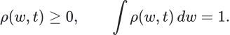
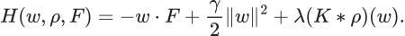
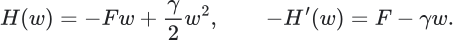
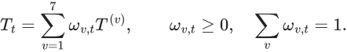
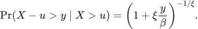
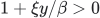
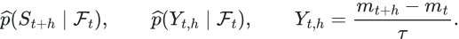
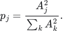
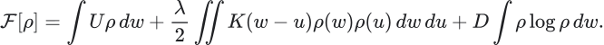
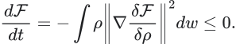

# How the ideas become a market model

Version note: this guide reviews the source framework and the earlier CGB baseline. The independent redesign that follows this review is derived and implemented in [document 10](10-structural-model-derivation.md). Source fidelity is a comparison tool, not a requirement to copy its numerical choices.

This chapter explains the ideas behind the construction. Read it before [the mathematical walkthrough](07-understanding-the-framework.md) if you want the intuition first. The companion [departure checklist](09-departures-and-repair-checklist.md) records what the earlier CGB baseline implemented and what the subsequent redesign needed to reconsider.

These explanations independently interpret the supplied work. The authored essays, collected papers, source implementation and CGB extension are distinct sources. Collection does not imply authorship or agreement with every claim.

## 1. What is especially creative here?

The strongest idea is a change in the object of research. Instead of starting with a price pattern and looking for a clever predictor, the essays start with a configuration of exposures inside an environment. They ask which configurations can persist, what makes them expensive to maintain, and how the population reorganizes when those conditions change.

That is a substantial intellectual move. It links four questions that are often handled separately: why a position is attractive, why many people hold similar positions, why they might have to change those positions together, and how that reorganization reaches prices.

For your account, the question becomes: **what would keep producing Canadian duration selling after the selling we have already observed?** The answer cannot just be that CGB has gone down. The hypothesized mechanism must have something left to do.

This is why the VWAP story interests you. You are not really fascinated by an average price. You are noticing repeated attempts at recovery that fail to change the market's behavior. The intellectually interesting object is the response of the system to those attempts.

My strongest positive assessment is that the framework tries to give measurements different jobs: environment, reference, pressure, propagation, state, forecast and response. It tries to make an architecture out of ideas, rather than attach scientific names to one trading rule. Whether each proposed physical identification succeeds is a further question; the architecture is worth understanding in detail.

## 2. The first move: replace identity with exposure

Suppose two accounts sell CGB. One is reducing risk after losses. One is expressing a macro view. A third sells nothing, but withdraws bids. Institutional names do not tell us which of those mechanisms will continue.

The population approach asks where participants sit in exposure space. In the source, the coordinates include duration, equity, credit, inflation, commodities and FX. A density describes the relative mass around a configuration:

The reduction is clever because a few common constraints can matter more than thousands of security names. Many different portfolios can carry the same vulnerability to rising rates. But normalizing the density removes total capital: the same shape at twice the leverage is not necessarily the same market. Scale and leverage must be retained separately if the hypothesis needs them.

For CGB, a possible research coordinate is a vector of level, slope and curvature exposures, accompanied by funding and liquidity conditions. This is a proposed translation. Our code currently observes prices and rates; it does not recover the population's holdings.

The lesson is not that identities never matter. It is that an explanation should survive replacing an institution's name with the economic role that makes its activity relevant.

## 3. From an intuition about constraint to a potential

The source author organizes the incentives through

Read it as a proposed cost landscape. The first term makes some exposure directions attractive under the current forcing. The second penalizes extreme exposure. The third says that the presence of others can change the cost of occupying a location. The kernel describes which locations influence one another.

Take one dimension, ignore interactions and suppose positive  means long duration. Then

The preferred exposure is . If the forcing turns against duration,  falls. If risk tolerance contracts,  rises. Either can make a previously comfortable long position too large. They are different reasons to sell, with potentially different persistence.

This gives you a sharper interpretation of a selloff. A market can fall because the desired exposure changed, because the permissible exposure shrank, or because crowding increased the cost of holding it. A one-column momentum feature cannot distinguish those explanations.

There is also a concrete model-building obligation: a landscape in exposure coordinates does not yet produce CGB ticks. One needs a bridge from desired position changes to orders, from orders and cancellations to liquidity, and from liquidity to price response. This is one of the most important missing bridges in our current version.

## 4. Why momentum and volatility are different coordinates

The source writes an individual exposure process as

The drift says which direction the landscape encourages. Diffusion says how dispersed the realized motion is around that tendency. In a short interval, the noise variance is . Increasing diffusion does not mathematically reverse the drift.

This separates four ordinary but easily confused situations: quiet balance, quiet directional adjustment, noisy balance and noisy directional adjustment. The fourth is particularly important for your account. A violent selloff can have a strong directional tendency and a difficult path at the same time.

The source's GAS/FLUIDE code is an engineered classification of coupling, compression, memory, tails and diffusion-related proxies. It is not a long/short classifier. A financial regime block and a directional state are separate axes; that is why the code duplicates eleven directional/transition tags across two environmental blocks.

Our seven descriptive phases collapse much of that richer construction into price behavior. That simplification makes a baseline easier to inspect, but it loses the question: **does a similar price trend propagate differently under a different interaction regime?**

## 5. From one actor to the population

The density evolves through a probability current:

The first contribution transports density down the landscape; the second spreads it away from concentrations. The continuity equation keeps track of where probability mass goes. Under suitable boundaries, the density stays normalized.

This is useful intuition for a market with distributed adjustment. The observed flow at one instant need not equal the whole remaining adjustment. One group may react immediately, another at a risk review, another when a hedge threshold is reached.

A theoretical equilibrium density is a reference for a frozen environment, not a promise that a market will calmly reach it. The source explicitly permits metastability: a configuration may persist for a long time before a constraint change makes departure rapid.

For CGB, this suggests studying **changes in response**, not trying to infer that a large move must be exhausted because it has already traveled far. A large move might have consumed the imbalance, or it might have brought another group to a threshold. Price distance alone cannot settle that.

## 6. The reference is what makes a deformation meaningful

The Beta essays ask what exposure and relationship are natural within the environment. This differs from subtracting a benchmark mechanically.

For outright CGB we can retain

with both the common-duration contribution and the local deviation visible. A CGB decline caused by US duration is still a decline your account may want to participate in. We should not remove the desired exposure merely to obtain an attractive residual chart.

The useful question is whether the local deviation changes the interpretation of the common move. CGB falling during a US recovery is different from CGB falling alongside an even larger US selloff. Neither relationship automatically dictates the next trade.

The source author also distinguishes stationary returns from stationary levels. This is important because a stationary one-minute return distribution does not imply that CGB prices will return to yesterday's level. A cointegrated price relationship, a rolling-centered series and a hedge portfolio are different objects.

The creative lesson is that the representation should be designed around the question. For our account, the reference is an explanatory coordinate around an outright trade. This is a deliberate change from his basket-and-spread architecture.

## 7. Pointer states: persistence of a description

In quantum decoherence, the environment couples differently to different states. Certain states retain their identity more robustly under that interaction. These are pointer states. The underlying physical analysis concerns a system–environment interaction and a reduced density matrix; it is more specific than calling a chart regime stable. See [Zurek's review](https://arxiv.org/abs/quant-ph/0105127).

The financial intuition worth exploring is: **which market descriptions remain informative after ordinary disturbances?** A meaningful duration-pressure state need not produce a lower price every minute. It might survive small rallies, temporary opposing trades and short interruptions in the original flow.

For your example, suppose a US bounce repeatedly gives CAD a chance to recover, yet CGB retains most of its decline and renewed selling quickly resumes. The descriptive relationship is more interesting than the fact that the chart has crossed a line.

We can make robustness a research object. Let  be a proposed state and let  be an economically justified family of small measurement perturbations. Then label stability can be summarized by

This is a proposed diagnostic, not a physical pointer-state theorem and not currently implemented. A constant label scores perfectly, so it must be accompanied by useful distinctions in future outcomes. We need both robustness and relevance.

An additional subtlety is redundant evidence. CGB, US futures and CAD swaps may appear to tell the same story. Agreement can make the state more observable, but ten transformations of the same curve are not ten independent confirmations. The source's interest in environment-as-witness motivates checking which measurements add new information and which repeat it.

## 8. The state grammar is a theory of change

The original model has eleven tags in each of two blocks: R, PTU, SU, U, PEU, EU, PTD, SD, D, PED, ED. The tags distinguish reference, formation, establishment and ending/transition phases. Their exact meanings are determined by the source grammar, not by the labels alone.

Why construct intermediate states at all? Because the first sign of pressure, an established trend and its possible ending can have the same latest return but different histories. A grammar tries to preserve those distinctions.

The seven 22-by-22 matrices then supply different transition preferences. A general way to express a mixture of such laws is

This equation expresses the architecture; exact source weighting and composition are documented in the audit. The intellectual move is to let the applicable transition pattern vary with context rather than assume one fixed law for every day.

For CGB, a possible distinction is between gradual common-duration repricing, a local liquidity shock, and an event-driven change. However, selecting three appealing names is not enough. The emissions, transition rules, duration behavior and observable differences must all be specified.

Our current phase-transition matrix is only a diagnostic. It does not govern the forecast. That is a major departure from his architecture, not a cosmetic difference in state names.

## 9. Statistics prepares the state before machine learning forecasts it

Statistical estimation in the source pipeline starts before XGBoost. Before supervised learning, his pipeline estimates weights, betas, local moments, tails, entropy and several normalized proxies.

The useful division of labor is this: statistical measurement describes the environment; the state grammar expresses a hypothesis about its organization; supervised learning estimates what tends to follow from a configuration; the fusion layer combines different descriptions of possible futures.

The moments answer different questions. Mean concerns signed tendency. Scale concerns dispersion. Skew concerns asymmetry. Tail estimates concern unusually large outcomes. Memory concerns dependence over time. One is not a substitute for another.

His code's quantities called Hurst and Lyapunov are custom memory and propagation scores. Their conceptual purpose is interesting, but their function names do not give them the interpretation of conventional scaling or chaos estimators. A faithful explanation must teach their actual construction.

The same care applies to tail risk. For an upper exceedance above , the generalized Pareto model is

The support must satisfy , with ;  is the exponential limit. This is a conditional model of extremes, not a promise that every extreme follows the fitted law. Our adverse-excursion quantile heads do not reproduce his EVT tail layer.

## 10. What the machine learner is actually learning

In the original model, future supervised labels are future outputs of an engineered state grammar. XGBoost learns a mapping from today's measurements to those later tags. This can teach a useful dynamics of the representation. It can also become accurate at predicting a label without delivering an economically useful forecast.

Our version changed the target to actual future CGB movement and path excursion. That preserves an external outcome against which the narrative can fail. It sacrifices part of the original state-centered design.

A closer adaptation could retain both tasks:

The first asks whether the hypothesized state persists or changes. The second asks what actually happens to CGB. Agreement is informative; disagreement exposes a weakness in either the state vocabulary or its economic relevance. This dual design is a proposal, not something already implemented.

This is where creativity should sharpen rather than weaken the experiment. If a sophisticated state story cannot explain anything beyond a simpler price-history baseline, we have learned something about the story. If it adds reliable information, we can identify which relation supplied it.

## 11. Probability: structure, evidence and calibration

The original amplitude construction follows the form

Its mathematical attraction is a structured route from state support to a normalized distribution. In the active source path, Monte Carlo support, structural preferences, frontier effects and classifier/construction scores influence those amplitudes. It is not just a vote among labels.

But quantum Born probabilities require the corresponding physical framework. Squaring positive financial scores does not, by itself, recreate the quantum argument. Any positive probability vector can be represented with , so that representation alone cannot establish which probabilities are correct. See [Zurek's envariance paper](https://arxiv.org/abs/quant-ph/0405161).

The most useful financial interpretation is therefore a structured forecast whose confidence must be checked. A probability of 0.8 means something operational only if similarly issued forecasts relate appropriately to subsequent outcomes.

Our logarithmic opinion pool is a different architecture. It combines a local-drift forecast and a supervised forecast using calibration-fitted weights and temperature. The experts share price information. Their agreement is not independent confirmation, and disagreement is worth preserving rather than hiding inside one number.

## 12. Thermodynamics: why the distribution matters

The source's free-energy functional combines average exposure cost, interaction cost and a dispersion term:

Under fixed parameters, symmetric interaction and suitable boundaries, its gradient-flow dynamics satisfy

This is a substantive mathematical statement. It means the specified dynamics move the density in a direction that reduces that functional. It does not require every individual to improve at every instant.

The creative financial reading is that an opportunity may lie in anticipating the path of reorganization. But the identity is not automatically an identity for account PnL. A changing environment adds explicit time-dependence, and translating population movement into a tradable price change still requires a measurement and impact model.

The thermodynamic ratchet paper adds another important intuition: memory is valuable when it matches structure in the input. Independent up/down signs and a perfectly alternating sequence have the same marginal sign frequencies but different predictability. Counting outcomes discards sequence structure. [The physical paper](https://arxiv.org/abs/1609.05353v1) establishes results for information engines; the proposed trading lesson is about designing useful memory, not converting joules into dollars.

For CGB, remember the sequence of failed recoveries, changing response to orders and cross-market alignment. Do not assume a longer rolling window automatically captures the relevant memory.

## 13. Cybernetics: the predictor lives inside a loop

Observation, belief, forecast, action and adaptation are different operations:

There are then additional loops. Outcomes change the next state estimate. Matured errors can change parameters. A trader's position changes what that trader can tolerate. Large or coordinated orders can change the market itself.

This is why an observation update should not be confused with retraining. Our Kalman state changes as new returns arrive while its fitted parameters stay fixed. A four-hour forecast cannot be judged by its four-hour outcome five minutes later. A decision to cut risk may be correct even if the direction forecast has not changed.

Performativity makes the loop explicit through a distribution  affected by deployment:

The distribution changes with the deployed model as well as with external conditions. [Performative Prediction](https://arxiv.org/abs/2002.06673) studies this mathematically. Our current indicator neither estimates that distribution map nor controls the market. Its controllable object is the account's exposure; the market is primarily its observed environment.

## 14. A concrete CGB example, with the intuition kept intact

Imagine a lower opening, a failed recovery toward VWAP and continued five-year paying. These are hypothetical observations, not a reconstruction of any named account's motives.

Start with the reference. Did US duration also sell off? If it recovered, did CAD recover proportionately? Decompose the curve: a falling  can reflect falling five-year yields or faster-rising two-year yields. Those are different outright-duration environments.

Then look at response. Is selling still producing downward displacement? Is buying producing only temporary recovery? Does displayed depth replenish and survive trading, or disappear before it is used? Is the response changing as the session progresses?

Two deliberately simple descriptive quantities could be signed executed flow  and midpoint displacement . A local response relation might be written

This is an observational regression proposal, not an identified causal impact law. Simultaneous news, cancellations and trade classification errors can affect both sides. The reason to consider it is to distinguish persistent selling with weak price response from modest selling with unusually strong response.

An even richer event representation would record an attempt, its displacement, subsequent retention and the cross-market conditions. A recovery event cannot be labeled failed until its failure criterion has occurred. The live record must use the information available at that point, not tomorrow's interpretation of the chart.

Now choose the state description. Perhaps the data support sustained directional adjustment; perhaps repricing has completed but liquidity remains poor. Retain uncertainty between those explanations. Then forecast the next one, two and four hours, preserving adverse path risk as well as endpoint direction.

Finally attach the account decision. A bearish forecast can be strong but too small to pay the spread, or large enough but incompatible with the intended adverse excursion. Costs belong in that decision. The price forecast and the trading decision remain distinct, but the purpose of the forecast is still economic.

## 15. Every source lesson in the wider collection

The supplied `theses/source` directory contains nine PHYSICS files and 38 CYBERNETICS files, including two different files numbered 08. This map covers every one. Coverage is not a claim to have verified every theorem: the six core essays and the later formalization were read in full; the broader scientific papers were reviewed through available abstracts/introduction passages and selected relevant sections. The earlier source audit provides detailed notebook tracing.

The translations into CGB below are our proposed applications. Where a paper is about medicine, recommender systems, governance or physics, its original result remains about that setting.

### The nine PHYSICS files

**P01 — Beta.** Establish the account's exposure and environment before selecting a strategy. The same macro environment can support different actions depending on the instrument universe and constraints. For CGB, outright duration remains the chosen exposure; common-duration and curve references explain it. His spread construction is not automatically the right traded object for this account.

**P02 — Smart Beta.** A persistent exposure premium is a configuration that can become incompatible with new constraints. Represent incentives, crowding and diffusion separately. For CGB, ask whether a selloff follows a change in desired exposure, risk capacity or liquidity, rather than labeling every decline the same momentum state.

**P03 — Zureck.** Effective laws can change while the modeling framework remains useful. Equilibrium is a conditional reference and metastability can be long-lived. The practical lesson is to monitor changes in the response relation. Our notebook does not yet estimate a changing forcing or interaction kernel.

**P04 — Zureck vs Laplace.** Build causal timing and sequential evidence into the model. The useful intuition is to accumulate evidence for departure from a reference instead of making every observation a new independent verdict. His Laplace/Zurek contrast is a philosophical framing, not a demonstration that ordinary conditional probability is invalid. Sequential evidence can be formalized classically.

**P05 — Zureck vs Laplace, part 2.** Relate persistent states, environmental observations, probability and tail risk. The especially useful idea is to ask which description remains reproducible across measurements. The physical quantum results and the financial state construction require different observation models; Born normalization does not supply the missing financial identification.

**P06 — Stationary Time Series.** Name the object being stabilized. Changes, cumulative levels, recentered deviations and executable portfolio returns are not interchangeable. A reference should improve interpretation, not manufacture a return-to-center that the actual exposure does not have.

**P07 — Trou noir.** The French notes challenge interpretations of Schwarzschild coordinates, domains and extensions. The transferable research question is whether an apparent singularity belongs to the system or to its coordinates. For CGB, a z-score exploding as estimated volatility approaches zero can be a representation failure. This lesson does not establish the notes' broad physical conclusions. A restricted coordinate chart cannot by itself settle the geometry of an extended spacetime.

**P08 — Kinetic theory of galaxies.** This is a paper by J.-P. Petit, G. D'Agostini and G. Monnet, not the source author. It studies a distribution interacting with its own gravitational field and uses restrictions on distribution shape to construct a model. The useful general idea is self-consistency: the population creates part of the environment that moves the population. A financial application would need an independently justified crowding/impact relation, not gravitational constants renamed as market coefficients.

**P09 — Ummo / mathematical formalization.** This authored French document extends the mappings to coupled sectors, collective memory, graphs, diffusion and four-valued logic, alongside speculative physical and biological claims. Three useful research prompts are relational coordinates, feedback between individuals and aggregate information, and distinguishing conflicting evidence from missing evidence. These can be formalized without adopting the speculative mechanisms. There is also an explicit algebraic inconsistency: for real , the simultaneous claims  and  permit only the zero case. A bearish market is not a negative square of a real growth rate. We should preserve the creative question and repair the mathematics rather than copy that equation into CGB.

### CYBERNETICS 01–14: information, representation, control and organization

**C01 — Thermodynamics of requisite variety.** Memory should match environmental correlations that an agent can use. A direction count misses ordering. For CGB, a sequence of pressure, temporary recovery and renewed displacement may matter more than the fraction of negative minutes. A physical work bound is not a financial profit bound.

**C02 — Redundant attempted solutions.** This systemic-therapy paper studies situations in which a repeated attempted solution helps maintain the problem. The research analogy is powerful: more smoothing can worsen a lag problem, and more confidence filters can select only the already-completed part of a move. Diagnose the failure mechanism before repeating the same intervention with a stronger parameter. It does not imply mechanically reversing a losing strategy.

**C03 — Multiscale requisite variety.** A useful system must distinguish environmental situations requiring different responses, at relevant levels of detail. The model need not reproduce every quote. It must preserve differences between continuation, absorption and a broken reference when those differences change the forecast or decision. The paper's scale is a formal coarse-graining concept; the time-horizon application is our extension.

**C04 — Building the observer into the system.** Observations are finite outputs obtained through a particular interface. Our feed, timestamps, corrections, sampling and instrument selection shape what can be inferred. A quote is evidence through a measurement process, not unrestricted access to the market's interior. The paper's stronger philosophical and physical claims are not prerequisites for that practical lesson.

**C05 — Adaptation and control.** Distinguish updating a state from changing the rule that updates it. For CGB, intraday filtering, scheduled refitting and account-position changes should have separate records and objectives. Calling all three adaptation hides which mechanism reacted and why.

**C06 — Complex-systems mathematical formalism.** Separate the entities, relations, states and operations of a model before implementing them. This is the value of a metamodel: it forces the code to express the proposed system instead of letting incidental data-frame columns define it. For CGB, market observations, inferred pressure, forecast distributions and account actions are different types of object.

**C07 — Reinforcement learning in categorical cybernetics.** The paper organizes learning algorithms as composable bidirectional processes. A forward action path and a backward learning signal have different roles. For CGB, this motivates clear interfaces between forecast, policy and feedback. It does not require an RL agent to produce an intraday indicator.

**C08a — Agent cybernetics.** Long-running agents require an architecture that preserves purpose, memory and feedback under changing conditions. The financial extension is a model that records what it believes, what changed and which response is permitted. An isolated classifier with good historical accuracy is not yet such an operating system.

**C08b — Towards Quantum Cybernetics.** The paper discusses regulation and information-theoretic limits, including conjectured quantum resources. The transferable question is what an observer/controller can distinguish and influence. We can influence our position and order placement much more directly than the market state. The paper does not establish quantum control of financial prices.

**C09 — Cybernetics and the Future of Work.** Complex objectives involve interacting technical and human systems. An indicator's job depends on its user: timing entry, holding conviction and managing exposure are different tasks. Define the useful behavior of the whole account-and-tool arrangement, not only a numerical prediction score.

**C10 — Complexity Control.** This work studies adaptive interactions between systems with different temporal complexity. It prompts a question about matching response speed and environmental dynamics. For CGB, a controller that reacts to every brief perturbation can destabilize a slower decision. The paper does not justify treating a custom financial Hurst score as a proven complexity-control law.

**C11 — Information, Computation, Cognition.** Information is considered through its effect on an agent and its organization. The useful modeling lesson is to define what distinction a measurement enables. A new forward rate is not useful merely because it is another column; it should help distinguish futures that were previously confused.

**C12 — Computing with Space / Bateson.** This mathematical work examines representation and transformation through spatial/tangle formalisms. For our model, the useful question is what a transformation preserves: units, ordering, neighborhoods and equivalent configurations. The financial implementation does not currently use its tangle calculus, and a scatterplot is not evidence that it does.

**C13 — Cybernetic Governance.** A coliving case study uses sensing, explicit obligations, incentives and feedback to coordinate a shared system. The general lesson is that operational rules can be designed as feedback mechanisms. For CGB research, responsibilities for feed quality, model changes and risk decisions should be visible rather than delegated to an unexplained final score.

**C14 — History of AI agents in social and behavioral sciences.** A convincing artificial agent can be a model of behavior without revealing the actual mechanism that produced it. A market simulator reproducing clustered volatility or trends is useful, but several incompatible agent stories may produce those same patterns. Simulation similarity is not unique identification.

### CYBERNETICS 15–28: actions change measurements and populations

**C15 — Strategic Classification.** People can change the features on which a decision rule relies. In markets, observable liquidity is produced by strategic participants, not passive sensors. This motivates testing how an order-book feature behaves around cancellation and execution; it does not license assuming every large order is deceptive.

**C16 — Delayed Impact of Fair Machine Learning.** A rule that satisfies a static criterion can change the underlying population in an undesirable direction over time. The transfer is to distinguish immediate forecast quality from the later state of the account and its observations. A policy that constantly trades the same episodes may alter costs, selection and available learning data.

**C17 — A Broader View on Bias.** Error can arise from representation and implementation as well as the original training sample. For CGB, treating a stale swap mark as fresh or a missing observation as zero changes the meaning of the feature. Statistical fitting cannot undo an undocumented measurement choice.

**C18 — Performative Prediction.** Deployment can change the distribution being predicted. This introduces a distinction between a model that is stable under retraining and one that optimizes its full effect on the environment. A stable account policy can still be economically poor; a stable forecast is not automatically a profitable strategy.

**C19 — Breaking Feedback Loops in Recommender Systems.** Observed responses can reflect what a previous policy chose to expose. A causal adjustment needs an explicit intervention question. For trading, a fill-conditioned sample describes the situations in which we were filled, which may differ from all forecast opportunities. The recommender adjustment is not a plug-in proof for execution data.

**C20 — Data Feedback Loops.** Outputs recycled as future training information can amplify existing distortions. For CGB, generated scenario paths or predicted state labels should not silently become ground-truth market outcomes. Forecasting an engineered future tag is legitimate when disclosed; validating the tag solely by agreement with its own construction is circular.

**C21 — Classification of Feedback Loops.** Different feedback paths affect different parts of a pipeline. Distinguish action changing price, action changing which data are collected, and retraining changing the next action. Naming the loop helps select the right diagnosis instead of calling everything regime change.

**C22 — Performative Prediction: Past and Future.** Learning about a system and steering it are different capabilities, and the strength of the predictor's influence matters. A small account may approximate a price taker while the wider population of similar accounts changes dynamics collectively. Those scales should not be conflated.

**C23 — Interference in A/B Training Loops.** Shared training data can contaminate a comparison between deployed policies. In our setting, strategies using one another's generated fills or shared adaptive labels are not automatically independent experiments. Historical forecast comparisons can remain useful without claiming a randomized causal comparison of policies.

**C24 — What Is the Causal Estimand?** Monitoring requires specifying the quantity whose deterioration matters. Forecast calibration, passive market predictability, execution quality and account returns answer different questions. A lower PnL could reflect worse forecasting, wider spreads or a changed position policy; one aggregate metric cannot diagnose all three.

**C25 — Systems Theory of Algorithms.** Algorithms themselves can be viewed as dynamical systems connected to other algorithms, humans and databases. The CGB pipeline should expose state, input, output and update timing at each boundary. Mathematical stability of one isolated component need not imply stability of the interconnected pipeline.

**C26 — Fairness Feedback Loops.** Repeated training on model-influenced or synthetic data can erase representation of some parts of the world. The financial analogy is a feedback process that increasingly trains only on familiar trend days and loses coverage of quiet, conflicting or unusual sessions. This is a hypothesis about sample selection, not a claim that the paper studies bond markets.

**C27 — Practical Performative Policy Learning.** The work seeks a lower-dimensional account of strategic responses rather than specifying every individual's utility. That echoes the useful population reduction in the source framework's essays. A CGB extension would need an observed mediator linking a deployed policy to changed conditions; we currently have no such identified map.

**C28 — From Tea Leaves to System Maps.** Monitor the surrounding data and deployment system, not only the feature distribution. A contract roll, source outage, changed quote convention or incomplete session can resemble a market break. The right response depends on which part of the system changed.

### CYBERNETICS 29–37: financial feedback and adaptation

**C29 — Order-Flow Filtration.** Event selection can change the association between order imbalance and returns. Standing depth, modified orders and executed-parent-order flow are different populations. A live adaptation must use order age and modifications known so far; eventual lifetime cannot classify the past before the order exits. Our current top-of-book features do not implement this richer event model.

**C30 — Performative Market Making.** Market participants' valuation models can become part of the price dynamics. The useful intuition is that a reference may attract prices partly because participants act on it. It does not mean every VWAP test is causal evidence or that all traders use the same reference.

**C31 — Nonlinear Performative Prediction.** Strategic distribution response need not be linear. Mathematical guarantees depend on the specified loss, response measure and regularity assumptions. For CGB, adding nonlinear XGBoost features does not itself mean the deployment-response problem has been modeled.

**C32 — Robust RL with Market Impact.** Historical prices omit the counterfactual impact of an agent's new actions. Robust policy evaluation can account for a specified set of plausible transitions, including asymmetric impact. That is relevant if we later optimize execution or position size; it is a different task from the current passive indicator.

**C33 — Dissecting Performative Prediction.** Ask what information is actually available about the distribution-response map before selecting a method. Prices alone, randomized interventions and a known simulator provide different capabilities. A broad theory menu should not be mistaken for identification from four sessions of swaps.

**C34 — Stability of Online Algorithms.** The paper connects no-regret learning with a mixed notion of performative stability. The limiting object is not necessarily a single fixed parameter vector or a profit optimum. The practical lesson is to define the intended type of convergence before calling an adaptive model stable.

**C35 — Realistic Market Impact in RL Environments.** The assumed cost/impact environment can change which policy appears best. Paying the observed spread can be accounted for separately from predicting direction, but learning a position policy must eventually account for size-dependent consequences. Our touch-price ledger is not an impact simulator.

**C36 — AI and Systemic Risk.** This theoretical work studies feedback between adoption, correlated signals and fragility. It offers a hypothesis about crowding in the decision process itself. Ten models trained on the same observations may behave like one crowded strategy. It does not establish how much of a particular CGB move was caused by model crowding.

**C37 — FinPILOT.** A forecast can guide a temporary planning step at decision time without retraining the forecasting model. Its price-taking premise and use of multi-step forecasts clarify a possible later policy layer. Our current indicator does not implement model-predictive control, and scenario optimization would inherit every limitation of its forecast model.

## 16. Four-valued evidence: a useful idea we had not fully developed

One of the useful prompts in the later formalization is to retain different kinds of unresolved evidence. For an operational proposition such as "downward pressure continues," keep separate support and opposition rather than immediately compressing everything into one signed number.

As a proposed display convention, let  indicate whether predeclared supporting and opposing evidence thresholds have been met. Then

These mean supported, opposed, conflicting and insufficient evidence. They are evidence categories, not simultaneous physical truths, and not a complete implementation of a formal four-valued logic.

For example, CGB and US duration may support continuation while local trade response supports absorption: conflict. Missing swap and book observations can instead mean insufficient evidence. Those situations may produce a similar pooled directional score but deserve different explanations.

Our notebook partially preserves this distinction through data status and expert disagreement. It does not yet provide mechanism-level support/opposition ledgers. That would be a useful addition because it teaches the user what is happening without pretending that uncertainty is itself a neutral market state.

## 17. What we should admire, and what we should actually build

The most worthwhile part of the work is the effort to move from constraints to representations, from representations to states, and from states to behavior. The best financial translation preserves those questions even when it needs different mathematics.

A closer CGB version should first improve its observable account of response and reference stability. It should then define economically distinct states, compare their future behavior and decide whether the richer architecture adds information. Recreating every scientific term before establishing those relations would lose the method while preserving its vocabulary.

The aim is a model that can explain, at a particular time: what changed, which relationship still holds, what evidence supports continuation, what contradicts it, how long the inference is meant to apply, and what would make it change. The current baseline answers only part of that. The checklist records the remaining work explicitly.
