# Deriving the CGB model from the account's problem

This is the current design, replacing the earlier baseline as the main research experiment. The preceding three teaching guides explain Karim's work and audit our earlier adaptation. This document derives our choices independently. It does not claim to describe what Karim personally would deploy, to establish a financial law from a physics paper, or to certify a trading edge. There is no supplied market dataset.

The organizing idea is demanding: every object must have a purpose, an observable meaning, a mathematical role, an implementation and a way to discover that it fails. Inspiration helps us ask questions. It cannot determine numerical answers before we see evidence.

## 1. What must be true, and what remains conjecture?

There are four different kinds of statement in this design.

| Kind | Example | What justifies it? |
|---|---|---|
| Definition or accounting identity | A long's adverse excursion is its worst unfavorable price movement | The quantities are explicitly defined |
| Information constraint | A live decision cannot use an observation that arrives later | The decision's information set |
| Market hypothesis | Similar observed adjustment conditions contain information about future paths | New chronological market evidence, still absent |
| Engineering convention | A five-minute decision clock or 64-neighbor bandwidth | A declared compromise, subject to validation |

No honest derivation turns a preferred lookback or a tree depth into a core truth. We can derive the requirement for a past-only scale. We cannot derive that 60 minutes is universally the best scale window. The latter is a visible provisional choice.

Our problem is: given what the account knows now, describe possible CGB price paths over 60, 120 and 240 minutes, including both direction and the route taken. CGB remains the outright exposure. US duration, the Canadian curve and optional flows describe the environment. Removing common US duration from the traded target would answer a different account's question.

## 2. Begin with the information boundary

Let observation i have receiver availability time a_i. The admissible information at decision time t is

This is an information constraint, not a fitted model. A forecast must be a function of this information. Exchange event time alone cannot tell us whether a delayed quote had reached the account. A late revision cannot be projected back into the original forecast.

The implementation constructs a receiver-time panel. It chooses the latest event actually known, respects subsequent revisions, preserves invalid observations, and rejects ambiguous clocks. A stale latest quote cannot silently be replaced by an older favorable quote. A session or contract change resets the relevant measurement history.

The model observes a one-minute grid and issues states on a five-minute clock anchored to each contract segment. A forecast remains stamped with its actual decision time. It is not silently relabeled with the later display time. Five minutes is a compute and noise tradeoff, not a claim about the market's natural clock.

**Code:** `features.py: prepare_panel`, `states.py: signed_flow_grid`, `build_state_observations`. **Failure test:** appending future observations must leave the historical prefix exactly unchanged. This test passes on the deterministic exercise.

## 3. Choose a forecast object that cannot contradict itself

Separate classifiers can say 'high probability of rising' while a separate return model says 'large expected decline'. That combination can sometimes be mathematically possible, but it needs an explicit distribution to explain it. Independently fitted risk heads can also report mutually incoherent outcomes.

We therefore predict one conditional distribution over future CGB price paths, separately for each horizon. Direction, expected endpoint and adverse excursion are functions of that same distribution.

For midpoint m, price tick tau, direction d and horizon h, define the research outcome and adverse excursion:

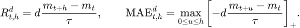

Long is d = +1; short is d = -1. A favorable endpoint following a severe adverse move is distinguished from a smooth continuation. The code measures the path on its grid: adverse moves between grid points remain unobserved. This is a material limitation for tight stops.

These are midpoint outcomes. Their definitions do not assert executable profit. CGB's standard minimum price fluctuation is 0.01 price points, worth CAD10 per contract; the defaults follow the [exchange contract specification](https://www.m-x.ca/en/markets/interest-rate-derivatives/cgb), checked on 2026-09-24. Actual contract identity and permitted session are still supplied explicitly.

## 4. What does physics contribute here?

Karim's framework motivates an environment-first account of motion, reference frames, state changes and feedback. We retain those questions. We do not import his numerical grammar as a physical necessity.

| Source intuition | Question for this account | Observable implementation | What is not identified |
|---|---|---|---|
| Reference frame and beta | Is movement common duration or a Canadian deviation? | Lagged CAD/US slope, current common component, residual | A causal US shock or a tradable hedge ratio |
| Momentum and diffusion | Is net displacement maintained relative to local variation? | Several past displacements and past volatility | Mechanical mass or a Brownian market law |
| Density and fragility | Does visible directional pressure produce movement? | Classified signed trades and contemporaneous response | Total crowd positioning, dealer inventory or compulsory future flow |
| Dissipation and absorption | Does buying or selling lose price effectiveness? | Response and a bounded pressure/response diagnostic | Literal thermodynamic energy loss |
| States and transitions | Does today's measured configuration help describe later configurations? | Five descriptive states and horizon-specific learned transitions | A complete sufficient state of the market |
| Pointer or stable observable | Which quantity actually belongs to the account's decision? | The CGB path and explicit state observations | Quantum measurement or a unique natural state partition |
| Probability geometry | How should uncertain alternatives combine? | Conditional probability and a convex mixture of path distributions | An empirical need for squaring scores under a Born rule |
| Cybernetic feedback | Can a frozen forecast be checked after its consequences are observable? | Versioned forecasts and a matured-outcome ledger | Autonomous self-correction, control or market impact |

The word 'absorption' is a useful hypothesis about a response pattern. The executable variable is a specified proxy. Likewise, statistical entropy measures uncertainty in a distribution here. It is not thermodynamic entropy measured in physical units.

This distinction protects the creativity: an imaginative explanation becomes a testable proposal instead of a label that can explain every possible outcome after the fact. A model that cannot be wrong is not an informative forecast.

## 5. Preserve the reference instead of confusing it with the target

In common CGB tick units, use

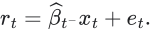

Here x is the observed US futures log-price change in basis-point units. Beta is estimated from earlier complete paired observations; its units convert US log-price movement into CGB ticks. This is a reference decomposition. It does not prove causation. The reference does not remove the common component from our traded target.

If the common component is -4 ticks and local residual is zero, an outright short can still capture the movement. If the common component is +2 and the residual is -6, the observed CGB movement is also -4. The second case raises a different question about relative response; it does not automatically deserve a larger short forecast.

The default new notebook selects `cgb`, `us` and `curve`. Each enabled module needs training coverage. The code does not quietly fit an environmental model using absent measurements. A CGB-only experiment remains possible through an explicit configuration, and that reduced setting is used in the software fixture.

Canadian 2s5s flattening is not coded as a bullish instruction. A slope movement must be read together with its level components. The curve features preserve five-year level movement and the 2s5s and 5s10s changes, so the three-point movement can be reconstructed. This avoids throwing away the distinction between a rally and a selloff with the same slope change.

### Why each measurement earns a candidate place

The requirement is to distinguish competing explanations, not to collect indicators. Each row below names a question that the selected measurements can answer descriptively. Whether that answer predicts the future is a separate empirical claim.

| Measurement | Core question and transformation logic | Objection to retain |
|---|---|---|
| Past volatility in ticks | What size of movement is large relative to recently observed variation? Use a past-only denominator with physical price units. | Volatility can change immediately after the forecast. |
| Displacements over 5/15/30/60 minutes | Is recent movement agreeing with, interrupting or reversing longer movement? Compare several completed intervals against the same past scale. | Nested intervals contain duplicate information, not four independent votes. |
| 30-minute efficiency | Did net movement survive offsetting travel? Divide absolute net displacement by total absolute movement. | A single jump can look perfectly efficient without implying continuation. |
| 30-minute range position | Is the current price near a recently observed extreme? Locate it within its own completed range. | Near-high price can precede either breakout or reversal. |
| 15/60-minute volatility ratio | Has short-scale variation increased relative to the surrounding period? Compare like units. | Increased activity gives no unique directional sign. |
| Return skewness | Is local return asymmetry dominated by unusually large moves on one side? Preserve a description of the observed distribution. | A 60-minute estimate is noisy and may simply encode one event. |
| Negative semivolatility fraction | Which side contributed more squared movement? Retain direction of realized variation separately from its magnitude. | Squared moves can be concentrated in one observation and need not reflect persistent pressure. |
| Quoted spread | Has the immediate price of crossing liquidity changed? Express current ask minus bid in ticks. | A spread snapshot does not measure depth, future slippage or queue behavior. |
| US movement, prior slope and correlation | Does the usual observed duration relationship describe this interval? Preserve both external movement and reference quality. | Asynchrony and structural change can invalidate the reference. |
| Common and local movement | Did CAD participate in the common move or deviate? Convert into CGB units with the prior reference and retain both components. | Residual movement is unexplained by this model, not proven local information. |
| CAD level and slopes | Was exposure repriced broadly or redistributed along the curve? Use invertible coordinates for the three measured tenors. | The curve can rotate for several causes with opposite outright implications. |
| CGZ/CGF changes | Did shorter-duration futures move with CGB? Use observed log-price changes without inventing DV01 equivalence. | Price normalization alone does not equate economic risk. |
| OIS, swaps and forwards | Where along the measured policy/rate structure is repricing occurring? Preserve changes in declared rate units. | Stale marks and derived forwards can manufacture repeated apparent confirmation. |
| Best-level imbalance and microprice | Is displayed quote quantity asymmetric now? Use visible sizes and prices only. | Cancellation, hidden depth and replenishment require events absent from a snapshot. |
| Trade VWAP distance and dispersion | Where is the current quote relative to the observed traded-price distribution? Weight by actual received volume. | A moving benchmark and incomplete tape can distort the apparent rejection. |
| SPX and VIX changes | Did surrounding risk conditions change concurrently? Preserve the measured context without assigning a universal bond sign. | The relation to rates is regime-dependent and may add no conditional information. |
| State age and session time | Has the observed pattern persisted, and how much session remains? Make timing that constrains path eligibility visible. | Models can learn calendar habits that fail around unusual events. |

An economically sensible question establishes a candidate measurement, not permission to claim predictive importance. Optional groups remain off until a declared experiment and sufficient overlap justify including them. A later failure to improve a matched-date forecast is a reason to remove a measurement rather than invent a more flattering explanation.

## 6. Derive a small observational state description

The first decision is whether observed displacement has a direction at the chosen scale. If it does, the second is whether the recent directional speed has weakened relative to the longer interval. This gives balance plus two directions times two response conditions: five states.

The labels are `balanced`, `up-responsive`, `up-weakening`, `down-responsive`, and `down-weakening`. 'Responsive' here means maintained price drift under this rule. It does not imply that signed order flow caused that drift. State age carries how long the description has persisted. There is no separate formation label merely to increase the state count.

Let M(t,n) denote the past n-minute displacement in ticks, and let sigma be the past standard deviation of one grid-step return. The descriptive normalized displacement is

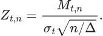

Delta is the grid interval in minutes. A square-root normalization makes windows comparable under a familiar reference scaling; it does not establish independent increments or a Gaussian significance test. The scale excludes the current return and requires a complete past window, with the existing 0.25-tick numerical floor.

The initial convention declares balance below absolute 30-minute Z of 0.75. Otherwise, d is the sign of that displacement. Weakening means

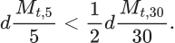

The one-half threshold is deliberately exposed as a convention, not disguised as derived physics. These states compress history; they cannot capture all of it. The learned model therefore also sees the underlying continuous observations. Invalid input produces an invalid state, never a fabricated balanced state.

**Objection:** a sudden rebound can be the beginning of an opposite trend, not weakening of the old one. **Response:** the state describes completed history, and future-state probabilities can assign mass to reversal. The direct future-price head also bypasses this coarse state description. If that direct head consistently wins on new data, the extra state representation has failed its predictive purpose.

## 7. Observe pressure and response without inventing inventory

If an upstream adapter supplies genuine aggressor classification, let signed trade volume be positive for buyer-initiated and negative for seller-initiated trades. Unknown classification stays unknown. Over the last five minutes,

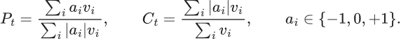

Only observations already received enter these sums. The classification coverage C must be at least 0.8 and classified volume must be positive. Missing or excessively delayed flow is unavailable. A supplied trade tape is assumed complete; the current adapter cannot verify venue sequence continuity. That assumption must be addressed by the actual feed integration.

Define response in normalized price units and a bounded diagnostic:

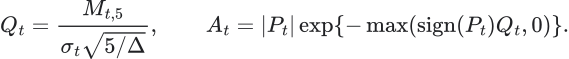

Strong signed pressure with little movement in that direction gives a larger A. Strong pressure with a large confirming move gives a smaller A. Opposite price movement also gives a large A. That last property is intentional: the diagnostic flags ineffective directional pressure, but cannot distinguish passive absorption from other simultaneous forces. P, Q and A remain separate measurements so the model can distinguish their combinations.

We choose a smooth bounded function to avoid dividing by almost-zero price response. Exponential decay is a conventional monotone mapping, not a thermodynamic derivation. Removing this proxy while retaining P and Q is a legitimate future ablation.

L2 snapshot imbalance is available in the older `book` module, but the project does not yet contain a complete event-level depth reconstruction, cancellations, queue replenishment or queue-position model. It would be false to call the present pressure proxy a full L2 mechanism model.

## 8. Make a VWAP rejection an event that can finish

A line touch is not a mechanism. The optional VWAP recovery logic asks a narrower question: during a negative 30-minute tendency, did a positive five-minute recovery below observed trade VWAP subsequently fail?

An attempt begins only after that recovery is observable. The code tracks its peak forward in time. Reclaiming VWAP or exceeding 20 minutes ends the attempt. A retreat from the peak of at least 0.75 times current five-minute reference volatility, while still below VWAP, records a failure when the retreat is observed. It never assigns a future failure to the attempt's starting timestamp.

The model receives current attempt status, newly completed failure, cumulative segment failures and availability. This initial event detector covers the bearish example the user supplied; it is not a symmetric exhaustive VWAP event grammar. The generic state and path model supports both directions. VWAP recovery features are off unless the VWAP module is selected.

These settings define a repeatable event. Whether the event adds information beyond the price path is an empirical question. Cumulative failures are exposed together with time since segment open because later times mechanically allow more attempts.

## 9. Learn transitions at the actual account horizons

A five-minute state transition matrix raised to the 48th power would require a sufficiently complete, time-homogeneous Markov state. Our five labels do not justify that assumption. We instead estimate a direct state relationship at each requested horizon.

For training examples i and horizon h, use equal-total-session weights w. Define counts and their shrunken conditional distribution:

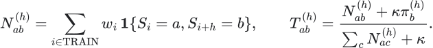

Pi is the weighted unconditional future-state frequency in TRAIN. Kappa initially equals ten weighted observations. An unseen current state therefore falls back to the observed future-state prior instead of producing an arbitrary row of zeros or a manually chosen law. States never observed as future states have no empirical support.

This is an empirical conditional forecast, not a discovered generator of continuous market motion. Equal-session weights prevent a longer or denser session from having more total influence. They do not make overlapping examples independent.

## 10. Where machine learning enters, and why

Two small gradient-boosted tree classifiers use current measurements. One predicts the future descriptive state; the other predicts the actual future endpoint class. The latter is down, neutral or up relative to a decision-time scale band:

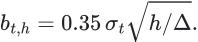

The neutral band makes direction a scale-aware definition. It is not an estimated transaction-cost hurdle, and a neutral label does not mean the book is balanced. The multiplier 0.35 is a predeclared convention inherited from the measurement contract.

Trees are used because they can represent interactions such as 'CAD weakness matters differently when US duration is falling and classified selling has weak response' without requiring us to assert a global linear coefficient. Trees do not discover causality or turn correlated forwards into independent evidence. Defaults are deliberately shallow with fixed regularization; there is no search over the held-out period.

The future-state classifier and transition prior are blended on CAL:

Alpha minimizes future-state log loss on CAL. All tree fitting occurs on TRAIN. Only these low-dimensional mixture parameters use CAL. This is a distribution pool, not an assertion that the two estimates are independent likelihoods.

The five-state representation is a candidate inductive bias. It earns its place only if the resulting path forecast adds predictive value over the direct classifier and simple controls on subsequent data.

## 11. Turn actual historical paths into comparable scenarios

Every training example must have a complete future path within the same session, contract segment and TRAIN partition. We do not bridge missing minutes or splice overnight moves into an intraday target.

Normalize each observed training path by the scale known at its start, then rescale it to the current known scale:

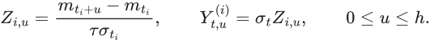

Y is in CGB ticks. This preserves the historical path's relative shape and its endpoint/adverse-excursion relationship. Each horizon has its own path bank, so a one-hour model can use later intraday examples that cannot support a four-hour horizon.

The important hypothesis is **conditional local scale transfer**: after matching observed conditions, normalized historical path shapes contain information about the current future. That assumption can fail around policy shocks, volatility transitions, delivery effects and unseen liquidity conditions. Rescaling is not proof of self-similarity or fractality.

A finite bank cannot generate a shape more extreme than its support at the current scale. Reported quantiles therefore are estimates under a restricted empirical model, not worst-case loss bounds. Historical overlap also means that hundreds of paths may represent only a few distinct sessions.

Within each horizon the forecasts are coherent. The three separate horizon banks are not a single joint 240-minute stochastic process. Cross-horizon probabilities and quantiles should not be combined as if they were sampled from one joint forecast.

## 12. Define similarity without counting duplicate witnesses

Continuous features are centered by TRAIN medians and scaled by TRAIN interquartile ranges. Constant or all-missing dimensions receive a unit numerical scale; missing values remain missing. This robust transformation limits dependence on a few extreme training observations. XGBoost sees the original feature units; the kernel uses these standardized coordinates.

Distance first averages squared differences within each economic group, then averages across jointly observed groups. Thus adding five highly related forwards does not automatically give that group five times the distance weight of CGB. This reduces one form of duplicate counting; it does not remove all redundancy, and the classifier is not constrained by the kernel's group weights.

For distance d, bandwidth b set by the 64th available neighbor, floor epsilon and session weight w,

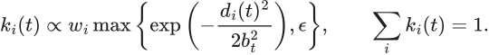

This is a smooth local empirical estimator. Sixty-four and the small kernel floor are engineering choices. The floor avoids zero support inside an observed outcome group; it does not create evidence for unseen outcomes. Current missing dimensions reduce what can be compared, so the output reports observed feature fraction and nearest distance. Those diagnostics do not themselves guarantee calibrated uncertainty under missingness.

## 13. Put all three forecasts on the same path space

The local expert assigns scenario mass k. The state expert redistributes that mass to match the future-state forecast while preserving relative local similarity within a state:

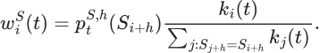

This is the law of total probability: probability of the future group times probability of the path conditional on that group. The supervised endpoint expert uses the same construction with the direct future-price class probabilities and corresponding endpoint groups. Unsupported state mass is recorded; the training gate requires all three endpoint classes in the path bank.

The final distribution is

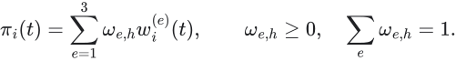

CAL endpoint log loss fits the three weights. This is interpretable as marginalizing a latent expert choice. No independence between experts is needed. Multiplying their probabilities would double-count correlated evidence unless a separate likelihood model justified that multiplication. Squaring the scores would change concentration without any observed financial measurement law requiring it.

The state blend and final mixture both use the same CAL period. That is allowed training of a small hierarchical pool, but CAL scores are not independent validation. Only untouched TEST reporting assesses the fitted combination. Short CAL histories can yield unstable weights; boundary weights are possible and do not prove permanent expert superiority.

## 14. Derive every published forecast from the final mass

Direction probabilities sum scenario mass by endpoint class. The displayed directional indicator is up probability minus down probability. Expected movement and scenario adverse excursions are

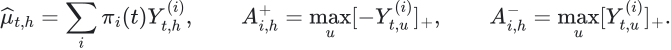

The code computes endpoint 10th/90th percentiles and long/short adverse-excursion 80th percentiles from exactly these masses. The 80th percentile is not a recommended stop; it is a quantity whose subsequent coverage and pinball loss can be measured.

Predictive class entropy, equal-weight expert disagreement, nearest distance, observed feature fraction, flow/reference availability and effective scenario count accompany the indicator:

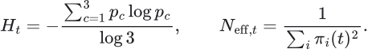

High entropy, missing inputs and expert disagreement are distinct. A neutral forecast from fresh consistent evidence differs from an uncertain forecast made with missing swaps. Effective scenario count measures weight concentration; it is emphatically not the number of independent days or a confidence interval.

No Monte Carlo is required to compute these finite weighted sums. Sampling the same bank would introduce avoidable simulation noise. A future generative model could need simulation, but it would first need its own identified dynamics and validation.

## 15. Costs are a separate mapping, with a decisive downstream role

The indicator estimates price paths. A proposed trading rule maps that information into an exposure and execution schedule. The existing `execution.py` measures the resulting bid/ask accounting separately. For a futures long crossing the spread at both ends,

Here n is contracts and V is money per price tick. A short enters at bid and exits at ask. Additional slippage is adverse price movement relative to that bid/ask convention; avoid counting the same spread twice.

Cash bonds use actual price quotes and nominal scaling, with the dirty-price/accrual convention made explicit. Paying a quoted yield spread is not the same operation as paying the executable price spread. A future-to-cash implementation also needs actual DV01, delivery/basis and bond conventions; the model does not assume cash and CGB are interchangeable units.

Costs do not alter what the future midpoint did, but they can eliminate a forecast's usefulness. A publishable trading claim needs a specified causal entry/exit rule and gross, base-cost and stress-cost results. None is claimed by a forecast-only test. Passive fill probability, queue position and market-maker RFQ terms are not inferred from a midpoint model.

## 16. Derive the test from the claim

The software claims information consistency and probability coherence. The research hypothesis claims conditional predictive information. The trading hypothesis would claim useful net results under a specific policy. These require different evidence.

| Claim | Appropriate challenge | Current status |
|---|---|---|
| Past measurements are causal | Append future data; compare historical prefix exactly | Software test implemented |
| TEST cannot select fitted parameters | Mutate future TEST prices; compare TRAIN banks, models and CAL weights | Software test implemented |
| The distribution is internally coherent | Check probability mass and path/risk identities; double scale | Software test implemented |
| Frozen deployment reproduces research inference | Save, load, forecast and compare; reject altered files | Software test implemented |
| State features add predictive information | Compare structural expert, direct expert, local expert and training-frequency prior on untouched outcomes | Reporting implemented; market evidence absent |
| Tail summaries are useful | Adverse-excursion quantile coverage and pinball loss | Reporting implemented; market evidence absent |
| Forecast survives alternative simple explanations | Persistence-only benchmark, matched event controls and time-of-day controls | Research experiment still required |
| Effect is repeatable rather than a few days | New walk-forward periods, block/session uncertainty and exposure-preserving nulls | Not certified by the one-split implementation |
| Strategy makes money after costs | Frozen trading rule with executable-side timing and stress-cost accounting | Not run; no trading policy selected |

Training/calibration/test partitions are chronological sessions. Complete labels must end inside their own retained partition. Boundary embargo is explicit. Session weighting does not repair short samples, serial dependence or repeated manual peeking. The initial defaults need at least 10 TRAIN, 3 CAL and 3 TEST sessions, but those are availability gates, not a statistical power calculation.

A four-session swap history cannot validate the month-long core model. Enable swaps in a separately declared experiment once sufficient overlap exists; compare on the same dates. Otherwise performance differences can be calendar differences masquerading as feature value.

## 17. Freeze, publish, observe consequences

Training produces a new run directory with configuration, TRAIN path banks, fitted trees, mixture weights, calibration-boundary measurement hashes, state journal and TEST diagnostics. The loader verifies file and source-code hashes. NumPy banks load without pickle. Dependency versions are recorded; the loader does not independently certify binary compatibility or authenticate a publisher.

A forecast uses the frozen transformation, bank and estimators. Its current observed state can change with incoming data, while the learned mapping remains fixed. The first implementation replays from the saved history origin and verifies the entire calibration prefix. This is intentionally simple and auditable, but not optimized for exchange-rate event throughput.

The persisted reading identifies its run and state-series hash. A read-only consumer displays it without retraining or reconstructing states. The matured feedback function evaluates only completed horizons. It never rewrites the original prediction or treats an unfinished four-hour path as an observed outcome.

That is a limited cybernetic loop: observation, forecast, subsequent discrepancy, explicit review. There is no automatic refit, broker route or order transmission. A future adaptation rule must specify its trigger, labels available at the trigger, calibration method and separate evaluation before being enabled.

## 18. Numerical decision ledger

| Choice | Initial value | Reason and limitation |
|---|---|---|
| Forecast horizons | 60, 120, 240 minutes | User's provisional one-to-four-hour objective; separate banks |
| Quote grid / decision clock | 1 / 5 minutes | Preserve path measurements while limiting repeated state decisions; not optimized |
| Scale / reference windows | 60 / 120 minutes | Past local variation and paired reference estimation; may be unstable around events |
| Momentum windows | 5, 15, 30, 60 minutes | Short response versus sustained movement; correlated by construction |
| Volatility floor | 0.25 ticks per grid step | Numerical stability in quiet observations; not a minimum economic risk |
| Direction threshold / weakening ratio | 0.75 / 0.5 | Explicit descriptive conventions, not discovered regimes |
| Endpoint neutral band | 0.35 reference horizon scales | Defines labels; independent of transaction costs |
| Transition prior count | 10 weighted examples | Shrinks sparse rows toward TRAIN state frequency; not ten independent days |
| Kernel neighbor / mass floor | 64 / 0.000001 | Smooth local matching with nonzero within-group support; no unseen-tail extrapolation |
| Aggressor coverage / maximum delay | 0.8 / 30 seconds | Require mostly classified timely flow; upstream completeness remains required |
| VWAP retreat / expiry | 0.75 five-minute scales / 20 minutes | Repeatable causal bearish recovery event; needs sensitivity study |
| Trees / depth / learning rate | 100 / 2 / 0.03 | Regularized nonlinear interaction baseline; no claim of optimality |
| Minimum child weight / L2 regularizer | 10 / 10 | Fixed additional tree regularization; measured in algorithmic units |
| Row / column subsampling | 1 / 1 | Avoid extra randomness in the initial shallow fit |
| State and expert pool weights | Fitted on CAL | Small-dimensional proper-score fitting; still vulnerable to short CAL history |
| Session gates / row gates | 10/3/3 sessions; 30 paths per split | Refuse obviously inadequate inputs; insufficient to establish significance |
| Embargo | 240 minutes | Boundary separation; actual labels are additionally purged by end time |
| Quote/context freshness | 30 seconds | Feed-specific provisional limit; not a venue guarantee |
| Rates/VWAP freshness | 300 seconds | Explicit tolerance for slower measurements; revise from actual feed semantics |
| Random seed | 20260924 for new tree heads | Reproducibility; never economic justification |
| CPU / two worker threads | Default | Portable deterministic exercise; CUDA is optional, not a scientific premise |
| Mean/quantiles and entropy | Exact finite sums | No need to sample a known finite distribution |

Legacy `ResearchConfig.efficiency_threshold` and `random_state` belong to the earlier baseline's phases/fit. The new state layer does not use its seven phase columns, and its trees use `ScenarioConfig.random_state`. Efficiency itself remains a continuous feature. This distinction prevents unused legacy controls being presented as active new-model choices.

## 19. Cognitive completion checklist

- [x] The account's exposure and forecast horizon determine the target.
- [x] Every published variable has units, timing and a defined code path.
- [x] Observed state, hypothesized mechanism and future outcome are distinct.
- [x] The source's state count, matrices and score exponents are not copied as necessities.
- [x] Continuous features remain available when a coarse state loses information.
- [x] Missing measurements remain visible; flow is not manufactured from price.
- [x] State transitions are learned at the requested horizons without an unjustified Markov power.
- [x] Direction, mean and adverse excursion share one path distribution per horizon.
- [x] Calibration and TEST have different roles; future mutation is tested.
- [x] Model and observations are versioned; a read-only consumer cannot refit them.
- [x] Bid/ask price accounting is separate and required before any profitability claim.
- [ ] Actual feeds establish complete tape, clock, calendar and contract semantics.
- [ ] New market data supports local scale transfer and useful feature relationships.
- [ ] State and flow additions beat simpler controls on matched dates.
- [ ] Repeated future periods establish stability and uncertainty at the session level.
- [ ] Event-level L2, cash-bond mapping and any automatic adaptation have their own derivations.
- [ ] A frozen execution policy survives costs, capacity and stress assumptions.

The result is a runnable research implementation with an auditable hypothesis. Its quality comes from making those unresolved questions observable, not assigning it a numerical perfection score. [The operating guide](11-running-and-testing.md) shows how to supply data and run it; [the verification record](../audits/implementation-verification.md) records what has actually been checked.
