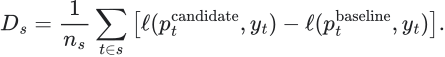

# Improving the CGB model when data arrives

This is the working research protocol for the one-to-four-hour CGB duration indicator. It combines the iteration plan with the additional questions suggested by the source framework. Those extensions are reasoned interpretations of the supplied research, not statements about what its author would personally deploy.

The loop is **observe a repeated failure, identify the assumption it challenges, derive a measurable alternative, change the smallest relevant component, and compare it on subsequent observations**. An improvement can mean removing an unnecessary feature or state. A more elaborate model is not automatically a better explanation or forecast.

The model implementation and software checks already exist. No market dataset or measured predictive edge has been supplied. The [derivation](10-structural-model-derivation.md) explains the current model; the [operating guide](11-running-and-testing.md) gives exact input schemas and commands.

## 1. Define what an improvement must accomplish

The account's object remains outright CGB duration. A common US-led selloff can be useful momentum. A Canadian residual can help explain the environment without becoming a new market-neutral mandate.

We distinguish four possible improvements:

| Objective | What must improve | What would not establish it |
|---|---|---|
| Measurement | More faithful reconstruction of what was known at each decision | A more attractive backtest produced by revised historical quotes |
| Prediction | Better future direction or movement estimates on matched observations | Recognizing a completed selloff more accurately |
| Path risk | Better estimates of adverse movement and uncertainty | A correct final direction reached through an underestimated drawdown |
| Trading use | Better results for an explicit executable policy after costs | A probability score alone |

Declare which objective a proposed change serves. A useful risk warning may leave endpoint accuracy unchanged. A better market forecast can still fail to pay its execution costs.

The horizons are 60, 120 and 240 minutes. Treat them as separate reported questions. Improvement at one horizon is not evidence of improvement at all three. If one horizon becomes the primary objective, choose it before comparing candidates and retain the others as diagnostics.

## 2. Make the first delivery a measurement audit

Keep received raw records and their revisions. Build the model's snapshots from their availability times rather than replacing old information with the final corrected tape. Record the adapter version and the actual meaning of each instrument, price, yield, trade classification and session boundary.

The first report should show, by instrument and session:

- Earliest/latest observation, valid coverage, stale observations and gaps.
- Event-time versus receiver-time delays and any clock anomalies.
- Actual futures contract, roll boundaries, quote units and crossed quotes.
- Aggressor-classification coverage and evidence of tape completeness.
- Available decision times after warmup, and complete outcomes at each horizon.
- Overlap between CGB, US duration, Canadian yields, swaps, forwards, trades and context.

A month of futures and four swap sessions are different evidence sets. Start the longer-history study using the instruments that really exist. Use the short swap sample for adapter checks and event exploration. It cannot retrospectively confirm the earlier month.

The intended configuration selects CGB, US duration and the Canadian curve. If one selected module lacks history, explicitly declare a smaller experiment. Do not silently fill absent swaps or stale yields with neutral-looking values. The current eligibility gates will reject missing training coverage for an enabled module.

**First deliverable:** a coverage report plus several replayed sessions whose quotes, features and event times agree with the source records. This comes before parameter optimization.

## 3. Freeze the first market-data run

Use the current settings to establish an identified baseline. Preserve its input cutoff, code revision, feature set, train/calibration/test dates, fitted models and forecast records. The current artifact format supports these identities and prevents overwriting a published reading.

The default minimum of 10 training, 3 calibration and 3 test sessions is a software availability gate. It is not a power calculation. Thousands of overlapping intraday predictions do not turn a few sessions into thousands of independent experiments.

At each eligible decision, preserve:

| Record | Why it matters |
|---|---|
| Actual decision time and instrument contract | Reconstruct the opportunity the model faced |
| Selected measurements and availability status | Distinguish information failure from market behavior |
| State and its age | Inspect the representation of completed history |
| Up/neutral/down probabilities | Evaluate forecasts rather than retrospective stories |
| Expected movement and adverse-excursion estimates | Judge both endpoint and route |
| Individual expert forecasts and final weights | Identify which component helped or hurt |
| Historical support diagnostics | Recognize weak matches and concentrated scenario mass |
| Complete later outcome and its maturity time | Prevent unfinished paths from becoming labels |

The present deployment saves forecasts and training/calibration states, but a consolidated live decision ledger joining every current measurement to its later outcome is a next engineering task. A forecast with no selected trade still belongs in the ledger; otherwise evaluation can become conditioned on successful-looking episodes.

## 4. Diagnose repeated discrepancies, not isolated surprises

A forecast assigning 70% probability to a decline still assigns 30% to the other outcomes. One rally does not disprove it. We look for repeatable deviations in probability calibration, path estimates or behavior under a declared condition.

| Observed pattern | Assumption under challenge | Targeted next step |
|---|---|---|
| CAD–US divergence vanishes after clock alignment | The apparent relative response was measured correctly | Repair synchronization and replay the original experiment |
| Continuous price features beat the state component repeatedly | Five states retain useful predictive structure | Compare the direct expert with and without state inputs |
| Direction is useful but adverse excursions are understated | Historical normalized paths transfer to current conditions | Examine volatility transitions, event conditions and path support |
| Forecasts are overconfident near scheduled releases | The learned probability mapping transfers across information environments | Inspect event-specific calibration using timing known in advance |
| Swaps appear useful only during their short overlap | Improvement belongs to swap information rather than the calendar | Compare both models on the same eligible dates and collect new overlap |
| Gains come from one exceptional session | The relationship repeats across environments | Report the session's contribution and examine later blocks |
| Repeated signal changes consume the forecast's gain | The chosen trading policy extracts useful movement efficiently | Diagnose turnover and delayed execution under fixed policy alternatives |
| A loss follows an unprecedented path shape | The finite scenario bank supports the current environment | Flag weak support; do not describe an empirical quantile as a maximum loss |

Do not repair every disappointing day. Record the case, identify whether it suggests a repeatable mechanism, and decide what additional observations would distinguish that mechanism from ordinary forecast uncertainty.

## 5. The additional questions suggested by the framework

The supplied research emphasizes environment, reference frames, changes in response, and a feedback process that can revise its description. The following are our CGB-specific applications of those themes.

| Principle | Question to ask of this model | What it could change |
|---|---|---|
| Exposure before signal | Does the apparent improvement serve outright duration, or merely a different residual trade? | Target and benchmark selection |
| Reference validity | Is the common/local decomposition meaningful in this interval, given paired data and relationship stability? | Reference diagnostics or an explicit unavailable state |
| Pressure versus response | Does similar observed buying or selling produce a different price response as the session evolves? | Response measurements or state descriptions |
| Multiple time scales | Does a short event reveal a persistent condition, or just a brief quote disturbance? | Aggregation and horizon-specific features |
| State sufficiency | Do two observations with the same state label have systematically different futures because of omitted history? | State age, continuous context, or a simpler representation |
| Uncertainty with memory | Does disagreement precede a change, reflect missing observations, or merely follow volatility? | A diagnostic before any proposed action rule |
| Feedback after consequences | Can a detected failure be evaluated using only matured outcomes? | A declared refit or review protocol |

These questions do not imply copying a particular state count, physical equation or numerical threshold. If an idea is called density, force, entropy or absorption, first name its observable column, units, timing and the alternative explanations it leaves unresolved.

A stationary-spread test belongs to a claim about a particular spread. Our outright momentum target does not require the CGB price level to revert to a stationary mean. For this model, important stability questions include whether normalized historical path shapes transfer, whether the reference relation remains meaningful, and whether forecast probabilities remain calibrated. The test must address the actual assumption.

## 6. Worked experiment: weakness during a supportive duration rebound

Suppose an already observed CGB selloff is followed by a US duration rebound, while CGB barely recovers. This motivates a hypothesis; it does not establish that a particular participant knows future flow.

**Proposed explanation:** a temporarily supportive common environment reveals persistent local weakness through the market's failure to respond.

**Alternatives:** stale Canadian quotes, asynchronous sampling, a changed CAD–US relationship, curve rotation, the size of the preceding selloff, or normal random variation.

**Core comparison:** after accounting for the preceding CGB move, volatility, time of day and observed US movement, does the relative recovery measurement improve subsequent CGB downside forecasts?

Define the event before examining its later outcome. The rebound threshold, comparison interval, confirmation rule and forecast horizon must all be fixed from development information. If confirmation occurs after the rebound starts, the prediction begins at confirmation. Price movement used to confirm the event cannot also be counted as forecast profit.

A useful null is conditional non-improvement. Let X contain the baseline observations, E the proposed event measurement, and Y the future CGB outcome:

This is the scientific claim being challenged. The finite experiment assesses out-of-sample predictive differences; it cannot prove exact equality or establish the event's causal mechanism.

Fit a baseline and candidate on matching training observations, calibrate both without touching the next evaluation block, and compare forecasts on identical decision times. Examine all qualifying events, including failed continuations. Also inspect non-event forecasts if the event changes the full model; improvement in a selected slice can hide deterioration elsewhere.

If alignment repair removes the effect, repair the measurement. If conditioning on ordinary momentum removes it, the event may be a redundant description. If improvement recurs on later sessions with suitable probability and path-risk behavior, retain it as a supported predictive feature with an unresolved causal interpretation.

The same derivation applies to a completed VWAP recovery failure. A line touch becomes informative only if a defined response after the touch adds something beyond the measurements already available.

## 7. Use scores that correspond to the published claims

For actual endpoint class y and predicted class probabilities p, logarithmic loss is

Lower loss rewards assigning more probability to outcomes that actually occur and penalizes confident errors. Classification accuracy alone cannot show whether a probability is calibrated. The implementation uses a numerical floor when computing logs; report and preserve that convention.

Compare candidates on matched timestamps within each session. The average loss difference within a session is

A negative session difference favors the candidate. Report the average together with the distribution across sessions, event concentrations and chronological blocks. Equal weighting by session avoids letting a denser day dominate; it does not make adjacent sessions independent. Any interval or resampling procedure must respect plausible dependence and be declared with the comparison. A small number of sessions supports limited conclusions even when the row count is large.

For an adverse-excursion quantile q at probability level a and realized excursion A, use quantile loss:

Inspect both loss and coverage. An 80th-percentile adverse-excursion forecast should cover approximately 80% of corresponding realized excursions when calibrated. Inflating every estimate can increase coverage while making the forecast unhelpfully conservative; loss helps expose that tradeoff. The estimate is not a recommended stop or a guaranteed bound.

| Forecast claim | Primary evidence | Additional interpretation |
|---|---|---|
| Direction probabilities | Log loss and Brier score | Calibration by probability range and context |
| Expected endpoint | Existing absolute-error diagnostic; add squared error to assess the conditional mean | Sign, scale and event concentration of errors |
| Adverse path | Quantile loss and coverage | Grid resolution and support limitations |
| Useful complexity | Paired comparison with simpler components | Which particular capability the added layer improves |
| Economic usefulness | Fixed-policy gross/base-cost/stress-cost results | Turnover, drawdown, exposure and session concentration |

Absolute error rewards a conditional median, whereas squared error rewards a conditional mean when the relevant moments exist. The present report's absolute error is a useful point-error diagnostic; a mean-focused comparison should add squared error and inspect sensitivity to extreme events. That addition is proposed here, not already implemented.

State classification accuracy is a diagnostic. It becomes valuable to this account when it improves the actual CGB forecast, a separately declared risk measure, or a useful warning with its own evaluation.

## 8. Keep an experiment record before running the candidate

Use one entry per hypothesis, including failures:

| Field | Required content |
|---|---|
| Identity | Experiment ID, parent run, code commit and input snapshot |
| Observed problem | A repeatable discrepancy, with supporting decision records |
| Explanation | Proposed mechanism and serious alternative explanations |
| Core claim | What new observable information should change about a future outcome |
| Change | One feature family, representation, scale rule, calibration method or policy change |
| Comparator | The frozen baseline and simpler relevant alternative |
| Dates and eligibility | Matching rows, sessions, contracts, event definition and available history |
| Decision rule | Primary score, minimum useful improvement, uncertainty treatment and permitted risk tradeoffs |
| Selection budget | Prespecified variants, parameter treatment and all comparisons to be recorded |
| Rejection conditions | Results that would make the explanation unnecessary or unsupported |
| Outcome | Retain, reject, inconclusive, or invalid because of data/implementation failure |
| Next evidence | New observations needed before changing the decision |

Choose a minimum useful improvement appropriate to the indicator's purpose before reviewing candidate results. There is no universal improvement threshold derivable from the source framework. If a layer is intended to improve risk assessment rather than direction, state that tradeoff explicitly instead of changing the success criterion afterward.

For sensitivity studies, specify a modest set of plausible settings before evaluation and examine whether conclusions survive nearby choices. Selecting the best cell after inspection is a new selection procedure that needs separate validation. An ensemble over settings is also a model: its weighting and evaluation must be declared. It does not automatically eliminate selection bias.

## 9. Preserve the boundary between development and new evidence

Once an evaluation period has influenced a redesign, it is development evidence for that redesign. Retain its results, but evaluate the revised procedure on later untouched observations. Old periods can later enter training under a protocol fixed before the next evaluation period.

For repeated chronological evaluation:

1. Declare the next training, calibration and evaluation boundaries.
2. Build measurements only from records available by each decision.
3. Fit scalers, transitions, path banks and supervised heads on TRAIN.
4. Fit the allowed probability-pooling parameters on CAL.
5. Freeze the complete candidate and baseline before the next evaluation block.
6. Publish predictions and evaluate only after each complete outcome matures.
7. Record the result and decide whether a later version is justified.

No label may cross its retained partition. Preserve purge and embargo rules. Extra hyperparameter selection, if introduced, needs earlier chronological development folds rather than an unannounced use of TEST. Evaluating many ideas against the same future block also spends that block as selection evidence; record that history.

The current code has one chronological split. Repeatedly pressing Train as files grow is not a fully specified walk-forward experiment. The first research automation to add is a runner that fixes these boundaries and stores paired candidate/baseline outputs across repeated blocks.

## 10. Establish a feedback rule before automatic adaptation

Live operation initially keeps the fitted model fixed while new observations change its current state. Accumulate outcomes only after they mature. A single losing day does not trigger automatic refitting.

Potential review signals include repeated calibration deterioration, poor historical support, changing missingness, a changed feed or contract convention, and persistent reference failure. Each signal needs a declared window, threshold, consequence and false-alarm assessment. Repeatedly testing for deterioration without accounting for repeated looks can itself manufacture alarms.

A review can lead to data repair, a temporary unavailable status, a new research candidate, or continued observation. It need not lead to a more complex model. Any abstention or exposure-reduction rule creates a selected subset of decisions; report its coverage and evaluate its effect rather than scoring only the observations it keeps.

If the account later trades at a size that changes liquidity or flow, the passive historical relationship may no longer transfer. That is a separate feedback problem requiring execution and impact observations. The current read-only indicator does not identify its own market impact.

## 11. Connect a supported forecast to execution

The permitted instruments, trading session and approximate cost scale belong in the research definition from the beginning. Detailed costed evaluation follows a fixed trading interpretation.

Specify entry delay, position handling, exit and execution side before comparing policies. For aggressive futures execution, a long enters at ask and exits at bid; the short does the reverse. Additional slippage is measured relative to that convention so spread is counted once. Cash bonds require actual price conventions and nominal/risk mapping, not substitution of a quoted yield spread.

Inspect gross results, base-cost results and a declared stress-cost schedule. Attribute a weak result to forecast error, timing, turnover, spread or slippage where the data supports that distinction. Changing the predictor and execution policy together prevents a clear account of which change helped.

Separate three outcomes: the forecast adds information; a particular execution policy captures it; the combination remains useful under the evaluated constraints. Passing the first does not prove the others, and a failed expensive policy does not by itself refute the predictive relation.

## 12. What to build next, and what is already available

| Component | Present status | Next use |
|---|---|---|
| Receiver-time inputs and measurements | Implemented | Validate against the actual feeds |
| States, path banks, trained heads and CAL mixture | Implemented | Establish the first frozen market-data run |
| Individual expert and frequency-prior comparisons | Implemented | Find which component adds information |
| Probability, endpoint and risk diagnostics | Implemented | Inspect paired session-level failures |
| Frozen save/load and immutable reading files | Implemented | Preserve every published forecast |
| Matured feedback function | Implemented | Produce a separate completed-outcome ledger |
| Consolidated decision replay | Proposed | Join current measurements, predictions and later consequences |
| Repeated chronological evaluation runner | Proposed | Compare fixed candidates across new time blocks |
| Persistence-only and matched-event controls | Proposed | Test whether extra structure adds information beyond simple momentum |
| Event-level L2 reconstruction and feed completeness | Requires feed-specific design | Study replenishment, cancellations and trustworthy flow |
| Costed trading-policy evaluation | Accounting helpers exist; policy not selected | Test a declared trading interpretation |
| Automatic retraining or broker execution | Not implemented | Requires separate evidence and an explicit operating design |

The immediate sequence after adding data is: **coverage and replay report; frozen baseline; diagnosis of systematic failures; one declared candidate; a fresh paired comparison**. Collect additional history throughout. No extension should be promoted solely because the current framework makes its story sound plausible.

## 13. Checklist for each decision to retain a change

- [ ] The change serves the CGB exposure and a declared horizon or risk objective.
- [ ] Every new input has a unit, availability time and identifiable source.
- [ ] The failure motivating the change is recorded before the candidate result.
- [ ] At least one serious alternative explanation has been examined.
- [ ] Candidate and baseline use matching eligible evaluation observations.
- [ ] Learned quantities, event thresholds and selection decisions precede the evaluation block.
- [ ] Probability improvement is separated from retrospective state recognition.
- [ ] Path risk and missing-data behavior have not been hidden by an endpoint score.
- [ ] Concentration by session/event and dependence between observations are visible.
- [ ] Parameter variants and unsuccessful experiments are retained in the record.
- [ ] Any claimed economic improvement includes a fixed policy and explicit costs.
- [ ] The conclusion is marked retained, rejected, inconclusive or invalid, with its evidence.

## Provenance

This is an independent CGB application of the supplied Fractal X essays and code by Karim Khemiri, the separately authored papers in that collection, and the [validation](https://github.com/wizzo-gmb/gitos-lenses/blob/main/quant-validation-discipline.md), [deployment ordering](https://github.com/wizzo-gmb/gitos-lenses/blob/main/causal-deployment-ordering.md), and [evidence reporting](https://github.com/wizzo-gmb/gitos-lenses/blob/main/evidence-reproducibility-reporting.md) principles published in gitos-lenses by Khem Kapital under CC BY 4.0. Source-specific inspection is recorded in [the audit](../audits/source-audit.md). The CGB examples, experiment protocol and proposed engineering additions here are our deductions; they are not claims of personal endorsement or existing market results.
