# CGB duration momentum: a structured synthetic-market research report

**Status: executed synthetic research. This is an independent report, not a report authored or endorsed by the source-framework author. No real market dataset was supplied, and no empirical trading edge is established.**

The experiment asks a concrete question: if linked Canadian and US rates markets undergo persistent repricing, changes in liquidity and occasional structural breaks, can our existing conditional-path model identify useful CGB continuation over one, two and four hours? A second question is whether useful forecasts survive price bid/ask costs and an executable timing convention.

The result is an actual run of the current package against a separately specified market simulator. It contains three base histories, three histories with persistent directional pressure removed, four frozen-model stress worlds, and one CGB-only ablation. Each history has 40 synthetic sessions, split 24/8/8 for TRAIN/CAL/TEST. All declared results are retained. The full data, forecasts, trade ledgers, fitted models and code accompany this report.

The simulator now prices a CAD/US bond ecosystem from discount curves. It includes government cash bonds, accrued interest, YTM, DV01, key-rate sensitivities, OIS, forwards, synthetic swap marks, repo carry, conversion factors, delivery baskets, futures, signed trade volume, best-level depth and contextual equity/volatility series. These are internally connected quantities, not independent random columns.

“Realistic” needs two separate meanings. **Accounting and valuation consistency can be checked now. Market calibration cannot.** The size of shocks, their persistence, bid/ask widths, execution costs and participant behavior are explicit assumptions. The histories are not reconstructions of named trading days or named firms' activity.

## 1. The first results to look at

The table below is the complete base-seed summary. Lower log loss is better. TRAIN-frequency loss is the score of a constant classifier using only the TRAIN class proportions. Nominal endpoint interval coverage is 80%. Net P&L belongs to an independent one-contract book for each horizon; those books are not combined into a portfolio.

| horizon_minutes | log_loss | baseline_log_loss | endpoint_mae_ticks | interval_80_coverage | scored |
|---|---|---|---|---|---|
| 60 | 0.952 | 1.060 | 10.123 | 0.851 | 576 |
| 120 | 0.975 | 1.012 | 17.496 | 0.827 | 480 |
| 240 | 1.132 | 1.092 | 33.430 | 0.764 | 288 |

| horizon_minutes | trades | gross_cad | net_cad | stress_net_cad | max_drawdown_cad |
|---|---|---|---|---|---|
| 60 | 41 | 4765.00 | 3656.00 | 2426.00 | 330.00 |
| 120 | 20 | 2675.00 | 2120.00 | 1520.00 | 634.00 |
| 240 | 8 | 1590.00 | 1358.00 | 1118.00 | 728.00 |

These rows should be read together. A profitable eight-session ledger does not establish calibrated probabilities. A lower average forecast loss does not establish profitable implementation. A correct terminal direction does not guarantee a tolerable path. The later sections expose each of those distinctions rather than choosing the most favorable metric.

**The main finding is narrower than “the model works.”** In all three base histories, the one- and two-hour probability forecasts beat the constant TRAIN-frequency baseline. Four-hour improvement is inconsistent, and its nominal 80% intervals can materially under-cover. The fast-decay stress produces negative one- and two-hour net results for the first seed. The model therefore demonstrates sensitivity to a continuation mechanism in these constructed worlds, while exposing fragility when persistence disappears. This supports further research, not live deployment.

| horizon_minutes | mean_loss_difference | best_difference | worst_difference | mean_interval_coverage |
|---|---|---|---|---|
| 60 | -0.106 | -0.118 | -0.091 | 0.833 |
| 120 | -0.046 | -0.094 | -0.006 | 0.819 |
| 240 | -0.003 | -0.046 | 0.040 | 0.735 |

These are three independently seeded synthetic histories under the same assumed generator. They are not three independent validations of the generator's realism. The code and chosen mechanisms can be wrong in the same way in every seed.

Open [the executed reading notebook](simulation-results.ipynb) for the tables and plots together. [All forecast metrics](metrics.csv), [all execution summaries](execution-summary.csv), [proper path scores](proper-path-scores.csv), [the configuration](resolved-config.json) and [the protocol](protocol.json) contain the machine-readable numbers behind this report.

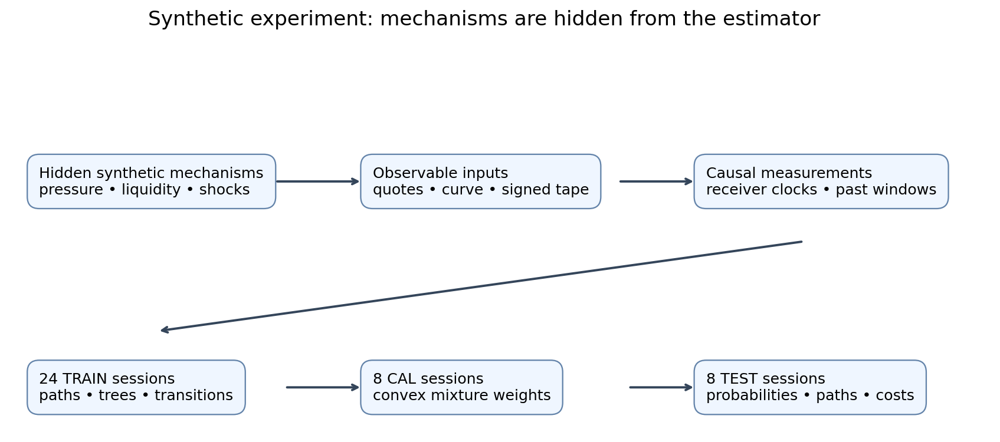

## 2. What the supplied notebook actually simulates

The supplied notebook contains two almost identical dealer/RFQ simulations. Both were executed after inspecting their source. Both reproduced the saved normal-scenario P&L of **26.113004252244%**, 289 trades from 1,231 RFQs, and final inventory of approximately **−6,437,365.34 declared inventory units**. The second version changes the expected-shortfall reporting convention; it does not change the strategy or its P&L.

That is useful evidence that the example is reproducible. It is not a CGB momentum performance estimate. The model decides what spread to quote to an RFQ customer; our model decides whether an outright duration movement is likely to continue. The objects, actions, inventory and accounting requirements differ.

The source inspection found the following material issues:

| Item | What the notebook does | Consequence |
|---|---|---|
| Inventory risk | Credits spread income and subtracts penalties, but does not mark held inventory against subsequent market prices | The equity curve is not a complete self-financing trading ledger |
| Hedging | Changes inventory through a feedback equation without an associated priced cash transaction for each adjustment | Inventory can change without the full economic cost appearing in P&L |
| Spread optimization | For a logistic hit probability, the root equation has the opposite sign from the derivative of its stated objective | The intended root is generally absent under the defaults; the grid fallback supplies the spread |
| Units | Divides a cost already expressed in basis points by RFQ notional before comparing it with a spread in basis points | The objective mixes incompatible units |
| Inventory penalty | Calls the incremental inventory-cost function after updating inventory, while that function adds the same RFQ again | The penalty references a different inventory transition from the one just executed |
| “Quantum” component | Draws a new random phase and multiplies it by the square root of the dominant return-category probability | This is an arbitrary randomized feature, not an identified market amplitude |
| “Ricci” component | Defines a matrix from minus the covariance of standardized increments | This does not establish a manifold, metric connection or Ricci curvature |
| Crisis scenario | Multiplies the evolving volatility by three every crisis tick | With the stated mean-reversion coefficient, the log-volatility fixed point is shifted by log(3)/0.04, an enormous level change |
| Tail risk | Computes a 99% daily tail statistic from only three synthetic day buckets | That cannot identify a meaningful 1% daily tail |
| Numerical failure | Resets non-finite equity to initial equity | A numerical failure can erase the visible consequence of a broken run |

For example, let p(s) be a logistic fill probability, with p′(s) = βp(s)(1−p(s)), and let c be a cost in the same spread units as s. For J(s) = p(s)(s−c), the first-order condition is:

The sign in the bracket matters. Sophisticated terminology cannot repair a wrong derivative or a missing cash flow. The copied reference notebook is preserved unchanged in [reference](reference/provided-example.ipynb); the rerun arrays and source hash are in [example-audit](example-audit/rerun.json).

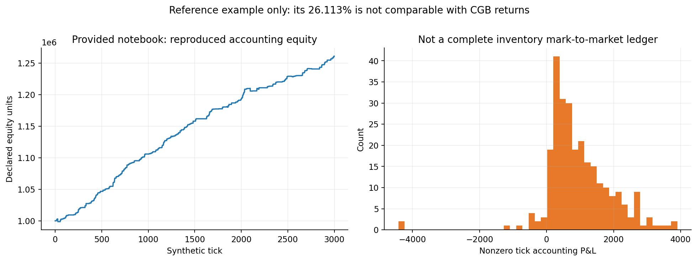

## 3. Research basis for fake data

The construction combines established valuation identities with explicitly hypothetical market dynamics. It is not calibrated by borrowing a correlation coefficient from an unrelated paper.

Bank of Canada high-frequency research finds stronger domestic-announcement effects at the short end of the Canadian curve, with US announcements increasingly relevant for longer maturities. This motivates separate domestic-policy and US/common-duration channels. It does not supply our one-minute transition coefficients. [Bank of Canada, 2025](https://www.bankofcanada.ca/2025/03/staff-analytical-note-2025-10/).

Earlier Bank research also documents US and Canadian macro-news contributions at different sampling frequencies. That supports keeping the horizon explicit: a daily or quarterly relationship cannot simply be copied into an intraday simulator. [Bank of Canada, 2018](https://www.bankofcanada.ca/2018/12/staff-analytical-note-2018-38/).

The curve family uses level, slope and curvature loadings in the Nelson–Siegel tradition. BIS documentation describes the use of this family and related extensions by central banks. We use it for smooth cross-sectional curve construction, not as proof that our physical time-series dynamics are dynamically arbitrage-free. [BIS technical documentation](https://www.bis.org/publications/paper-25-zero-coupon-yield-curves-technical-documentation).

Exchange materials explain conversion factors, deliverable baskets and cash-and-carry relationships. The CGB tick used here is 0.01 price points, worth C\$10 per contract. Our synthetic fractional-year conversion-factor calculation is deliberately simpler than the exchange's issue-specific conventions. [CGB specifications](https://www.m-x.ca/en/markets/interest-rate-derivatives/cgb), [conversion factors](https://www.m-x.ca/en/markets/interest-rate-derivatives/bond-futures-conversion-factor), [pricing manual](https://www.m-x.ca/f_publications_en/bond_futures_manual_en.pdf).

Research on learned synthetic financial time series emphasizes fat tails, volatility clustering, seasonality and dependence between price, volume and spreads. Its diffusion-model approach needs a real training distribution. With no supplied calibration sample, a transparent mechanism-based simulator lets us state assumptions and deliberately break them. A learned generator would otherwise conceal an invented training distribution behind a more elaborate model. [Takahashi and Mizuno, 2024](https://arxiv.org/abs/2410.18897).

## 4. Start with the economic coordinates

The traded object is CGB, an outright Canadian duration exposure. US rates, the Canadian curve and the tape are observations of its environment. A US-led selloff can be precisely the directional movement we want to recognize. Removing it by construction would change the research question into relative value.

The hidden simulator therefore contains separate US pressure, Canadian pressure, domestic policy slope, liquidity, volatility and temporary displacement. None of these hidden columns is passed to the forecaster. The estimator sees only the resulting prices, yields, trade aggregates and quote depths.

For the main pressure coordinates:

The base persistence is φ = 0.985 per minute, giving an impulse half-life of approximately 45.9 minutes. That is an assumption chosen to make a one-to-four-hour continuation question meaningful but uncertain. It is not an estimate from CAD flow data. The fast-decay stress changes φ to 0.65 in TEST, reducing the half-life to approximately 1.6 minutes.

Three scheduled shock opportunities occur at synthetic minutes 30, 150 and 300. The first mostly excites US pressure; the second mostly excites Canadian pressure and the domestic-policy slope; the third excites both as a common supply/risk-premium disturbance. Shock magnitudes and signs are random and fixed by seed. These are synthetic event slots, not a historical economic calendar.

The model is not told the hidden shock's sign or its mechanism. It can observe what happened afterward. The distinction matters: a simulator that feeds the shock type into the predictor and then rewards it for recognizing the same type has only tested its own labeling convention.

## 5. The Canada–US transmission mechanism

A US duration coordinate receives persistent pressure and a heavy-tailed innovation. The Canadian duration coordinate receives part of the US move, local pressure, changes in temporary displacement, and its own innovation:

In the base world β = 0.65 and γ = 0.20. In the decoupling stress, TEST uses β = −0.35 and γ = 0.40. The negative coefficient is an adversarial counterfactual: local Canadian repricing temporarily opposes the common duration move. It is not an estimate of the usual CAD–US relationship.

The innovations are standardized Student-t draws with five degrees of freedom. This produces finite variance and heavier tails than a Gaussian. It is not a claim that five degrees of freedom fits CGB. Changing this tail assumption is a future simulator sensitivity, not a parameter secretly chosen to improve the strategy.

The returned quantities above are **latent duration coordinates**. They are mapped into curve levels, and actual traded futures prices are then recomputed from bond cash flows and delivery costs. The latent coordinate is not substituted for the final CGB execution price.

The control world removes persistent directional pressure from those return equations. Volatility clustering, mean-reverting curve-shape factors, quote rounding, financing carry and nonlinear bond valuation remain. Accordingly, it is a **duration-pressure-removal control**, not a mathematical assertion that every quoted instrument is an exact zero-drift martingale after every convention. In particular, shape-factor mean reversion can still be predictable after bond repricing. A gain in this control is not, by itself, a false-positive test result; a strict traded-price martingale control would be an additional experiment.

## 6. Liquidity, order flow and absorption

Log volatility and log depth follow separate mean-reverting processes. Event impulses enter their levels; they are not multiplied into volatility every tick indefinitely. Base volatility and depth are bounded to keep the declared synthetic regime finite. The liquidity shock applies a temporary multiplier to the observation, rather than changing the recurrence into an explosive process.

Signed flow pressure is bounded:

Temporary displacement evolves as:

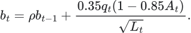

Here L is the depth multiplier, A is a hidden switching absorption mechanism, and ρ = 0.975 in the base world. Thin depth increases the same pressure's displacement. Absorption reduces it. Decay of earlier displacement can oppose current pressure. Thus “net selling” and “price falling” are connected but not synonymous.

This is the central reason to simulate mechanisms. A sell-heavy tape can accompany continuation, weak response or recovery, depending on liquidity and the accumulated displacement. The model must distinguish those combinations using observations, not a simulator label stating which answer is correct.

The tape contains two aggregate records per minute, representing buy-initiated and sell-initiated contracts at the displayed touches. It is not an event-level queue reconstruction. Book imbalance and top-of-book depth respond to the same pressure/liquidity environment. Cancellations, queue position, hidden orders and actual market-maker inventory are absent.

The model's observed absorption diagnostic uses signed classified volume P and normalized recent price response Q:

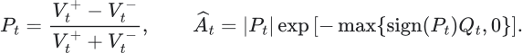

The hidden A and observed  are different things. The first is a generating mechanism; the second is a measurement that can be confounded by US moves, curve changes or noise. They are never treated as identical truth labels.

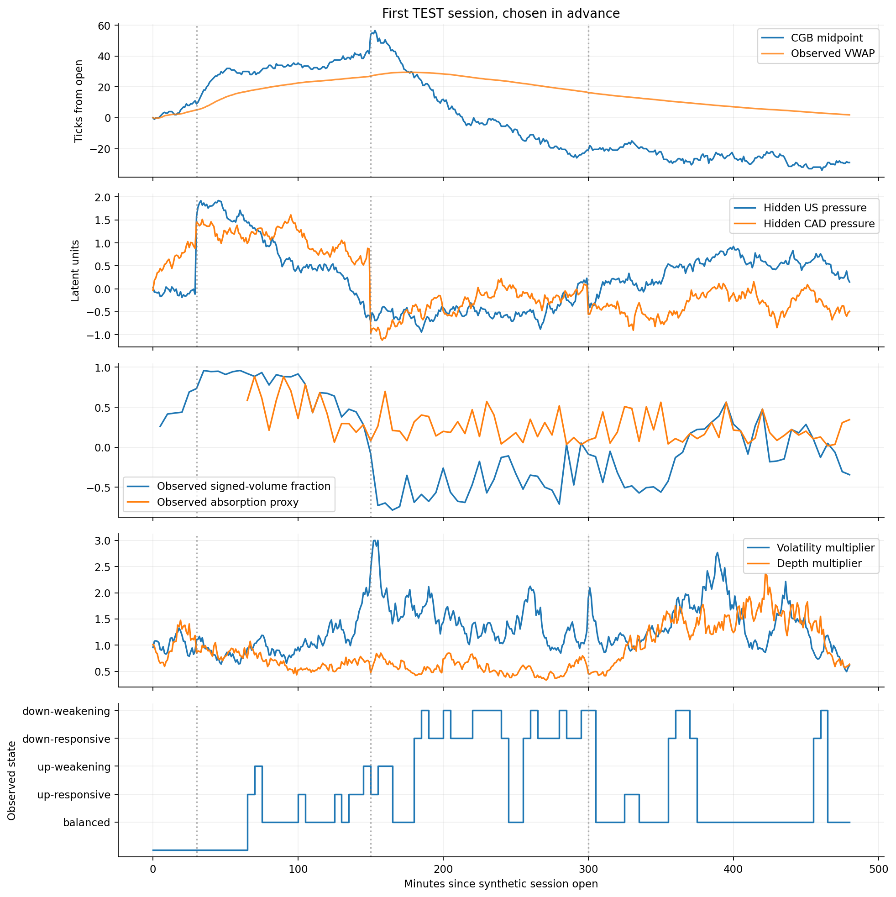

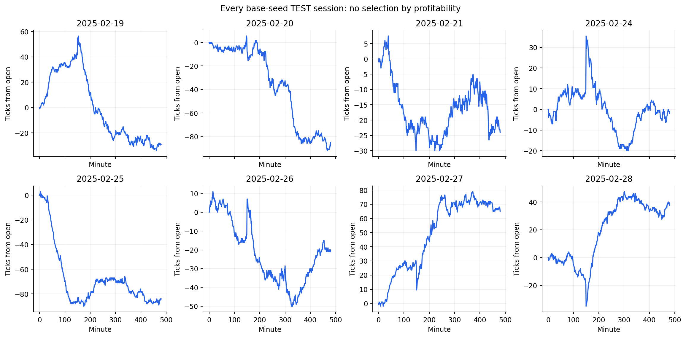

## 7. Discount curves: one source for many prices

For maturity T in years, the continuously compounded zero curve is:

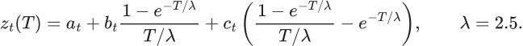

The corresponding discount factor is:

The Canadian level responds to the Canadian duration coordinate; domestic policy principally alters the slope; local pressure also changes curvature. The US has its own level/slope/curvature coordinates. OIS has a separate government–overnight basis. All numerical loadings are visible in `bond_ecosystem.py`.

Why separate curves? A government yield, an overnight discount rate and a dealer quote need not represent the same claim or liquidity. Why keep few factors? Without observed calibration data, hundreds of freely moving tenors would create arbitrary curve distortions and an enormous space of invented relationships.

The generated discount factors are checked for positivity and monotonicity across the exported maturities. Positive discount factors are a mathematical property of the exponential map; monotonicity in this experiment also depends on its parameter ranges. Neither fact proves that the physical stochastic dynamics admit a fully specified risk-neutral pricing measure.

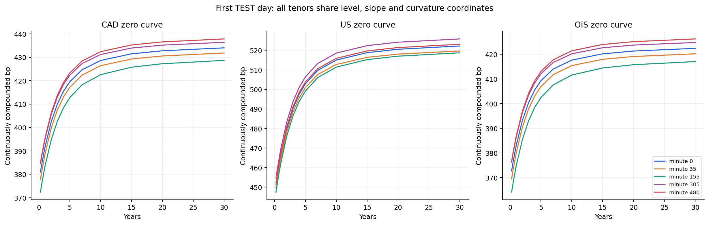

## 8. Cash bonds, accrued interest and yield

Each synthetic bond has a defined coupon, maturity and semiannual payment schedule. With cash flow CF at future time T:

Accrued interest advances between coupon dates. The first coupon in these synthetic schedules is a quarter year after the initial valuation date; subsequent coupons are half a year apart. Time is ACT/365 and fractional-year coupons are exact. These teaching conventions do not implement the full Canadian settlement calendar, ex-coupon rules or exchange rounding rules.

Quoted benchmark yields are obtained by solving the semiannual-compounding YTM equation against the dirty price:

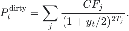

This is why a yield move and a cash P&L are not interchangeable. Yield is an inverse summary of a cash-flow price. Two bonds with the same yield change can have different price changes because their timing, coupons and sensitivities differ. The simulation trades cash bonds through clean bid/ask plus accrued interest; it never subtracts a quoted yield spread directly from dollar P&L.

The basket contains Canadian 2-, 5- and 10-year benchmark bonds, two CGZ deliverables, two CGF deliverables, three CGB deliverables, US 2/5/10-year cash benchmarks and two synthetic US10 deliverables. These securities are fictional, with explicit parameters. The model does not claim they are an actual exchange delivery basket.

## 9. DV01 and key-rate exposure

Parallel DV01 is computed by bumping the entire relevant zero curve down and up by one basis point and repricing every cash flow:

The factor 1000 converts a price quoted per 100 face into currency for 100,000 face. This is a curve DV01, with its bump convention explicitly specified; it is not silently equated to a yield-to-maturity derivative.

Key-rate sensitivities use triangular 2-, 5- and 10-year bump functions that partition the curve. Their sum agrees closely with parallel DV01, with the small finite-bump nonlinearity retained. Convexity is also computed from symmetric curve bumps. This lets us detect unit mistakes and exposure mismatches before discussing an alpha score.

For a cash-bond implementation matched to one futures contract's entry DV01:

That matches one local parallel sensitivity. It does not make a 10-year benchmark identical to the futures' CTD bond: key-rate exposure, convexity, basis and financing still differ.

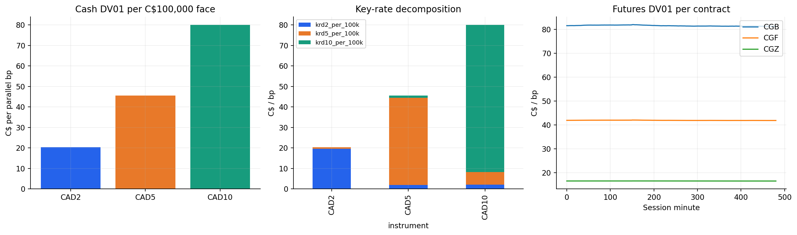

## 10. Repo, coupons and the futures delivery basket

For deliverable i, repo rate r, time to delivery Δ, conversion factor CF and delivery accrued interest AI, the cash-and-carry delivery cost is:

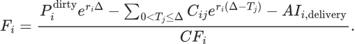

The coupon term matters. Financing the dirty cash price until delivery and forgetting coupon receipts overstates the forward cost. Subtracting clean accrued interest at the wrong date creates another hidden mismatch.

The synthetic futures fair value is the minimum delivery cost across the declared candidates:

Conversion factors are computed once from the delivery-date clean price at a 6% semiannual yield, divided by 100. Repo includes a small assumed specialness adjustment for candidate A. Futures DV01 reprices the whole basket after parallel curve bumps while holding repo fixed, allowing the identity of the minimum to change.

This models a single deterministic delivery date and a cash-and-carry minimum. It does not price wildcard, timing or quality-option uncertainty as a full stochastic delivery-option model. Actual exchange conventions and issue-specific eligibility would replace these assumptions before real deployment.

The report includes a separate large parallel-curve stress to show the competing delivery-cost curves. That is a valuation test, not another alpha backtest selected for a good return.

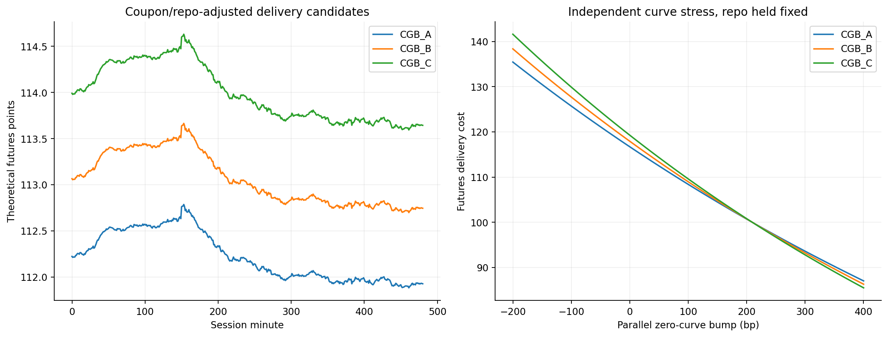

## 11. OIS, swaps and forwards

Annual-payment OIS par rates are calculated from the same OIS discount curve:

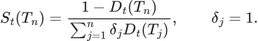

The 1y1y and 2y1y rates use discount-factor ratios. For a one-year forward interval:

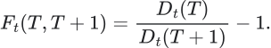

Those are annual effective forward rates, expressed in basis points in the exported table. They are not the continuously compounded identity 2z(2)−z(1), although the two are closely related at small rates.

The synthetic SWAP marks refer to the same simplified overnight cash flows as OIS, so their fair values coincide. We do not invent a legacy floating-rate credit curve and pretend it describes today's Canadian swap convention. Dealer spread differences, actual CORRA compounding, payment lags and collateral agreements would require a richer adapter and actual instrument definitions.

Complete theoretical curves exist inside the simulator. Only the final four sessions of OIS/swap/forward observations are exposed through the feed. That reproduces your unequal-history problem: underlying theoretical values are not permission to backfill observations that the model never received. These modules are therefore excluded from the fitted predictor in this experiment. Their full fair-value table is a hidden audit artifact, not a feature table.

## 12. What is actually observed, and when

The synthetic account session is 08:00–16:00 New York time with 481 one-minute grid points. It is an explicitly chosen operating window, not the full exchange session. Dates are synthetic weekday labels and do not claim holiday-calendar accuracy. Positions are flat inside each declared session; no overnight trade is inferred from a four-hour forecast.

Except at session open, quotes and trade aggregates have event time one second before the decision grid and arrival time 0.65 seconds before it. The base event-to-arrival latency is therefore 0.35 seconds. This gives the model a completed observation at the grid boundary without seeing the next minute.

The adapter selects the newest event actually available at each receiver time. It preserves freshness limits, contract identity and unavailable data. Late older messages cannot rewind the current quote. The feed-gap stress delays US quotes by 90 seconds and trade aggregates by 60 seconds during a scheduled window, and omits ten consecutive CGB quote minutes each TEST day.

The simulator still knows latent prices during an outage. The research evaluator is intentionally denied those prices. Otherwise a supposedly robust missing-data backtest would quietly score a path using information that the actual feed could not provide.

The SPX/VIX-like context series share macro conditions with rates, with opposite stock/rate interpretations for growth versus inflation themes. They are generated and exported, but not selected as predictors. They are not option-surface calculations or a reconstruction of the official VIX methodology.

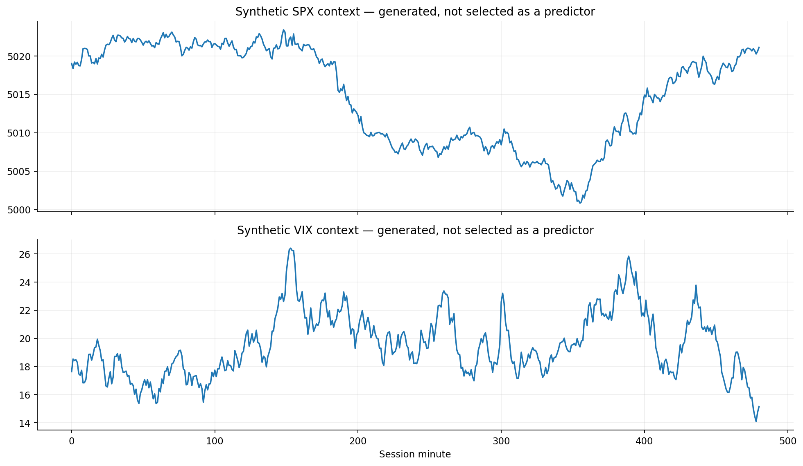

## 13. The forecaster being tested

The archived `model_snapshot/momentum` implementation, copied unchanged from `src/momentum`, is used without changing its model parameters in response to simulation performance. Enabled inputs are CGB, US duration, Canadian curve, best-level book and observed VWAP, plus signed-flow measurements when sufficiently covered in TRAIN.

The first layer transforms observations into quantities with a defined meaning: trailing volatility in ticks, multi-window normalized movement, path efficiency, range position, volatility ratios, common/local duration movement, curve changes, book imbalance, VWAP distance, and pressure/response diagnostics. Rolling reference coefficients and volatility estimates use past information; full-sample standardization is not used.

The next layer describes five observable states: balanced, up-responsive, up-weakening, down-responsive and down-weakening. State labels summarize completed price behavior. They are not the simulator's causes. For example, a down-weakening description can arise from absorption, a US recovery, an exhausted local shock or noise.

TRAIN contains complete historical future paths normalized by the local past volatility. Two shallow XGBoost classifiers learn future observed state and future endpoint class. An empirical state-transition matrix supplies a second estimate of future state. The tree settings remain 100 trees, depth 2, learning rate 0.03, minimum child weight 10 and L2 regularization 10.

The neighbor calculation uses TRAIN medians and interquartile ranges, then averages distance within economic feature groups so that many correlated curve columns do not automatically count as many independent witnesses. Missing groups remain missing; the model publishes a coverage diagnostic.

The path bank produces three distributions over the same set of normalized TRAIN paths: local-neighbor, future-state-conditioned, and endpoint-class-conditioned. A group-conditioned distribution follows:

CAL selects a blend of the two state forecasts and a convex mixture of the three path experts:

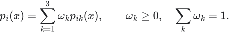

Exact finite sums are used for the resulting distribution. Drawing thousands of Monte Carlo paths from an already enumerated bank would introduce avoidable sampling noise. Monte Carlo randomness belongs in the generation of alternative market histories here; it is not required to calculate a finite weighted mean.

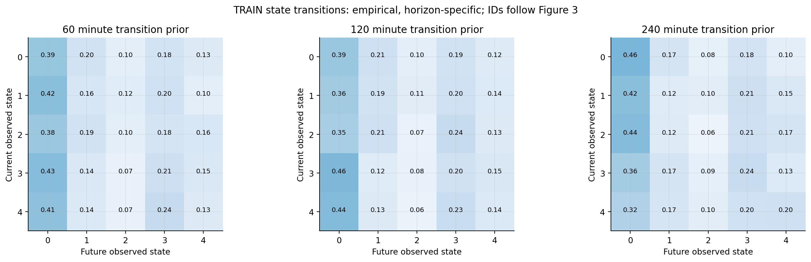

| run | horizon_minutes | state_ml_weight | local_weight | structural_weight | supervised_weight | train_paths |
|---|---|---|---|---|---|---|
| base-1729 | 60 | 0.782 | 0.000 | 0.000 | 1.000 | 1728 |
| base-1729 | 120 | 0.734 | 0.000 | 0.228 | 0.772 | 1440 |
| base-1729 | 240 | 0.000 | 0.000 | 0.323 | 0.677 | 864 |
| null-1729 | 60 | 0.112 | 0.000 | 0.557 | 0.443 | 1728 |
| null-1729 | 120 | 0.344 | 0.000 | 0.642 | 0.358 | 1440 |
| null-1729 | 240 | 0.055 | 0.000 | 1.000 | 0.000 | 864 |
| base-2718 | 60 | 0.136 | 0.000 | 0.000 | 1.000 | 1728 |
| base-2718 | 120 | 0.242 | 0.000 | 0.524 | 0.476 | 1440 |
| base-2718 | 240 | 0.404 | 0.000 | 0.859 | 0.141 | 864 |
| null-2718 | 60 | 0.193 | 0.321 | 0.000 | 0.679 | 1728 |
| null-2718 | 120 | 0.000 | 0.376 | 0.000 | 0.624 | 1440 |
| null-2718 | 240 | 0.018 | 0.928 | 0.000 | 0.072 | 864 |
| base-3141 | 60 | 1.000 | 0.000 | 0.000 | 1.000 | 1728 |
| base-3141 | 120 | 0.100 | 0.000 | 0.000 | 1.000 | 1440 |
| base-3141 | 240 | 0.455 | 0.000 | 1.000 | 0.000 | 864 |
| null-3141 | 60 | 0.314 | 0.000 | 0.862 | 0.138 | 1728 |
| null-3141 | 120 | 0.000 | 0.530 | 0.000 | 0.470 | 1440 |
| null-3141 | 240 | 0.593 | 0.000 | 1.000 | 0.000 | 864 |

A weight at zero or one is a legitimate outcome of the constrained CAL objective. It does not mean that the omitted expert is universally useless or that the selected one is physically correct. Eight calibration sessions can select an expert that subsequently loses to another on TEST. We report all original expert metrics inside each frozen-model directory.

## 14. Forecasts and their meaning

For a selected horizon, all directional and path statistics come from its one path distribution. The indicator is:

It lies between −1 and +1. It is neither expected P&L nor a probability of profitable execution. Endpoint classes use a neutral band of 0.35 times current past volatility times the square root of horizon minutes.

The same path weights produce the expected endpoint, 10th/90th endpoint quantiles and 80th-percentile adverse-excursion bounds for long and short exposures. Adverse excursion for direction d is:

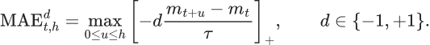

An endpoint quantile band is not a bound on the whole path. Even a pointwise fan chart at every minute is not a simultaneous 80% path guarantee. The path-risk quantile and its observed coverage must be assessed separately.

The illustrated fan is fixed at minute 190 of the first TEST session before seeing its result. It includes the actual future realization. Independent models at 60, 120 and 240 minutes can disagree; they do not form a single joint multi-horizon stochastic process.

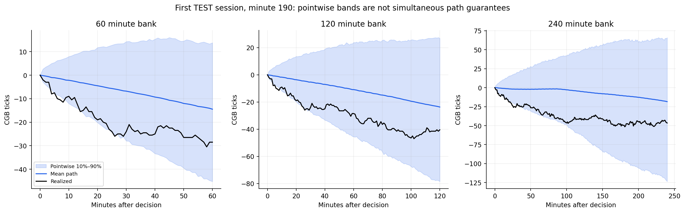

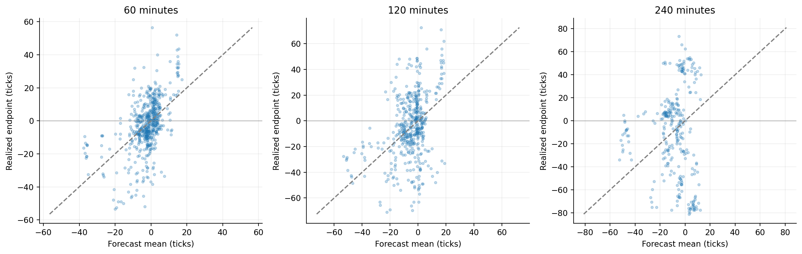

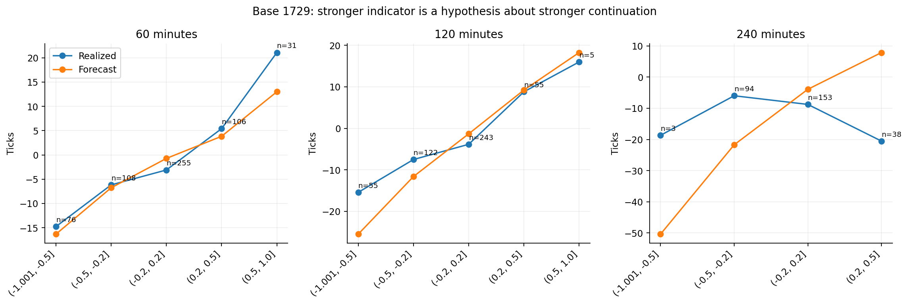

## 15. Chronology and the experiment grid

The seeds are 1729, 2718 and 3141. Each gets a complete base history and a complete no-persistent-pressure control. The first base seed additionally supplies the four paired stresses and a CGB-only ablation. Stress histories are identical to the base history throughout TRAIN and CAL, including their received observations. The base fitted model is reused without retraining.

| World | Change | Question |
|---|---|---|
| Base × 3 | Persistent common/local pressure, switching absorption and stochastic liquidity | Can the model recognize continuation in this assumed world? |
| No-persistent-pressure × 3 | Remove persistent pressure from duration-coordinate increments | Does the method manufacture apparent structure when that mechanism is absent? |
| Fast decay | TEST pressure persistence 0.65 and faster displacement relaxation | What if the learned persistence stops lasting long enough? |
| Liquidity shock | TEST minutes 130–250: volatility ×2.5, depth ×0.25, wider spreads and an additional shock | What happens when the return path and execution costs deteriorate together? |
| Decoupling | TEST common coefficient changes sign and local coefficient strengthens | Does a stable historical reference relationship become misleading? |
| Feed gaps | Delayed reference/tape messages and missing CGB quote blocks | Are unknown inputs and unobservable outcomes kept visible? |
| CGB-only | Refit on CGB price features and observed states, without flow/environment modules | Does the added environment improve this particular experiment? |

The 240-minute boundary embargo is present, but the overnight separation between these sessions is longer, so session partitioning supplies the effective separation. Every training target must end inside TRAIN, and every calibration target inside CAL. Test returns do not choose parameters, weights, thresholds or displayed sessions.

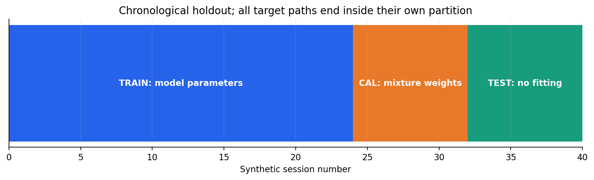

## 16. Market diagnostics: does the generated tape have structure?

The first-seed history has the following measured properties, before asking whether the model makes money:

| statistic | realized_sigma_ticks | range_ticks | move_ticks | lag1_return_acf | lag1_absolute_acf |
|---|---|---|---|---|---|
| mean | 1.475 | 74.513 | -13.875 | -0.018 | 0.068 |
| min | 1.151 | 37.000 | -139.000 | -0.190 | -0.034 |
| max | 2.307 | 153.000 | 73.000 | 0.097 | 0.216 |

The diagnostics examine return tails, volatility clustering, within-session autocorrelation, depth/spread relationships and correlations between feature families. Overnight jumps are excluded from one-minute return calculations. Curve outputs and forwards are redundant measurements of common latent coordinates; strong correlations are expected and are not evidence of independent confirmation.

The simulator deliberately contains intraday events and common market drivers. It does not yet reproduce empirically estimated time-of-day volume seasonality, real auction calendars, order-size distributions, exact trade interarrival times, queue cancellation dynamics, contract rolls or delivery optionality. Those omissions define the next calibration work rather than disappearing behind a claim of realism.

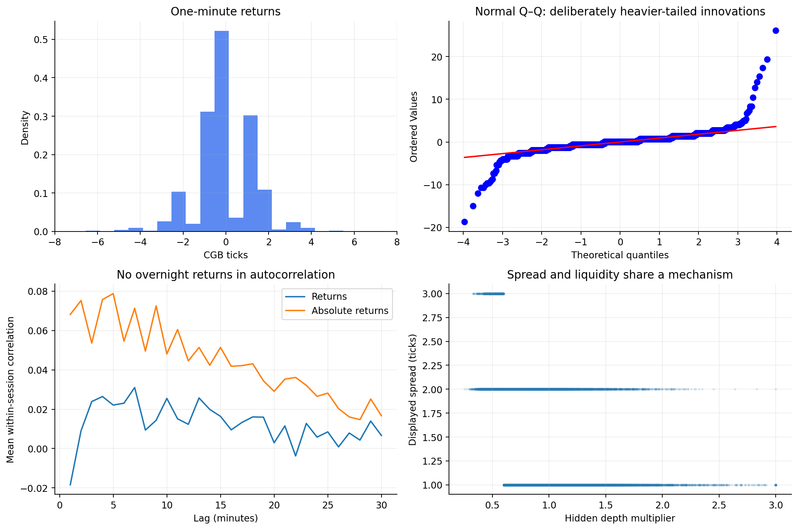

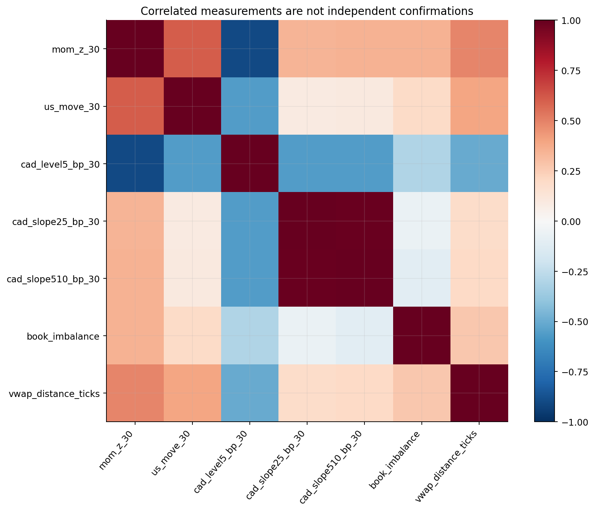

## 17. Forecast quality: every declared result

Log loss evaluates the probability assigned to the event that actually occurred. Brier score evaluates squared probability error across all three classes. Endpoint MAE and RMSE evaluate magnitude forecasts. Interval coverage is accompanied by width and an interval score in the downloadable tables, so an unnecessarily wide band cannot claim success from coverage alone.

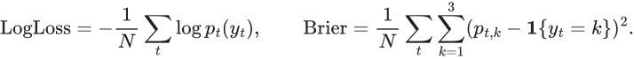

In implementation, each included session receives equal total weight. Forecasts issued five minutes apart overlap heavily, especially at four hours. They are not hundreds of independent trials. The uncertainty whiskers resample the eight TEST sessions as blocks and are descriptive, conditional on the frozen fit and this synthetic world. They do not account for all model-selection uncertainty or dependence across real trading days.

| run | horizon_minutes | scored | log_loss | baseline_log_loss | loss_difference | brier | endpoint_rmse_ticks |
|---|---|---|---|---|---|---|---|
| base-1729 | 60 | 576 | 0.952 | 1.060 | -0.108 | 0.564 | 13.537 |
| base-1729 | 120 | 480 | 0.975 | 1.012 | -0.037 | 0.586 | 23.029 |
| base-1729 | 240 | 288 | 1.132 | 1.092 | 0.040 | 0.692 | 40.366 |
| cgb_only-1729 | 60 | 576 | 1.023 | 1.060 | -0.037 | 0.613 | 14.832 |
| cgb_only-1729 | 120 | 480 | 0.996 | 1.012 | -0.016 | 0.599 | 23.605 |
| cgb_only-1729 | 240 | 288 | 1.052 | 1.092 | -0.040 | 0.632 | 37.565 |
| fast_decay-1729 | 60 | 576 | 1.127 | 1.145 | -0.018 | 0.681 | 9.941 |
| fast_decay-1729 | 120 | 480 | 1.267 | 1.234 | 0.033 | 0.761 | 14.798 |
| fast_decay-1729 | 240 | 288 | 1.267 | 1.235 | 0.032 | 0.774 | 27.752 |
| liquidity_shock-1729 | 60 | 576 | 1.012 | 1.096 | -0.084 | 0.606 | 21.835 |
| liquidity_shock-1729 | 120 | 480 | 1.047 | 1.111 | -0.064 | 0.633 | 37.632 |
| liquidity_shock-1729 | 240 | 288 | 1.129 | 1.139 | -0.009 | 0.682 | 58.348 |
| decoupling-1729 | 60 | 576 | 0.958 | 1.002 | -0.044 | 0.573 | 16.492 |
| decoupling-1729 | 120 | 480 | 0.976 | 0.966 | 0.010 | 0.592 | 29.229 |
| decoupling-1729 | 240 | 288 | 1.172 | 1.140 | 0.032 | 0.719 | 42.052 |
| feed_gaps-1729 | 60 | 360 | 0.990 | 1.080 | -0.090 | 0.593 | 11.384 |
| feed_gaps-1729 | 120 | 168 | 1.068 | 1.087 | -0.020 | 0.646 | 16.977 |
| feed_gaps-1729 | 240 | 0 | n/a | n/a | n/a | n/a | n/a |
| null-1729 | 60 | 576 | 1.088 | 1.088 | -0.000 | 0.661 | 10.787 |
| null-1729 | 120 | 480 | 1.093 | 1.087 | 0.006 | 0.666 | 14.262 |
| null-1729 | 240 | 288 | 1.055 | 1.060 | -0.005 | 0.640 | 22.260 |
| base-2718 | 60 | 576 | 0.975 | 1.093 | -0.118 | 0.580 | 14.557 |
| base-2718 | 120 | 480 | 1.017 | 1.111 | -0.094 | 0.612 | 29.140 |
| base-2718 | 240 | 288 | 1.081 | 1.126 | -0.046 | 0.669 | 58.287 |
| null-2718 | 60 | 576 | 1.089 | 1.098 | -0.009 | 0.661 | 11.397 |
| null-2718 | 120 | 480 | 1.115 | 1.122 | -0.007 | 0.677 | 15.680 |
| null-2718 | 240 | 288 | 1.124 | 1.143 | -0.019 | 0.686 | 24.090 |
| base-3141 | 60 | 576 | 0.984 | 1.075 | -0.091 | 0.589 | 15.277 |
| base-3141 | 120 | 480 | 1.007 | 1.013 | -0.006 | 0.608 | 25.488 |
| base-3141 | 240 | 288 | 1.078 | 1.080 | -0.002 | 0.650 | 51.994 |
| null-3141 | 60 | 576 | 1.082 | 1.096 | -0.014 | 0.656 | 12.887 |
| null-3141 | 120 | 480 | 1.115 | 1.095 | 0.020 | 0.677 | 17.135 |
| null-3141 | 240 | 288 | 1.102 | 1.104 | -0.002 | 0.669 | 22.266 |

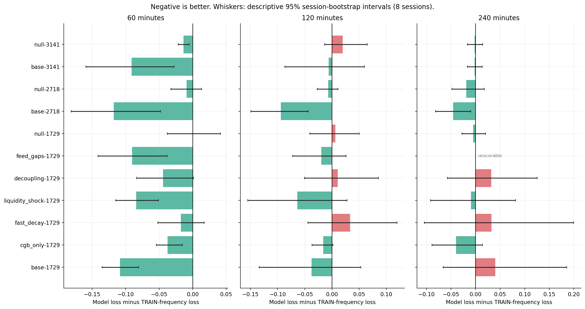

The constant TRAIN-frequency baseline asks whether conditioning improves on the historical class mix. The zero endpoint forecast, simple momentum execution policy and always-long/always-short ledgers answer different questions. No single baseline is sufficient, and their roles are kept explicit.

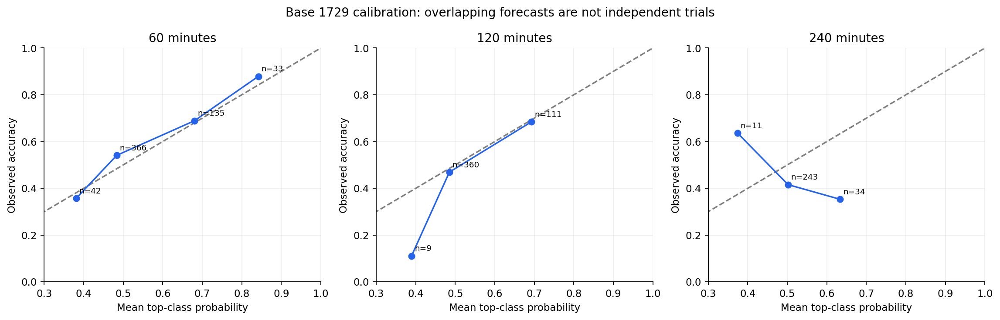

| run | horizon_minutes | interval_80_coverage | interval_80_width | long_mae80_coverage | short_mae80_coverage |
|---|---|---|---|---|---|
| base-1729 | 60 | 0.851 | 38.663 | 0.868 | 0.826 |
| base-1729 | 120 | 0.827 | 67.876 | 0.883 | 0.779 |
| base-1729 | 240 | 0.764 | 120.402 | 0.764 | 0.885 |
| cgb_only-1729 | 60 | 0.858 | 43.963 | 0.870 | 0.825 |
| cgb_only-1729 | 120 | 0.856 | 72.137 | 0.890 | 0.802 |
| cgb_only-1729 | 240 | 0.788 | 125.274 | 0.830 | 0.872 |
| fast_decay-1729 | 60 | 0.950 | 41.839 | 0.913 | 0.922 |
| fast_decay-1729 | 120 | 0.992 | 70.817 | 0.946 | 0.960 |
| fast_decay-1729 | 240 | 0.958 | 122.865 | 0.903 | 0.997 |
| liquidity_shock-1729 | 60 | 0.826 | 52.511 | 0.863 | 0.811 |
| liquidity_shock-1729 | 120 | 0.794 | 95.295 | 0.865 | 0.800 |
| liquidity_shock-1729 | 240 | 0.736 | 171.015 | 0.826 | 0.844 |
| decoupling-1729 | 60 | 0.759 | 35.814 | 0.830 | 0.738 |
| decoupling-1729 | 120 | 0.696 | 64.008 | 0.852 | 0.669 |
| decoupling-1729 | 240 | 0.729 | 115.787 | 0.830 | 0.788 |
| feed_gaps-1729 | 60 | 0.872 | 34.291 | 0.875 | 0.858 |
| feed_gaps-1729 | 120 | 0.929 | 61.220 | 0.952 | 0.875 |
| feed_gaps-1729 | 240 | n/a | n/a | n/a | n/a |
| null-1729 | 60 | 0.847 | 30.114 | 0.821 | 0.839 |
| null-1729 | 120 | 0.792 | 38.164 | 0.787 | 0.810 |
| null-1729 | 240 | 0.691 | 47.706 | 0.726 | 0.837 |
| base-2718 | 60 | 0.785 | 39.766 | 0.757 | 0.856 |
| base-2718 | 120 | 0.750 | 74.302 | 0.694 | 0.858 |
| base-2718 | 240 | 0.618 | 115.055 | 0.684 | 0.878 |
| null-2718 | 60 | 0.774 | 28.155 | 0.811 | 0.847 |
| null-2718 | 120 | 0.731 | 36.418 | 0.756 | 0.844 |
| null-2718 | 240 | 0.733 | 59.163 | 0.781 | 0.819 |
| base-3141 | 60 | 0.863 | 46.146 | 0.844 | 0.778 |
| base-3141 | 120 | 0.881 | 77.250 | 0.858 | 0.835 |
| base-3141 | 240 | 0.823 | 122.674 | 0.885 | 0.823 |
| null-3141 | 60 | 0.788 | 32.241 | 0.852 | 0.750 |
| null-3141 | 120 | 0.838 | 46.030 | 0.869 | 0.746 |
| null-3141 | 240 | 0.809 | 66.840 | 0.920 | 0.632 |

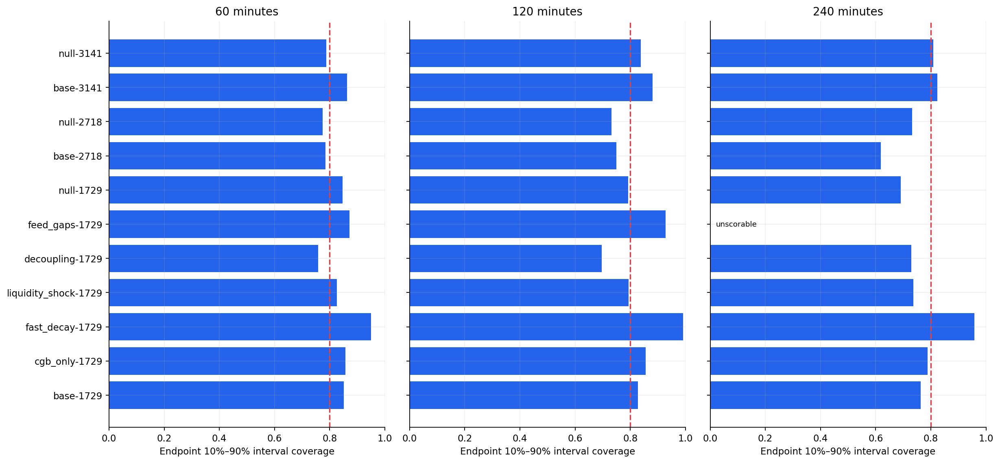

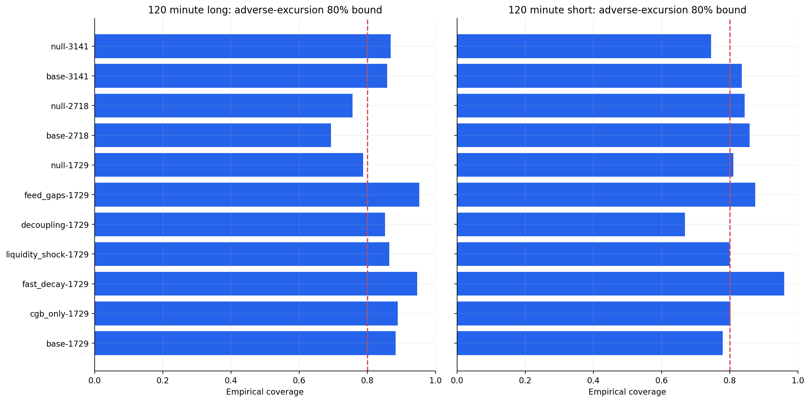

Risk quantiles are not separately calibrated to guarantee 80% coverage. CAL optimizes endpoint class log loss. If adverse-excursion coverage is poor, that is a substantive model limitation, not something to hide by renaming the quantile a confidence bound. The saved pinball and interval scores make this visible.

## 18. Execution: costs are a separate model with real consequences

The fixed demonstration policy considers a trade when the absolute indicator is at least 0.20 and the forecast mean agrees with its direction and exceeds the current displayed spread plus 1.4 ticks. The 1.4 ticks represent the assumed one-tick roundtrip additional slippage and C\$4 roundtrip fees. This rule is declared in advance and is not optimized on TEST.

The entry uses the next one-minute quote after the decision. The exit is at the original forecast expiry, so a 60-minute forecast creates a nominal 59-minute holding period after the delayed entry. Each horizon is an independent one-contract book with no overlapping positions inside that book. Simple momentum uses a fixed 0.75 threshold on normalized 30-minute movement; the long-only and short-only controls use the same eligible decision schedule but do not match every model trade time.

For a long and a short:

The spread is already paid through the entry/exit touches and is not subtracted a second time. C adds only explicit fees and additional adverse slippage. The base ledger uses one additional tick roundtrip; the cost stress uses four, reducing each completed trade's P&L by another C\$30. Neither assumption is a broker quote or an estimated impact function.

Positions are marked minute by minute to the liquidation-side touch. With an unavailable quote the ledger carries the last available mark and flags the data scenario; within-gap excursions can therefore be understated. Missing entry quotes reject the entry. A missing exit quote seeks the first fresh quote within five minutes and the session; otherwise it is recorded as an unpriced open trade. **The entire affected book's aggregate P&L and drawdown are then unavailable.** A sum of its other completed trades is retained only as `priced_subset_net_cad`, not as the book's return. The feed-gap one-hour results trigger this condition. This is a deliberate execution failure, not a zero-dollar trade.

| run | horizon_minutes | strategy | trades | net_cad | stress_net_cad | max_drawdown_cad | unpriced_trades |
|---|---|---|---|---|---|---|---|
| base-1729 | 60 | always_long | 48 | -2602.00 | -4042.00 | 3532.00 | 0 |
| base-1729 | 60 | always_short | 48 | -32.00 | -1472.00 | 1615.00 | 0 |
| base-1729 | 60 | model | 41 | 3656.00 | 2426.00 | 330.00 | 0 |
| base-1729 | 60 | simple_momentum | 39 | -816.00 | -1986.00 | 1230.00 | 0 |
| base-1729 | 120 | always_long | 24 | -1896.00 | -2616.00 | 3028.00 | 0 |
| base-1729 | 120 | always_short | 24 | 524.00 | -196.00 | 1360.00 | 0 |
| base-1729 | 120 | model | 20 | 2120.00 | 1520.00 | 634.00 | 0 |
| base-1729 | 120 | simple_momentum | 22 | 1332.00 | 672.00 | 718.00 | 0 |
| base-1729 | 240 | always_long | 8 | -1092.00 | -1332.00 | 2374.00 | 0 |
| base-1729 | 240 | always_short | 8 | 658.00 | 418.00 | 1134.00 | 0 |
| base-1729 | 240 | model | 8 | 1358.00 | 1118.00 | 728.00 | 0 |
| base-1729 | 240 | simple_momentum | 8 | -162.00 | -402.00 | 1876.00 | 0 |
| cgb_only-1729 | 60 | always_long | 48 | -2602.00 | -4042.00 | 3532.00 | 0 |
| cgb_only-1729 | 60 | always_short | 48 | -32.00 | -1472.00 | 1615.00 | 0 |
| cgb_only-1729 | 60 | model | 16 | 2326.00 | 1846.00 | 292.00 | 0 |
| cgb_only-1729 | 60 | simple_momentum | 39 | -816.00 | -1986.00 | 1230.00 | 0 |
| cgb_only-1729 | 120 | always_long | 24 | -1896.00 | -2616.00 | 3028.00 | 0 |
| cgb_only-1729 | 120 | always_short | 24 | 524.00 | -196.00 | 1360.00 | 0 |
| cgb_only-1729 | 120 | model | 11 | 1666.00 | 1336.00 | 278.00 | 0 |
| cgb_only-1729 | 120 | simple_momentum | 22 | 1332.00 | 672.00 | 718.00 | 0 |
| cgb_only-1729 | 240 | always_long | 8 | -1092.00 | -1332.00 | 2374.00 | 0 |
| cgb_only-1729 | 240 | always_short | 8 | 658.00 | 418.00 | 1134.00 | 0 |
| cgb_only-1729 | 240 | model | 6 | 1126.00 | 946.00 | 830.00 | 0 |
| cgb_only-1729 | 240 | simple_momentum | 8 | -162.00 | -402.00 | 1876.00 | 0 |
| fast_decay-1729 | 60 | always_long | 48 | -2152.00 | -3592.00 | 2338.00 | 0 |
| fast_decay-1729 | 60 | always_short | 48 | -482.00 | -1922.00 | 1128.00 | 0 |
| fast_decay-1729 | 60 | model | 22 | -538.00 | -1198.00 | 898.00 | 0 |
| fast_decay-1729 | 60 | simple_momentum | 40 | -2570.00 | -3770.00 | 2830.00 | 0 |
| fast_decay-1729 | 120 | always_long | 24 | -1506.00 | -2226.00 | 1964.00 | 0 |
| fast_decay-1729 | 120 | always_short | 24 | 134.00 | -586.00 | 752.00 | 0 |
| fast_decay-1729 | 120 | model | 17 | -288.00 | -798.00 | 746.00 | 0 |
| fast_decay-1729 | 120 | simple_momentum | 20 | -1110.00 | -1710.00 | 1834.00 | 0 |
| fast_decay-1729 | 240 | always_long | 8 | -702.00 | -942.00 | 1218.00 | 0 |
| fast_decay-1729 | 240 | always_short | 8 | 268.00 | 28.00 | 494.00 | 0 |
| fast_decay-1729 | 240 | model | 8 | 188.00 | -52.00 | 754.00 | 0 |
| fast_decay-1729 | 240 | simple_momentum | 8 | 38.00 | -202.00 | 954.00 | 0 |
| liquidity_shock-1729 | 60 | always_long | 48 | -3162.00 | -4602.00 | 4499.00 | 0 |
| liquidity_shock-1729 | 60 | always_short | 48 | -552.00 | -1992.00 | 2438.00 | 0 |
| liquidity_shock-1729 | 60 | model | 39 | 3994.00 | 2824.00 | 379.00 | 0 |
| liquidity_shock-1729 | 60 | simple_momentum | 38 | -82.00 | -1222.00 | 1420.00 | 0 |
| liquidity_shock-1729 | 120 | always_long | 24 | -2356.00 | -3076.00 | 3888.00 | 0 |
| liquidity_shock-1729 | 120 | always_short | 24 | 304.00 | -416.00 | 2060.00 | 0 |
| liquidity_shock-1729 | 120 | model | 20 | -500.00 | -1100.00 | 2462.00 | 0 |
| liquidity_shock-1729 | 120 | simple_momentum | 20 | 1550.00 | 950.00 | 1138.00 | 0 |
| liquidity_shock-1729 | 240 | always_long | 8 | -1302.00 | -1542.00 | 3070.00 | 0 |
| liquidity_shock-1729 | 240 | always_short | 8 | 868.00 | 628.00 | 1738.00 | 0 |
| liquidity_shock-1729 | 240 | model | 7 | 1362.00 | 1152.00 | 1200.00 | 0 |
| liquidity_shock-1729 | 240 | simple_momentum | 8 | -332.00 | -572.00 | 2568.00 | 0 |
| decoupling-1729 | 60 | always_long | 48 | -1572.00 | -3012.00 | 3178.00 | 0 |
| decoupling-1729 | 60 | always_short | 48 | -1062.00 | -2502.00 | 2122.00 | 0 |
| decoupling-1729 | 60 | model | 39 | 3154.00 | 1984.00 | 832.00 | 0 |
| decoupling-1729 | 60 | simple_momentum | 43 | 838.00 | -452.00 | 920.00 | 0 |
| decoupling-1729 | 120 | always_long | 24 | -806.00 | -1526.00 | 2598.00 | 0 |
| decoupling-1729 | 120 | always_short | 24 | -566.00 | -1286.00 | 1818.00 | 0 |
| decoupling-1729 | 120 | model | 20 | 1020.00 | 420.00 | 778.00 | 0 |
| decoupling-1729 | 120 | simple_momentum | 24 | -116.00 | -836.00 | 1210.00 | 0 |
| decoupling-1729 | 240 | always_long | 8 | 88.00 | -152.00 | 2040.00 | 0 |
| decoupling-1729 | 240 | always_short | 8 | -522.00 | -762.00 | 1838.00 | 0 |
| decoupling-1729 | 240 | model | 8 | 998.00 | 758.00 | 1320.00 | 0 |
| decoupling-1729 | 240 | simple_momentum | 8 | -1462.00 | -1702.00 | 1938.00 | 0 |
| feed_gaps-1729 | 60 | always_long | 8 | n/a | n/a | n/a | 8 |
| feed_gaps-1729 | 60 | always_short | 8 | n/a | n/a | n/a | 8 |
| feed_gaps-1729 | 60 | model | 32 | n/a | n/a | n/a | 1 |
| feed_gaps-1729 | 60 | simple_momentum | 31 | n/a | n/a | n/a | 1 |
| feed_gaps-1729 | 120 | always_long | 16 | -1254.00 | -1734.00 | 1906.00 | 0 |
| feed_gaps-1729 | 120 | always_short | 16 | 336.00 | -144.00 | 756.00 | 0 |
| feed_gaps-1729 | 120 | model | 16 | 1106.00 | 626.00 | 784.00 | 0 |
| feed_gaps-1729 | 120 | simple_momentum | 16 | 726.00 | 246.00 | 708.00 | 0 |
| feed_gaps-1729 | 240 | always_long | 8 | -1092.00 | -1332.00 | 2374.00 | 0 |
| feed_gaps-1729 | 240 | always_short | 8 | 658.00 | 418.00 | 1134.00 | 0 |
| feed_gaps-1729 | 240 | model | 8 | 1358.00 | 1118.00 | 728.00 | 0 |
| feed_gaps-1729 | 240 | simple_momentum | 8 | -162.00 | -402.00 | 1876.00 | 0 |
| null-1729 | 60 | always_long | 48 | -2172.00 | -3612.00 | 2418.00 | 0 |
| null-1729 | 60 | always_short | 48 | -462.00 | -1902.00 | 1124.00 | 0 |
| null-1729 | 60 | model | 14 | 724.00 | 304.00 | 432.00 | 0 |
| null-1729 | 60 | simple_momentum | 37 | -2118.00 | -3228.00 | 2644.00 | 0 |
| null-1729 | 120 | always_long | 24 | -1546.00 | -2266.00 | 2014.00 | 0 |
| null-1729 | 120 | always_short | 24 | 174.00 | -546.00 | 712.00 | 0 |
| null-1729 | 120 | model | 13 | 358.00 | -32.00 | 574.00 | 0 |
| null-1729 | 120 | simple_momentum | 20 | -1290.00 | -1890.00 | 2034.00 | 0 |
| null-1729 | 240 | always_long | 8 | -712.00 | -952.00 | 1248.00 | 0 |
| null-1729 | 240 | always_short | 8 | 278.00 | 38.00 | 494.00 | 0 |
| null-1729 | 240 | model | 8 | 158.00 | -82.00 | 494.00 | 0 |
| null-1729 | 240 | simple_momentum | 8 | -122.00 | -362.00 | 1054.00 | 0 |
| base-2718 | 60 | always_long | 48 | -2002.00 | -3442.00 | 3010.00 | 0 |
| base-2718 | 60 | always_short | 48 | -472.00 | -1912.00 | 1840.00 | 0 |
| base-2718 | 60 | model | 40 | 2140.00 | 940.00 | 812.00 | 0 |
| base-2718 | 60 | simple_momentum | 42 | -1028.00 | -2288.00 | 2362.00 | 0 |
| base-2718 | 120 | always_long | 24 | -1046.00 | -1766.00 | 2260.00 | 0 |
| base-2718 | 120 | always_short | 24 | -246.00 | -966.00 | 1748.00 | 0 |
| base-2718 | 120 | model | 19 | -876.00 | -1446.00 | 2080.00 | 0 |
| base-2718 | 120 | simple_momentum | 23 | 2568.00 | 1878.00 | 728.00 | 0 |
| base-2718 | 240 | always_long | 8 | -1802.00 | -2042.00 | 2206.00 | 0 |
| base-2718 | 240 | always_short | 8 | 1368.00 | 1128.00 | 692.00 | 0 |
| base-2718 | 240 | model | 6 | -1494.00 | -1674.00 | 2002.00 | 0 |
| base-2718 | 240 | simple_momentum | 8 | 2378.00 | 2138.00 | 494.00 | 0 |
| null-2718 | 60 | always_long | 48 | -1332.00 | -2772.00 | 1760.00 | 0 |
| null-2718 | 60 | always_short | 48 | -1142.00 | -2582.00 | 1845.00 | 0 |
| null-2718 | 60 | model | 15 | -450.00 | -900.00 | 678.00 | 0 |
| null-2718 | 60 | simple_momentum | 43 | -682.00 | -1972.00 | 1415.00 | 0 |
| null-2718 | 120 | always_long | 24 | -286.00 | -1006.00 | 990.00 | 0 |
| null-2718 | 120 | always_short | 24 | -1006.00 | -1726.00 | 1639.00 | 0 |
| null-2718 | 120 | model | 11 | -294.00 | -624.00 | 576.00 | 0 |
| null-2718 | 120 | simple_momentum | 22 | -598.00 | -1258.00 | 1322.00 | 0 |
| null-2718 | 240 | always_long | 8 | -202.00 | -442.00 | 674.00 | 0 |
| null-2718 | 240 | always_short | 8 | -232.00 | -472.00 | 831.00 | 0 |
| null-2718 | 240 | simple_momentum | 8 | -642.00 | -882.00 | 1014.00 | 0 |
| base-3141 | 60 | always_long | 48 | -2032.00 | -3472.00 | 2978.00 | 0 |
| base-3141 | 60 | always_short | 48 | -692.00 | -2132.00 | 1639.00 | 0 |
| base-3141 | 60 | model | 41 | 2206.00 | 976.00 | 866.00 | 0 |
| base-3141 | 60 | simple_momentum | 42 | -1358.00 | -2618.00 | 2116.00 | 0 |
| base-3141 | 120 | always_long | 24 | -1586.00 | -2306.00 | 2622.00 | 0 |
| base-3141 | 120 | always_short | 24 | 94.00 | -626.00 | 1381.00 | 0 |
| base-3141 | 120 | model | 16 | 1506.00 | 1026.00 | 818.00 | 0 |
| base-3141 | 120 | simple_momentum | 23 | 1008.00 | 318.00 | 1356.00 | 0 |
| base-3141 | 240 | always_long | 8 | -972.00 | -1212.00 | 2010.00 | 0 |
| base-3141 | 240 | always_short | 8 | 468.00 | 228.00 | 1035.00 | 0 |
| base-3141 | 240 | simple_momentum | 8 | 1608.00 | 1368.00 | 664.00 | 0 |
| null-3141 | 60 | always_long | 48 | -752.00 | -2192.00 | 1378.00 | 0 |
| null-3141 | 60 | always_short | 48 | -1972.00 | -3412.00 | 2157.00 | 0 |
| null-3141 | 60 | simple_momentum | 42 | -2278.00 | -3538.00 | 2520.00 | 0 |
| null-3141 | 120 | always_long | 24 | -286.00 | -1006.00 | 1060.00 | 0 |
| null-3141 | 120 | always_short | 24 | -1206.00 | -1926.00 | 1448.00 | 0 |
| null-3141 | 120 | model | 5 | -710.00 | -860.00 | 776.00 | 0 |
| null-3141 | 120 | simple_momentum | 21 | 356.00 | -274.00 | 826.00 | 0 |
| null-3141 | 240 | always_long | 8 | 528.00 | 288.00 | 674.00 | 0 |
| null-3141 | 240 | always_short | 8 | -1032.00 | -1272.00 | 1190.00 | 0 |
| null-3141 | 240 | simple_momentum | 8 | 678.00 | 438.00 | 684.00 | 0 |
| null-2718 | 240 | model | 0 | 0.00 | 0.00 | 0.00 | 0 |
| base-3141 | 240 | model | 0 | 0.00 | 0.00 | 0.00 | 0 |
| null-3141 | 60 | model | 0 | 0.00 | 0.00 | 0.00 | 0 |
| null-3141 | 240 | model | 0 | 0.00 | 0.00 | 0.00 | 0 |

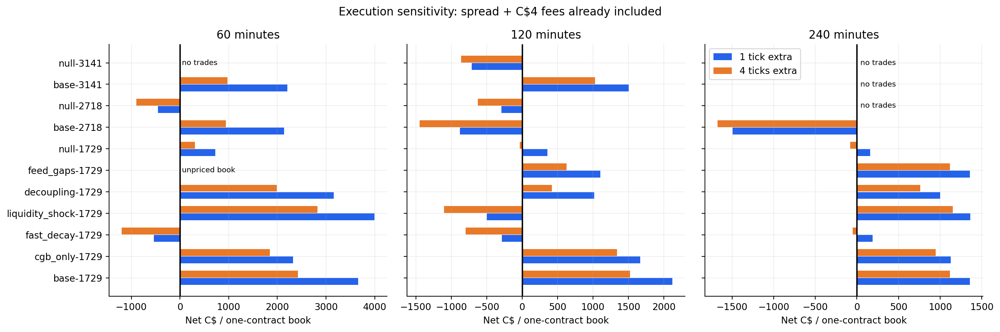

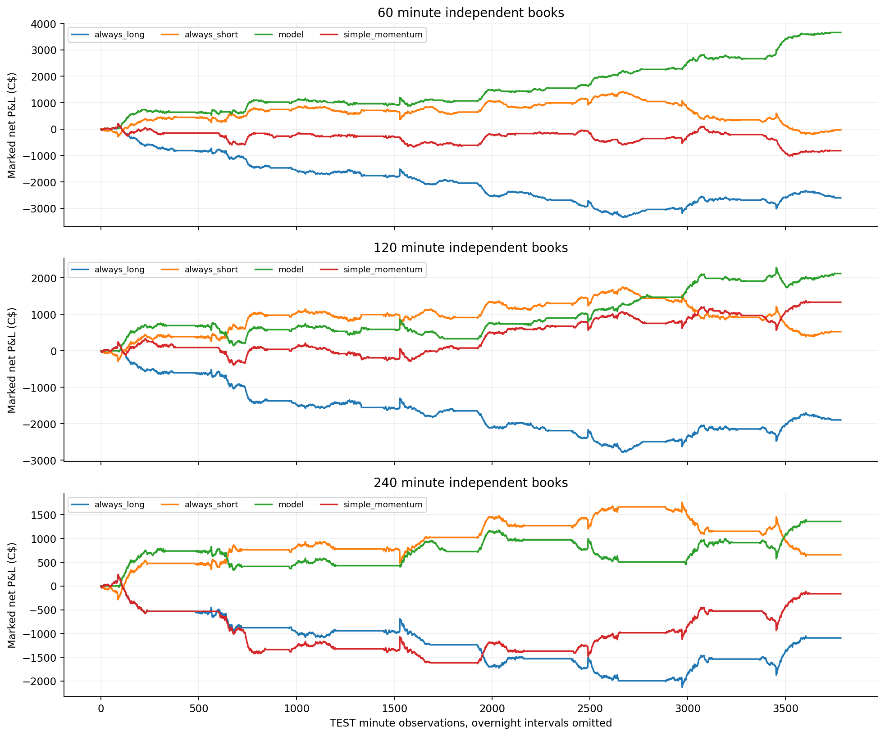

Dollar P&L is reported per independent contract book. No capital base, margin leverage, annualized Sharpe ratio or annualized return is invented. Eight synthetic test sessions are not a defensible basis for claiming a production risk-adjusted return.

## 19. The same decisions through cash bonds

The report also prices each first-seed model decision through the synthetic 10-year cash benchmark. Entry face amount is matched to the futures' entry DV01. Cash execution uses clean bid/ask plus accrued interest, with C\$4 fees, an assumed extra 0.002 price points of roundtrip slippage and a 10bp annualized net funding friction after collateral/proceeds remuneration.

This is an illustrative price ledger. It does not assume a frictionless ability to borrow any bond or transact an arbitrary face amount. Full repo funding, haircut, cash collateral, borrow availability and settlement rules are not reconstructed. The net funding-friction convention prevents the common mistake of charging the full repo interest as a cash cost to both long and short positions without recognizing cash/proceeds remuneration.

The bond and futures can still diverge after entry because their key-rate exposures and delivery basis differ. Choosing a vehicle is therefore partly execution and partly exposure modeling. The indicator's directional hypothesis remains the same; the mapping from that hypothesis to a priced position must be explicit.

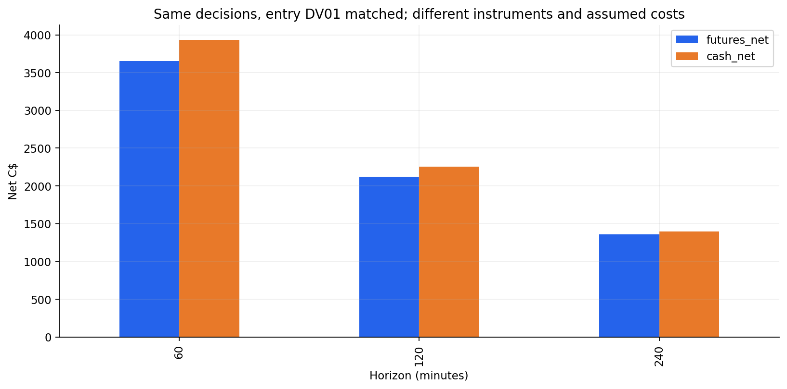

[The complete cash-versus-futures ledger](cash-versus-futures-ledger.csv) includes face amounts and matched entry DV01s.

## 20. What the stresses reveal about the current implementation

The forecaster publishes nearest-scenario distance, scenario effective sample size, feature coverage, entropy and expert disagreement. These diagnostics have meaning, but they are not calibrated abstention rules. A model can publish a confident wrong forecast when its reference relationship breaks. Finite support also means it cannot invent a tail shape absent from TRAIN merely by reweighting existing paths.

Effective scenario count is:

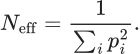

This measures concentration of probability over stored scenarios. It is not the number of independent market episodes: many stored paths overlap. Likewise, predictive entropy measures uncertainty within the model's own three-class distribution, not whether the model family is correct.

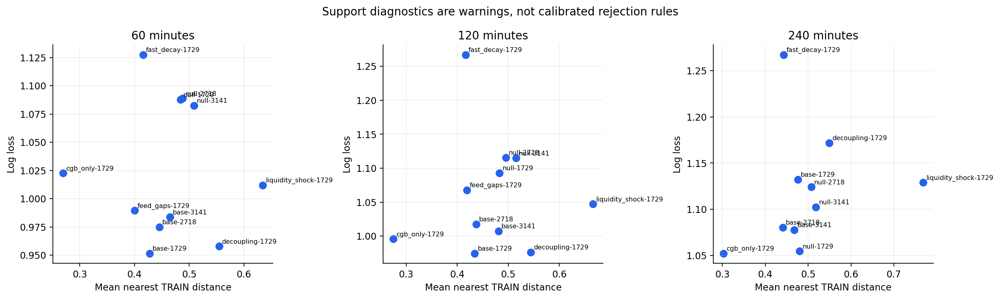

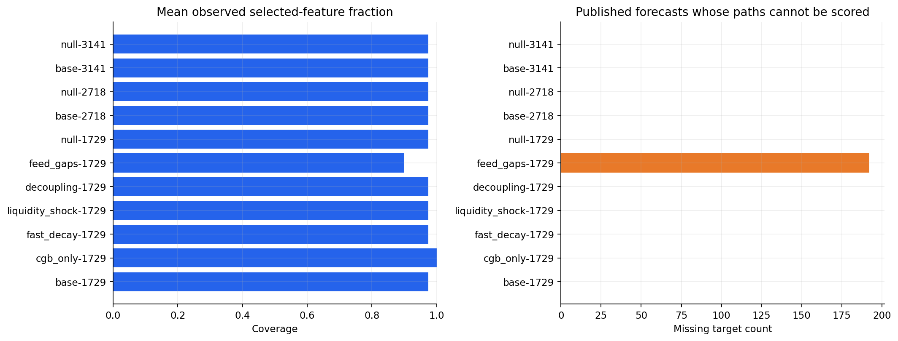

The four-hour feed-gap case is especially instructive. With the declared daily missing block, every otherwise eligible four-hour future path can intersect an outage. A four-hour score then becomes unavailable. The correct output is a count of forecasts, a count of unobservable outcomes, and n/a for the score. Using the simulator's hidden complete tape to rescue the score would defeat the missing-data test.

The first exploratory implementation exposed exactly this empty-score edge case and stopped rather than producing a value. The scorer was repaired to retain those forecasts and mark metrics unavailable. The exploratory artifacts are preserved in [the superseded run](archive/linear-duration-exploration/STATUS.md). The market construction was then upgraded to the bond ecosystem at the user's request; results from the two constructions are not mixed.

## 21. What survives from the source framework, and what does not

The source repository's useful discipline is to define an environment, choose a reference, measure response, represent alternative states, carry uncertainty and observe feedback. This experiment gives each of those ideas an operational object. It does not borrow scientific names as evidence.

| Principle | Operational meaning here | What would be an overclaim |
|---|---|---|
| Invariance | Price/discount/carry identities, units, causal clock order, probability mass | Market predictability follows from an identity |
| Reference frame | US duration and local CAD deviation remain separately observable | The residual is automatically alpha |
| Dynamics | Persistent latent pressure, decaying displacement, measured state transitions | The fitted state labels identify physical causes |
| Measurement | Quotes and tape arrive with timestamps and freshness constraints | The analyst knows the final corrected tape in real time |
| Probability | One normalized distribution over paths per horizon | Squaring arbitrary classifier scores creates physical amplitudes |
| Entropy | Uncertainty of a declared probability distribution | Market entropy is thermodynamic heat or a universal trade signal |
| Feedback | Forecasts are logged, outcomes mature, discrepancies become research evidence | The system safely changes its own rules after every loss |
| Falsification | Null controls, broken persistence, changed coupling, illiquidity and outages | A positive base simulation validates a live strategy |

There is no Hamiltonian, conserved physical energy, measured thermodynamic temperature or quantum state in this implementation. Such a quantity would need units, an observation model and an independent test before its name could support a claim. The rigorous move is to retain the reasoning discipline and make the market-specific mathematics stand on its own.

## 22. Audit evidence

| check | status | detail |
|---|---|---|
| quote_units_and_clocks | PASS | Positive uncrossed prices; CGB bid/ask on 0.01 lattice; positive depth; event <= arrival. |
| curve_identities_and_short_history | PASS | Annual effective forwards satisfy discount-ratio identities; swaps exist only in last four TEST sessions. |
| cashflow_curve_and_futures_identities | PASS | Positive decreasing discount factors; dirty = clean + accrued; positive DV01; key-rate sum within C\$0.0001 per 100k; YTM inversion; coupon-aware repo carry and cheapest delivery selection. |
| model_and_path_integrity | PASS | Frozen deployment hashes verified; TRAIN-only scenario dates; stochastic matrices; coherent scenario excursions; no hidden truth columns selected. |
| all_forecast_and_cash_ledgers | PASS | Every run: probabilities, indicator identity, quantile order, one-minute delay, no overlap per book, spread counted once, priced-subset mark reconciliation, frozen stress prefix. Aggregate book P&L/drawdown withheld whenever an open trade remains unpriced. |
| missing_targets_remain_visible | PASS | 488 published forecasts retained with unavailable future outcomes, excluded explicitly from scoring only. |
| historical_live_replay_matches_batch | PASS | Raw receiver-time replay at first TEST session minute 190 exactly reproduces saved batch probabilities, endpoints and adverse-excursion bounds for all three horizons. |
| feature_prefix_invariance | PASS | Recomputed truncated receiver-time history matches full-run features through the cutoff. |
| provided_notebook_preserved_and_reproduced | PASS | Original notebook SHA unchanged; both normal-scenario variants reproduce identical P&L; only reported ES convention differs. |

The audit reconstructs a historical live decision from raw messages using the same public prediction function as deployment. Its probabilities, endpoint quantiles and adverse-excursion bounds match the saved batch experiment. Recomputing only the available history also matches the prefix of the full-run feature table. This tests the specific concern that the batch backtest might know something the live model does not.

All frozen deployments include hashes of the canonical package and their own artifacts. The final report bundle adds file hashes for code, data, plots and documents. No source notebook or the user's existing derivation edit was overwritten. No live order, external upload or automated retraining was performed.

## 23. What to improve after adding actual data

First calibrate the **market simulator**, separately from improving the forecaster. Estimate intraday volatility and tails by session and event window; the persistence of signed flow; CAD/US lead–lag relationships; curve factor covariance; liquidity/depth response; trade interarrival and size distributions; spreads by instrument and time; and the distribution of data delays. Compare generated and held-out real diagnostics, not only their means.

Second replace the teaching instrument conventions with the actual contracts: correct deliverable issues, exchange conversion factors, day counts, settlement dates, coupon schedules, repo specialness and the precise OIS/forward quote definitions. Use price-level bid/ask data for execution. Do not backfill the missing swap month from a curve fit and call it observed historical confirmation.

Third ask where the predictor fails. If it cannot beat simple momentum in a synthetic world with persistent pressure, additional features require justification. If it works in base but breaks under decoupling, candidate repairs include explicit relationship-break diagnostics and CAL-defined abstention, tested on a new untouched episode. If endpoint probabilities are useful but MAE coverage is poor, add separately evaluated risk calibration; do not relabel the same bound.

Fourth keep the research loop chronological. A finding in this TEST set is a hypothesis for the next experiment. Changing a coefficient and rerunning the same TEST creates a development set; it does not create a new independent validation. Keep every tried configuration and distinguish parameters of the market generator from parameters of the predictor and execution policy.

Fifth require complementary evidence. Forecast probability scores, path-risk scores, net execution results, coverage/availability, stress behavior and replay consistency each answer a different question. Passing one cannot replace the others. A modest conclusion supported by all six is more valuable than a striking single P&L chart.

## 24. Cognitive checklist

- [x] The objective remains outright CGB duration over 60/120/240 minutes.
- [x] Hidden simulator mechanisms are separated from observable predictor inputs.
- [x] Canada and the US have shared and local drivers, with an explicit relationship-break stress.
- [x] Cash bonds, curves, OIS, forwards and futures share valuation identities and declared conventions.
- [x] Dirty/clean/accrued prices, cash DV01 and futures DV01 are not mixed.
- [x] Limited swap history remains limited; theoretical values do not become observed history.
- [x] TRAIN, CAL and TEST retain chronological roles; stress tests reuse frozen fits.
- [x] Base histories, controls, ablation and unsuccessful cases are all retained.
- [x] Forecast scores and price execution ledgers are evaluated separately.
- [x] Costs are paid at price touches, with spread counted once and additional costs labeled.
- [x] Missing information remains distinguishable from a neutral forecast.
- [x] Overlapping labels are not represented as independent trials.
- [x] Published mathematics is rendered as equations, not code boxes.
- [ ] Real CAD data validate the simulator's distributions and relationships.
- [ ] Real data establish forecast skill after selection and trading costs.
- [ ] Full L2 queues, dealer inventory, own-order impact and settlement plumbing are modeled.
- [ ] Live risk limits and abstention thresholds have independent validation.

## 25. Reproduce and inspect everything

The canonical simulation is `simulation/structured_simulation.py`; cash-flow valuation is `simulation/bond_ecosystem.py`; verification is `simulation/verify_simulation.py`; scientific plots are built by `simulation/simulation_report.py`. The report narrative is assembled from the saved tables. The reading notebook loads saved results and embeds the actual plots; it does not silently fit a different model.

From this study folder, the experiment runs with `python -m simulation.structured_simulation`. A completed output directory is protected from accidental rerunning; set `CGB_SIMULATION_OUTPUT` to a new output location for a new experiment. See [reproduction instructions](docs/reproducing.md). Build plots with `python -m simulation.simulation_report`, verify with `python -m simulation.verify_simulation`, then assemble text with `python -m simulation.report_narrative`. For rendered vector equations, install the pinned local renderer dependencies with `npm install --prefix simulation` and run `node simulation/render_report_math.cjs`. The delivered report already contains rendered equations; no installation is needed to read it. Dependencies are recorded in the frozen-model manifests and the repository's tested requirements file.

The output is organized as follows:

| Location | Contents |
|---|---|
| `REPORT.md` | This complete research report |
| `simulation-results.ipynb` | Executed tables and embedded plots |
| `figures/` | 25 standalone scientific PNG figures |
| `results/<run>/inputs/` | Compressed observable feeds plus clearly separate hidden curve/mechanism audit tables |
| `results/<run>/predictions-and-outcomes.csv.gz` | Every published forecast, including unscorable outcomes |
| `results/<run>/trade-ledger.csv` | Every completed priced trade |
| `results/<run>/marked-pnl.csv.gz` | Minute marks and drawdowns for all demonstration books |
| `results/<run>/execution-rejections.csv` | Missing-entry and unpriced-exit cases, including empty files when none occur |
| `results/<run>/frozen-model/` | Fitted trees, empirical paths, source hashes, per-expert metrics and calibration lineage |
| `results/<stress>/frozen-model-reference.json` | Explicit link to the reused base model |
| `metrics.csv`, `execution-summary.csv`, `proper-path-scores.csv` | Complete comparison tables |
| `cash-versus-futures-ledger.csv` | Entry-DV01-matched cash comparison |
| `verification.json`, `manifest.json` | Structural checks and final file hashes |
| `example-audit/`, `reference/` | Reproduced source example and its unchanged notebook |

There are 662 saved result files in the completed experiment. The main report is Markdown with local plot and equation assets. Keep those assets with it when moving the folder.
