# What the structure has earned, and what it should learn next

This review reads the thesis collection against the **actual saved CGB experiment**, then derives a research programme for the period before real data arrives. The most useful next step is to make the synthetic market harder to understand for economically meaningful reasons.

The central proposition is: **momentum can be the visible continuation of an adjustment that participants have not yet finished, under constraints that may themselves be changing.** That proposition deserves a model in which adjustment, participants, constraints and observations are separate objects. Our existing experiment gives us a useful forecasting and accounting foundation. Its persistent pressures are mostly specified directly; it does not yet generate them from inventories and binding constraints.

There is also a particularly revealing result in the fitted model: **at 60 minutes, every base seed assigns essentially all final directional mixture weight to the supervised price-class expert.** The path representation remains active, but the separate state-transition expert has not earned additional directional weight in those fits. This is a research opportunity with a precise mathematical explanation, not a reason to discard the project.

Read this report first, then the [ordered experimental plan](research-plan.md). The [physics lessons](physics-lessons.md), [foundations](foundations.md), [feedback lessons](feedback.md) and [deployment lessons](deployment.md) give the document-by-document reasoning. The [coverage ledger](coverage.md) records the full-text reading of all 47 supplied thesis Markdown files. Some documents collect other authors' work; inclusion in the collection does not make every statement its curator's own claim. Questions written here are our reconstruction from those texts, not quotations of private thoughts.

## 1. Start with a dispute worth having

One extreme position is that a carefully designed simulator already contains the answer: define the right objects, implement their interactions, and the trading advantage follows. Another extreme is that nothing useful can be done until a large real dataset appears. Both positions give away something valuable.

Before real data, we can discover whether our representation can express the intended mechanism, whether the mechanism is observable, whether a learner can recover the available information, whether a trading rule uses it sensibly, and which measurements would be most valuable to collect. Those are substantial achievements. We can also discover that a beautifully coherent world has no profitable opportunity for the observer we actually possess.

Consider two markets with exactly the same information available to us at 10:00. In one, a constrained account still needs to sell duration for two hours. In the other, its sale is complete and a temporary quote displacement is about to recover. If nothing available at 10:00 distinguishes these worlds, the same algorithm must produce the same output in both. More sophisticated mathematics cannot create an observation that has not arrived. It can represent the uncertainty correctly and identify the next observation that would matter.

The ambitious objective is therefore **a structure that tells us where an advantage could exist, what information exposes it, when that information arrives, and what destroys its value**. That is stronger than assembling a large feature list.

A thesis-grounded line of questioning would begin with: What is moving? Who has to change exposure? What is preventing immediate completion? Where is that unfinished adjustment visible? What would make its continuation stop? Why can our observer detect any of this before the remaining price change is exhausted?

## 2. What the saved results actually say

The completed study contains 11 synthetic experiments. Each full history has 24 TRAIN, eight CAL and eight TEST sessions. Forecasts use 60-, 120- and 240-minute horizons. The execution books are independent one-contract experiments, with next-minute entries, price bid/offer, C$4 round-trip fees, and one extra tick of slippage; the stress account uses four extra ticks. These books must not be added together as if they represented one capital allocation.

Because the exit remains at the original forecast maturity, a 60-minute forecast normally produces 59 minutes of held exposure. Keep that distinction when comparing duration policies.

| Base history | 60-minute log-loss improvement against TRAIN frequencies | 60-minute net C$ | Net with higher slippage | Model trades |
|---|---:|---:|---:|---:|
| 1729 | 0.1085 | 3,656 | 2,426 | 41 |
| 2718 | 0.1177 | 2,140 | 940 | 40 |
| 3141 | 0.0912 | 2,206 | 976 | 41 |

Positive numbers in the improvement column mean a lower forecast loss. The improvement appears in all three histories. Their saved session-bootstrap intervals exclude zero at this horizon. This is a real recurring result within the constructed environment, rather than a single attractive equity curve.

Several other results are just as informative:

| Observation | Research interpretation |
|---|---|
| The fast-decay 60-minute book loses C$538, or C$1,198 at higher slippage | The length of the adjustment matters. We must distinguish insufficient memory, a changed continuation law, and insufficient remaining movement after costs. |
| One four-hour base interval covers only 61.8% of outcomes against a nominal 80% | The path distribution can be internally coherent yet too narrow or wrongly shaped for its environment. |
| A two-hour base model book loses C$876 while simple momentum earns C$2,568 on that history | Probability forecasting, selective entry and holding decisions need separate comparisons. Better average forecasting need not imply a better trading policy. |
| The full first-seed one-hour model improves on the CGB-only model, but trades 41 times versus 16 | The added environment has value in that experiment; the difference does not isolate a particular witness or an exposure-matched trading benefit. |
| The missing-feed world retains unscorable forecasts and an unpriced exit | The accounting preserves uncertainty. A priced subset is not silently presented as the whole account. |
| All three one-hour mixtures choose the supervised expert | The most successful directional result is narrower than a claim that all structural components jointly produced it. |

The exact inputs are [metrics](../../metrics.csv), [execution books](../../execution-summary.csv), [mixture weights](../../fitted-weights.csv), and [path scores](../../proper-path-scores.csv). The accompanying [read-only audit](audit_saved_results.py) reproduces the comparisons used here without refitting anything.

## 3. The first uncomfortable question: what is actually doing the work?

Our model contains a local path distribution, a future-state-conditioned path distribution, and a supervised price-class-conditioned path distribution. Calibration chooses their mixture by endpoint-class log loss.

Let the historical paths have local weights, and let each path belong to a down, neutral or up endpoint class. The supervised expert takes the classifier's mass for a class and distributes it across paths inside that class:

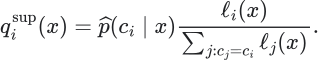

The bank is required to contain all three classes. Summing within a class cancels the local allocation:

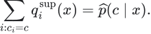

Consequently, when the supervised mixture weight is one, the directional indicator is exactly the price head's up probability minus its down probability, apart from numerical precision. The local paths still determine expected magnitude, quantiles and adverse excursions. They can therefore still affect whether the execution rule enters. Observed state features can also enter the price classifier. The narrow finding is that the **separate future-state forecast and transition expert add no final directional mass** in these one-hour mixtures.

The mechanism is explicit in `path_experts`, `redistribute` and `_mixture_weights` in [scenarios.py](../../model_snapshot/momentum/scenarios.py). The saved expert metrics independently show the one-hour supervised and mixture losses coincide for every base seed.

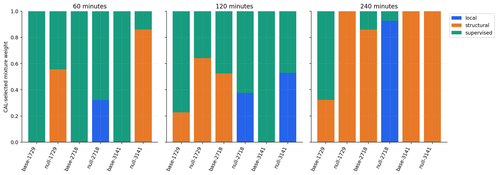

The plot is from the existing study. Its weights describe the final path-expert mixture, not feature importance. In particular, the absence of a separate local-expert coefficient does not remove the local weights used inside the supervised expert.

There are three serious interpretations, and we should allow all of them:

1. The state expert is redundant because the price head already extracts its useful information.
2. The five-state vocabulary is too crude to carry the intended mechanism.
3. The calibration objective cannot reward an improvement that occurs only inside an endpoint class, such as distinguishing a smooth decline from a decline after a large adverse rally.

The third is an identifiability problem in the objective itself. Two distributions can have identical up/down/neutral probabilities and very different first-passage times. Endpoint-class log loss assigns them the same score. No optimiser can recover a preference that the objective does not express.

The appropriate next comparison is a deliberately strong baseline: **price classifier plus conditional empirical paths**. Challenge it with structural alternatives using separately declared endpoint, path and decision criteria. If the simpler construction wins, keep it. If structure improves adverse-path estimates while leaving direction unchanged, give it that specific job. Do not constrain mixture weights merely to keep every philosophical component visible.

## 4. What we should preserve

The strongest parts of the current work are practical expressions of the thesis's concern with reference frames, observations and deployment contracts.

| Existing choice | Why it deserves to survive the next version |
|---|---|
| Outright CGB remains the target | Common US-led duration can be precisely the move the account wants. A reference relationship need not remove the exposure being traded. |
| Event time and availability time are distinct | A fact cannot influence an earlier decision merely because it is later stamped with an earlier market time. |
| TRAIN transforms, CAL mixtures and frozen TEST fits | The experiment can distinguish learning from later evaluation. |
| Full empirical paths within each horizon | Endpoint, quantiles and adverse excursion are calculated from one distribution, rather than unrelated point estimates. |
| Cash-flow pricing, positive discounts, DV01, key-rate sensitivities, carry and fictional delivery baskets | These impose meaningful identities between curves and instruments. Keep this valuation layer when replacing the stochastic driver. |
| Common duration, local deviation and curve rotation remain visible | The same CGB decline can occur under different surrounding constraints. |
| Economic-group distance weighting | A module with many correlated columns does not automatically receive more distance weight simply because it has more columns. |
| State age and recovery-attempt memory already exist | Memory is already part of the observer. The next issue is whether it matches the environment's memory. |
| Costs, losses, missing outcomes and no-trade books remain in the record | The system can be examined without quietly selecting convenient outcomes. |
| Frozen source, fitted models, input histories and hashes are saved together | A statement about a result can be traced to the implementation that produced it. |

These are not administrative decorations. They determine whether a future experimental disagreement can be resolved.

## 5. Where the present world is easier than the intended market

The current driver creates US and Canadian persistent pressure processes, then uses those same hidden quantities to influence prices, signed flow, depth imbalance and curve shape. Hidden values are excluded from model inputs, but several observable channels are deliberately informative about them. This is a sensible first construction. It is also an environment in which recognition is comparatively convenient.

Specific departures matter:

| Current construction | Missing question |
|---|---|
| Persistent pressure is generated directly with autoregressive dynamics | What stock of unfinished adjustment sustains it, and how is that stock depleted? |
| Absorption switches randomly | Which inventory or capacity constraint makes absorption appear, disappear or change direction? |
| Common and local pressure reset at each session open | Does pressure survive overnight, and is the reset a market event or a bookkeeping boundary? |
| Event impulses occur at minutes 30, 150 and 300; elapsed session time is a feature | How much is learned economic state, and how much is an easily learned event clock? |
| CAD returns depend on contemporaneous US returns | Which actual transmission lags, delayed reactions or feedback loops can be identified? Feed latency alone does not create economic propagation. |
| Many curve observations share the same factor construction | When do several observations add information, and when are they alternate expressions of one underlying measurement? |
| Five observed states are defined by price direction and weakening | When does the state describe price grammar, and when does it distinguish pressure, capacity and unfinished adjustment? |
| Separate models and path banks for each horizon | Can their forecasts describe one possible future trajectory across horizons? |
| The feedback function records matured outcomes | Which controller, if any, changes a subsequent decision? A feedback record alone does not define that controller. |

The existing ecosystem also has a tightly tied OIS/government factor construction and fictional delivery assumptions. An independent funding/basis state and changing delivery incentives are useful alternative worlds. This is an extension of the implemented valuation layer, not a claim that cash-bond mathematics is missing.

## 6. Derive the market from inventories before inventing another signal

The smart-beta and Zureck essays organise the problem around a distribution of capital, an environment, interactions and constraints. The kinetic paper asks for a distribution and field that are mutually consistent. An operational CGB translation starts with positions and transactions.

Let each participant hold instrument quantities, and let the valuation Jacobian map those quantities into risk exposures:

Here the quantities are contracts or bond notionals. The rows of the sensitivity matrix can represent CAD duration, US duration, Canadian curve slope and basis sensitivity. For optimisation, divide each exposure by a declared reference risk unit so the coordinates are comparable. A change in the sensitivity matrix can change risk even without trading; this is one reason to retain the bond mathematics.

Transactions conserve instrument quantities across participants and the recorded outside sector:

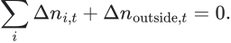

Risk exposures themselves need not be conserved because valuations and sensitivities change. This distinction prevents a simulator from calling every increase in duration exposure a purchase.

Start with three transparent participant types: an account moving toward a revised target, a dealer absorbing flow subject to inventory limits, and an account responding to observed price trends. Give each different adjustment speed and capacity. Include an explicit outside sector whenever the population is not closed. Do not begin with hundreds of personality types or language-model traders.

A candidate dimensionless adjustment cost is:

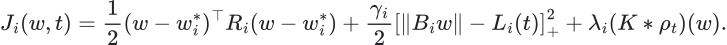

The first term represents distance from a target. The second penalises exposure beyond a capacity limit. The third represents an explicitly chosen interaction with the distribution of other exposures. The interaction can attract similar positioning or penalise crowding, depending on its declared sign and shape. These are different worlds, not interchangeable interpretations of one coefficient.

An adjustment rule can turn the cost gradient into intended changes, subject to trading capacity:

Positive semidefinite mobility describes how quickly an account can act in each direction. Implement trades in instrument units, reconcile their executions, update dealer inventory, and revalue all exposures. Market clearing must reconcile matched quantities. A price-impact or quoting rule determines the price at which the dealer absorbs residual client flow; it must not create an unrecorded counterparty.

Now continued selling can have a reason: a target changed, a risk limit tightened, market depth slowed completion, or price moves themselves increased the amount of adjustment required. Exhaustion also has a reason: the target was reached, capacity returned, a counterparty absorbed the inventory, or a new price made the original trade unattractive.

The first useful experiment holds initial net flow and price movement fixed but changes the distribution of remaining inventories. Does the future differ? If so, which observable response exposes that difference? That is a direct test of whether population structure adds something beyond aggregate pressure.

## 7. Give the thermodynamics a definite job

The free-energy construction offers a disciplined way to specify adjustment and dissipation. Use it as an actual generator family, with a defined density, interaction kernel, forcing and boundary conditions.

For a smooth exposure density, symmetric interaction kernel and constant positive diffusion, one candidate functional is:

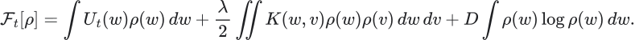

All terms must be expressed in the same chosen units. If using a finite agent population, either derive a finite-population analogue or specify the density estimator and its bandwidth; Dirac masses cannot simply be inserted into the differential-entropy term.

For the gradient-flow world with suitable zero-flux boundaries:

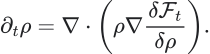

Its balance equation separates relaxation from a changing environment:

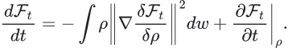

This decomposition is useful. A market can continue moving because an old distortion is relaxing, because external forcing continues to change the target, or because constraints change the landscape while adjustment occurs. Record those terms separately in simulator truth. Then ask whether the observer can distinguish their consequences.

A persistent directional move need not correspond to a permanently elevated scalar stress level. A large initial stress can be dissipating quickly while a smaller but continuously renewed forcing keeps producing direction. Therefore the candidate feature is not merely “stress is high.” It might be estimated remaining adjustment relative to execution capacity, together with evidence that forcing continues.

Also allow non-gradient interactions as a competing family. Directed CAD–US responses, inventory transfer cycles and delayed feedback can create circulation in exposure space. A pure potential model may compress these into the wrong explanation. Compare a gradient-only construction with a construction containing declared directed interactions, while preserving the same valuation and accounting identities.

## 8. Memory is the object, not just the lookback window

The foundational information-thermodynamics papers make a useful distinction between single-observation uncertainty and information carried in a sequence. Two return streams can have the same one-minute distribution and volatility but very different predictable futures.

The current simulator's autoregressive pressure makes memory decay in a particular way. The model already observes state age. We should now vary the mechanism of persistence while matching simpler statistics: exponential relaxation, a finite execution schedule, heavy-tailed episode durations, interrupted execution, or a process that changes behaviour after a capacity threshold is reached.

The implemented time constants make the fast-decay result much easier to interpret. Between fresh shocks, the pressure recurrence has a one-minute coefficient of 0.985 in the base world and 0.65 in fast-decay TEST. For an isolated existing pressure and mean-zero future innovations:

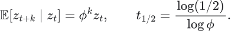

The pressure half-life changes from **45.86 minutes to 1.61 minutes**. After an hour, the retained contribution of the original pressure changes from about 40.4% to approximately zero. For a fixed linear price loading, the cumulative 60-minute expected contribution is proportional to:

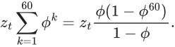

The multiplier falls from 39.15 to 1.86. These are driver calculations, not a direct repricing or P&L calculation for the full nonlinear ecosystem. They show that this stress changes both memory and the remaining integrated contribution of an existing disturbance. Temporary displacement also decays faster. Calling the loss simply a failure of adaptation would skip that distinction.

Therefore compare two separate controls: equal initial pressure with different persistence, and equal integrated expected pressure with different duration profiles. The latter requires changing shock amplitudes, so report that change explicitly. Together they separate a shorter information lifetime from a smaller available move after costs.

An episode's continuation can be represented through its termination hazard. For a specified covariate path and a hazard-based termination construction:

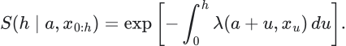

This is a continuous-time representation with a specified hazard. A live forecast does not know future covariates: it must integrate over their conditional paths, or declare a frozen-covariate approximation. In a discrete simulator, use the corresponding product of one-minus-hazard terms. Distinguish the probability that a mechanism persists from the probability that price ends favourably: new shocks can overwhelm a mechanism that remains active.

An increasing termination hazard describes an adjustment nearing completion. A decreasing hazard can describe survivor selection: episodes that have already persisted are more likely to belong to a long-lived class. Identical current flow and price slope can therefore imply different futures depending on age and past response.

The useful question is whether past observations beyond our compressed state still improve future predictions. If they do, the representation has discarded usable memory. Test that with held-out prediction, not a decorative estimate of an information quantity on the same data used to choose the representation.

The fast-decay loss then becomes a research fork: did the environment become unforecastable after costs, did the existing features retain the wrong memory, or did a frozen calibration fail to recognise the shorter horizon? An oracle/observer comparison can distinguish these possibilities.

## 9. Let the environment select the states

The pointer-state intuition is especially productive when converted into a representation problem: which distinctions remain useful under the interactions and disturbances that matter to the trade?

Our five current states are convenient price descriptions. They do not yet establish that “down-responsive” identifies responsiveness to order flow, because the state assignment itself uses price momentum and weakening. Flow-response measurements are separate features. Keep that distinction explicit.

A demanding ideal groups histories together only when they imply the same future distribution:

This predictive-equivalence construction is related to causal states in computational mechanics. Our proposal is to approximate it for the bounded CGB forecasting problem, then test the approximation on held-out generator families. It is not a requirement to recover an infinite-history object exactly. [Shalizi and Crutchfield](https://csc.ucdavis.edu/~cmg/compmech/pubs/cmppss.htm) provide the methodological reference.

There are two separate compression targets. A state sufficient for the entire price-path distribution may need more detail than a state sufficient for the current long/flat/short decision. Conversely, a state adequate for direction may discard the distinction needed for sizing or adverse-excursion control. Choose the output first.

Useful candidate coordinates include estimated remaining adjustment, available absorption capacity, disturbance age, common/local alignment, recovery effectiveness, and uncertainty about each measurement. Start continuous. Add discrete states when they create a stable, inspectable simplification, rather than declaring a large taxonomy before observing what distinctions matter.

The source's rare-transition concern also deserves its own evaluation. Dominant trend and rest states can be easy to classify while the first actionable transition is missed. Measure lead time, false transition alarms, missed turns and detection delay. Do not let aggregate classification accuracy conceal failure at the moment a position changes.

## 10. Several witnesses can still be one witness

Suppose ten forwards are calculated from the same five curve inputs. They can provide useful coordinates, but they do not constitute ten independent confirmations. Likewise, a deterministic synthetic mapping from a latent factor to yields, book imbalance and trade imbalance can create apparent redundancy that is stronger than what future feeds provide.

The existing group-distance construction already limits one form of column-count bias. The remaining issue is deeper: groups themselves can share one cause or one measurement error. A genuine independent witness contributes information conditional on what is already known.

One diagnostic target is:

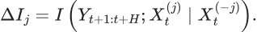

Do not begin by estimating this high-dimensional quantity directly. Use a practical conditional prediction comparison, with a generator in which independent innovations and shared factors are known. Compare an added witness, a deterministic copy, a noisy copy, and an independently measured channel with the same marginal correlation.

This also sharpens CAD–US reasoning. A lead can arise from economic propagation, asynchronous observation, or both. Build those mechanisms separately. A receiver-time lead should disappear when feed delays are corrected. An economic propagation effect should survive that correction in the world where it is present.

For 2s5s, retain the component moves. Flattening caused by falling five-year yields and flattening caused by rising two-year yields are different events for an outright ten-year duration account. A curve label without its decomposition discards the very information the model is supposed to understand.

## 11. Geometry can describe fragility precisely

There is no need to avoid geometric constructions. The useful discipline is to choose their domain, metric, transition law and decision role explicitly.

One option is a geometry over measured economic states, using risk-normalised coordinates. Another is a geometry over conditional future distributions. In either case, a meaningful distance should not change its economic interpretation merely because a yield is expressed in percent rather than basis points or because a derived forward is duplicated.

For nearby states and their transition distributions, a coarse Ricci construction is:

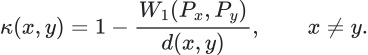

It measures whether nearby states have contracting or separating transition distributions under the declared metric. This is the operational definition developed by [Ollivier](https://arxiv.org/html/math/0701886). Here our proposed use is local sensitivity of future outcomes, not a compulsory forecast architecture.

The creative experiment is to compare two locally similar markets whose small perturbations have very different consequences. In one, replenishment and inventory transfer absorb disturbances. In the other, several constraints are nearly binding and a small shock triggers a larger cascade. Does a transition-distribution geometry identify that distinction earlier than a simpler response-sensitivity measure?

Use the simplest strong competitor: paired perturbations under common random numbers, or the local response Jacobian where it exists. If curvature adds no useful discrimination, retain the simpler diagnostic. If it helps identify regions where tiny measurement errors create large forecast changes, it has earned a role in uncertainty or position capacity.

Coordinate transformations also require care. Exact bond repricing and local DV01 linearisation agree only to the approximation's order. A useful invariance audit distinguishes numerical mistakes from genuine convexity residuals. It should not demand that nonlinear transformations and aggregation commute when the mathematics says they need not.

## 12. Uncertainty has more than one source

The UMMO formalisation's four-valued logical motif suggests a practical evidence ledger: support, opposition, both, or neither. This is our CGB application of that motif. The point is to retain contradictions rather than average every disagreement into a neutral score.

At minimum, the observer should keep separate:

| Situation | Example | Sensible response to investigate |
|---|---|---|
| Directional evidence agrees | Fresh domestic pressure and common-duration weakness | Evaluate continuation and remaining movement. |
| Directional evidence conflicts | Canadian weakness against US strength | Investigate local pressure, basis movement, timing or a failed reference relationship. |
| Evidence is unavailable | Stale swap quotes or incomplete depth | Reduce the scope of the claim; preserve the missingness reason. |
| Future outcomes remain dispersed despite good observations | A known event is approaching | Represent outcome risk rather than calling the feed unreliable. |
| Similar past states are scarce | New combination of curve and liquidity conditions | Mark limited empirical support. |
| Components disagree because their assumptions differ | Persistent-state prior versus rapidly reversing price evidence | Test which assumption is failing and whether disagreement predicts a boundary. |

One entropy number cannot identify all of these situations. Two models can have the same predictive entropy for entirely different reasons. A governor needs to know which reason it is responding to.

### Work through the VWAP rejection rather than naming it

Take the opening you described: CGB opens lower, attempts to recover toward VWAP fail, and five-year paying appears in the surrounding market. We should construct several worlds that initially reproduce this same picture.

| Possible mechanism | What could continue the decline? | Observation that would help distinguish it |
|---|---|---|
| A target-adjusting seller has substantial risk left to move | Continuing execution of the remaining adjustment | Repeated fresh selling after pauses, with a response that survives changes in immediate quote depth |
| The original seller is finished but quotes are temporarily displaced | Nothing from that completed order alone; subsequent shocks decide | Improving recovery effectiveness and replenishment without renewed directional flow |
| US duration continues to reprice | Imported common-duration pressure | Canadian recovery failures conditional on contemporaneously received US movement, after accounting for feed delays |
| Dealers approach inventory capacity | Changing quotes and reduced willingness to absorb further flow | A nonlinear change in price response to comparable flow, rather than simply larger flow |
| The five-year activity is predominantly curve redistribution | Outright direction depends on the other legs and surrounding repricing | Separate two-, five- and ten-year component moves, basis behaviour and sensitivity-adjusted exposure |
| Liquidity providers react to an apparent momentum signal | The observation channel and price response change together | Similar displayed imbalance producing different fills, replenishment or subsequent movement after the response rule changes |

These are proposed mechanisms, not diagnoses of a named account's intentions. The same failed recovery can fit several rows. Our task is to discover which response measurements distinguish them before the next decision.

I would ask, in order: Was buying actually attempted, or did the market simply drift upward? How much price recovery did a comparable amount of buying obtain? Did that recovery survive? Was US duration helping it? Were quotes replenishing or retreating? Was the next selling burst larger, or did the same selling move price further? Did the relationship change after a known event? What remaining mechanism would keep the move going if new external shocks stopped?

Then invert the story. Suppose the model becomes more bearish after every failed bounce. Build a world where those failures coincide with the seller finishing. Can it recognise increasing absorption and shorten its expected continuation, or has its definition made every observation confirm the same story? A framework that cannot change its conclusion when the generating mechanism changes is too rigid, however persuasive its narrative sounds.

The same discipline applies to 2s5s flattening. It may come from five-year yields falling, two-year yields rising, both falling at different speeds, or both rising at different speeds. Those cases can have opposite implications for the ten-year instrument. The spread change locates a relationship; component moves and their causes determine what it means for this account.

## 13. Keep one future across the holding window

The account's original question concerns a one-to-four-hour adjustment. The present model fits separate distributions at 60, 120 and 240 minutes. They are valid separate forecasts, but there is no construction ensuring that all three are projections of one joint path law.

A joint path model would satisfy a marginalisation relation:

This statement concerns complete prefix-path distributions. It does not require up probabilities or interval widths to move monotonically with horizon. A coherent market can fall for an hour and recover later.

There is, however, a useful pathwise monotonicity: for a fixed direction and the same realised path, maximum adverse excursion cannot decrease when the observation horizon extends. Under one joint law, its corresponding quantiles inherit stochastic ordering. Separate fitted banks can violate that relationship.

Possible constructions include one longer path bank with prefix queries, a semi-Markov episode model, or a state-space simulator conditioned on current observations. Longer complete paths reduce sample support, and late-session availability creates unequal windows. Evaluate that tradeoff explicitly. A simple shared-prefix construction is a better starting point than a large generative model.

This is also where FinPILOT's duration emphasis becomes useful: direction, duration and first-passage behaviour are different forecast products. A correct terminal sign reached after an intolerable adverse move should not receive the same decision interpretation as a clean continuation.

## 14. Put machine learning where an unknown mapping actually exists

There are several possible places for learning, and they answer different questions.

| Learned object | Question answered | Strong initial comparison |
|---|---|---|
| Observation filter | Which hidden adjustments are compatible with the received data? | Known-DGP Bayesian or particle filter in tractable synthetic worlds. |
| State representation | Which history distinctions predict different futures? | Existing five-state observer plus continuous features. |
| Transition or hazard model | How does persistence change with age, capacity and environment? | Fixed-hazard and simple conditional-hazard models. |
| Conditional path model | Which future shapes remain plausible? | Existing class-conditioned empirical path bank. |
| Probability calibration | How much confidence is justified in this environment? | TRAIN/CAL-fixed calibration checked on untouched families. |
| Decision adapter | How should a fixed forecast be used at stated costs and risk constraints? | Current one-contract threshold policy, flat, and simple momentum. |
| Governor | When should confidence, scope or capacity change? | Frozen policy and shadow monitoring without intervention. |

Do not replace all of these at once. Otherwise a favourable result cannot tell us which scientific claim improved. In particular, keep the forecast fixed while comparing action adapters, and keep the action policy fixed while comparing forecasters.

The original notebook gives learning a more constrained role inside its structural assembly: direct future-tag XGBoost heads, structural rows, sequential leg projections or Monte Carlo paths, temperature/disagreement modulation and amplitude normalisation. Our model instead includes a direct endpoint-class head and calibrates convex mixtures of empirical paths. That is a substantive departure, not a line-by-line reproduction.

We should preserve the purpose of the source's separation—observation, structure, learned evidence, path evolution and operational output—while allowing the CGB experiments to decide which composition works. The exact notebook also contains bounded coefficients and diagnostic-only branches. Matching its intuition does not require copying each coefficient or treating every explanatory comment as a causal component of the final output.

## 15. A cybernetic controller must have something specific to control

The saved `matured_feedback` implementation records completed forecasts and their loss. It does not implement a live adaptive controller. That is a useful clean baseline.

There are at least four feedback loops to separate before adding adaptation:

1. Learning from all subsequently observed public outcomes, even when we do not trade.
2. Learning only from selected fills or trades, which changes the observed training sample.
3. Our orders changing prices, liquidity or other participants' actions.
4. Other accounts using similar signals and jointly changing the environment.

The first can occur for a price taker without the model changing the market. The other loops require additional mechanisms. Begin own market impact at exactly zero, then increase it as a controlled parameter. Treat spread/slippage stress and action-dependent world dynamics as different experiments.

A minimal governor has a declared observation, a small action set and a clock: continue, reduce capacity, restrict a module, or wait. It acts only on information available then, including outcomes that have actually matured. It needs a re-entry rule and cooldown. Otherwise apparent risk control can consist of abandoning every difficult episode forever.

Measure false withdrawals, missed favourable trades, reduction in tail loss, time to recovery, turnover from switching and the cost of re-entry. Keep shadow forecasts and public outcomes while the policy is flat. A stopped account should not become blind to whether its reason for stopping has disappeared.

The performative-prediction papers also motivate a second adversarial experiment: participants respond to the deployed indicator. If displayed imbalance is cheap to alter, a strategy that relies heavily on it may face a different observation channel after deployment. Vary response costs and participant adaptation rather than assuming either universal manipulation or universal price taking.

## 16. What the strongest skeptical researcher would demand next

The next experiment should discriminate explanations, not merely produce more rows. Every proposed test needs a question, intervention, control, observable output, evaluation measure and a decision that changes the project.

The first three demands would be:

**First: show me the oracle gap.** In a synthetic world, we know the hidden state and its dynamics. Compare the best feasible hidden-state forecast with a filter using only received observations, and then with our actual feature/learning pipeline. If all three fail after costs, change the opportunity hypothesis. If the observer loses information the oracle has, investigate measurement. If the observer can predict but our learner cannot, investigate representation or estimation.

For an ideal log-score comparison with a sufficient hidden state, the observability gap has a precise expression:

The equality concerns the population conditional laws. An approximate numerical oracle is a benchmark whose accuracy must be checked, not an automatic bound. Hidden-state truth belongs in the evaluator, never the deployed feature table.

**Second: show me worlds that initially fool each other.** Hold the observable opening fixed while varying remaining inventory, absorption capacity, disturbance age or external forcing. Determine the earliest additional observation that makes the future distinguishable. The result may identify a measurement to collect, a horizon to shorten, or an honest period of ambiguity.

**Third: show me a world where action has no advantage.** The existing pressure-removal controls leave other predictable components. Add a separate martingale control for the traded price under the full available information, with bounded predictable positions and nonnegative costs. For its stated finite horizon:

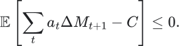

Construct that property at the traded-price level; nonlinear repricing of a martingale yield need not preserve it. If financing or carry is present, declare the corresponding gains process and cash account. Individual finite samples can be profitable; test the distribution across independent worlds rather than demanding every run lose money.

These demands are compatible with creative structural modelling. They prevent us from confusing an expressive vocabulary, available information and executable opportunity.

## 17. The research sequence I would choose

Preserve the published study as baseline S0. The next version should answer a narrower question more convincingly before becoming a larger system.

1. **Attribute the existing result.** Reproduce the supervised-mixture identity, compare endpoint and path objectives, audit event-clock dependence, and compare horizons on matched decision origins. No new architecture is needed yet.
2. **Build a small observability laboratory.** Use a tractable hidden-state world, observable twins and a strict traded-price martingale control. Measure the oracle/filter/learner differences.
3. **Make adjustment endogenous.** Add a small inventory-conserving population, changing capacity and explicit dealer absorption. Preserve the curve and bond valuation layer.
4. **Challenge memory and state choice.** Vary episode-duration laws and overnight carry; compare price states, continuous economic coordinates and predictive-state approximations.
5. **Require path and horizon coherence.** Compare one joint path construction with the existing independent horizons, including adverse-excursion and first-passage scores.
6. **Add governed adaptation only after the observer is understood.** Distinguish measurement failure, environmental change, selected labels and action feedback; retain shadow observations and explicit re-entry.
7. **Use the resulting failure map to specify data collection.** It should identify which timestamp quality, inventory proxies, order-book granularity, independent swap/basis observations and history length would resolve the important ambiguities.

The [research plan](research-plan.md) turns this sequence into concrete experiment cards, including adverse interpretations and continuation rules. It does not assume that every proposed mathematical object deserves to survive.

## 18. Checklist for intellectual honesty and useful ambition

- [x] Read all 47 supplied thesis Markdown documents, including their included references and appendices; record scope and missing external supplements in the coverage ledger.
- [x] Distinguish collected authors' arguments, the source notebooks' implemented choices and our CGB extensions.
- [x] Inspect the actual fitted mixture weights and derive their directional consequence.
- [x] Preserve existing measurement, valuation, execution and reproducibility strengths.
- [x] Recognise that state age, flow response and group weighting are already implemented.
- [x] Identify exogenous pressure, random absorption, session resets, fixed event clocks and contemporaneous coupling as specific generator assumptions.
- [x] Separate endpoint prediction, path shape, action selection and control.
- [x] Give inventories, density, free energy, memory, predictive states and geometry explicit mathematical jobs.
- [x] Define a research sequence before running additional experiments.
- [ ] Establish the observability gap and the earliest discriminating measurements.
- [ ] Show that an endogenous constraint-driven world can generate the intended phenomena.
- [ ] Demonstrate useful distinctions across untouched generator families rather than only new seeds of one mechanism.
- [ ] Establish joint-horizon and adverse-path behaviour appropriate to the holding decision.
- [ ] Evaluate any governor's recovery, false withdrawals and retained opportunity.
- [ ] Use those findings to decide what real observations are necessary and which components are worth deploying.

The most important change in emphasis is from **recognising a trend-shaped tape** to **estimating unfinished adjustment and the conditions under which its consequences remain tradable**. That is a concrete extension of the thesis's environment-and-constraint logic. The current experiment is the baseline against which that extension must earn its complexity.
