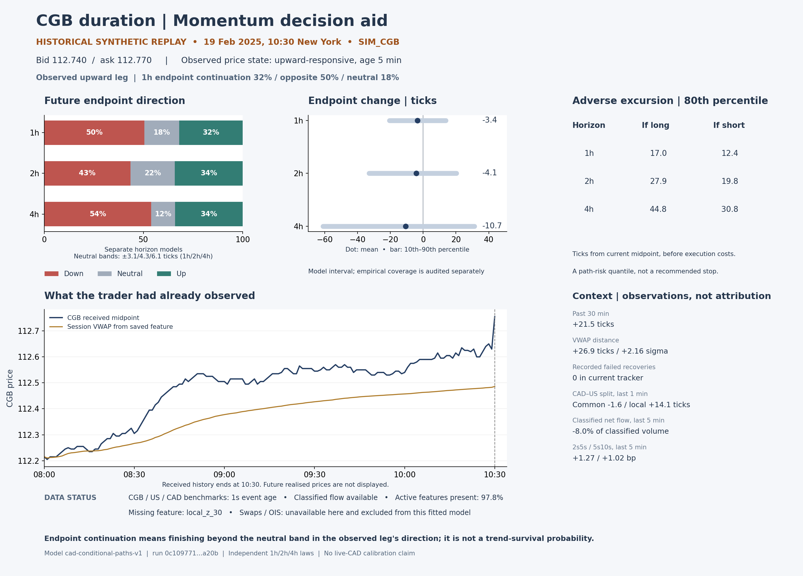

# From a directional prototype to a CGB momentum decision aid

The one-hour model remains worth developing. We now have a narrower and more useful interpretation of its success: it is a conditional directional forecast that sometimes follows an existing move, sometimes opposes it, and sometimes anticipates movement from balance. The next product should make that distinction explicit. The intended deployment is a read-only aid to a duration trader, with observation, forecast, path risk and data health visible together.

This folder contains the first bounded batch from the [research plan](../../docs/thesis-review/research-plan.md), a focused source-code comparison with Fractal X, and a trader display built from an actual saved synthetic forecast. The original S0 histories, fitted models and results remain unchanged. Component comparisons reuse previously inspected S0 TEST data and are retrospective diagnostics. The separate observability laboratory saved its protocol before generating its new worlds.

For the smaller live-product design, read [the compact indicator](compact-indicator/REPORT.md): ten verified source excerpts, a one-horizon panel, explicit failure behaviour, and 32 logical display checks.

## What the new experiments say

### The one-hour result survives a useful comparison, but has a time-of-day weakness

We trained fixed price-only and clock-only comparators using the original TRAIN/CAL partition for each of the three base histories. Lower endpoint-class log loss is better.

| Synthetic history | Frequency baseline | Clock only | Price only | Full one-hour model |
|---|---:|---:|---:|---:|
| 1729 | 1.0600 | 1.0555 | 0.9802 | 0.9516 |
| 2718 | 1.0927 | 1.1049 | 1.0107 | 0.9750 |
| 3141 | 1.0749 | 1.0743 | 1.0368 | 0.9838 |

The full one-hour model wins on each full evaluation sample. Only one of the three paired session-bootstrap intervals excludes no improvement. There are eight TEST sessions per history, so many overlapping forecast rows do not provide many independent sessions.

When we restrict the one-hour evaluation to the morning origins also eligible for four-hour forecasts, the advantage disappears in two of the three histories. All three matched-origin uncertainty intervals cross zero. This identifies a concrete next experiment: vary event timing and market mechanisms while keeping the model frozen. It does not justify choosing a favourable trading schedule from these same TEST outcomes.

At four hours, the price-only comparator wins in all three histories on point estimates. The one-hour product deserves priority; two and four hours remain separate research views. A weak clock-only model does not rule out interactions between the clock and other features. Matched timestamps also do not make the different horizon targets identical.

### The model is not exclusively a continuation model

We classified the saved one-hour trades using the existing 30-minute normalised-momentum threshold, fixed before this added analysis. Of 122 trades across the three base histories:

- 49 followed the established move;
- 27 opposed it;
- 46 occurred when the past move was inside the declared balanced region.

The continuation subset had positive net ledger totals in each history, including under the existing higher-cost assumptions. Those are partitions of an already executed policy. They are not returns from a separately tested continuation-only policy, because removing trades can change later position availability.

This is a consequential product decision. Display the observed leg and separately show endpoint continuation, opposite direction and neutral probabilities. Do not describe every profitable directional forecast as momentum. The display's relative label uses the observed price state; this audit uses the declared 30-minute momentum threshold. Both definitions are documented, and their disagreement should be measured before choosing a production definition of an episode.

### More structural components are not automatically improving the forecast

The existing one-hour fits select essentially the supervised price-class path expert. We added a comparator with identical endpoint-class probabilities but uniform paths within each class. Local path weighting improves the average of endpoint and two adverse-excursion CRPS scores by approximately 0.27%, 0.68% and 0.35%. Two paired intervals exclude zero. These small differences measure forecast quality in ticks, not trading profit.

We also selected mixtures on that three-marginal path objective rather than endpoint classification alone. All three CAL fits again chose the supervised-local expert. The original objective did have a path blind spot, but correcting it did not rescue the transition expert in this experiment. The new score evaluates three marginals; it does not establish joint path coherence or first-passage accuracy.

Keep the observer and the direct forecast visible. Give an additional structural expert responsibility when it improves a specified quantity, such as reversal timing, adverse excursion or response to changing capacity. [Full attribution report and exact results](component-audit/report.md).

## How close this is to Fractal X

The strongest similarity is architectural. The probability engines and market objects differ materially.

| Layer | Source framework | Current CGB adaptation |
|---|---|---|
| Exposure | Daily selected universe and constructed spread | Outright CGB duration with CAD and US context |
| Observation | Persistent eleven-tag leg automaton in two blocks | Five price states with age, response and recovery features |
| Future construction | Sequential leg simulation and structural transition laws | Conditional empirical future paths and learned state/price heads |
| Probability | Structural/MC evidence, temperature and amplitude-squared normalisation | CAL-selected convex mixtures of path experts |
| Output | Saved official forecast with identity; read-only display | Frozen artifacts and saved horizon forecasts; read-only display |
| Feedback | Some training weights active; several interventions diagnostic | Outcome records and diagnostics; no autonomous live adaptation |

A useful source-grounded use case is: **observe the current duration episode, estimate what can happen next, expose the likely path and the observations that would weaken the interpretation, and let the trader compare that view with their position and thesis.** This is a reconstruction from written code and lessons, not a claim about the author's private thoughts.

One especially useful source finding is that several cybernetic diagnoses do not change the original strategy parameters. They publish diagnostics. Its active training-memory weights are a separate mechanism. Likewise, its observed tag and predicted tag are separate objects. These distinctions support a clear first CGB product: informative monitoring with a reproducible forecast, before introducing automatic reactions to recent errors.

The focused [source comparison](docs/fractal-structure.md) records notebook cells, active versus diagnostic channels, missing pieces and deployment implications. It builds on the completed [47-document thesis review](../../docs/thesis-review/REPORT.md); it does not claim a new full-corpus rereading or independent verification of the source model's performance.

## New worlds: is the problem information, representation or decision-making?

The [observability laboratory](observability/REPORT.md) separates three questions using a tractable Gaussian pressure process, an identical-history branch experiment, and a strict traded-price martingale control.

1. **Information:** Across 128 independent TEST worlds, a precise current pressure proxy reduces the one-hour causal observer's loss gap versus a hidden-state oracle from 0.1459 to 0.0213. Delivering that precise proxy thirty minutes late leaves a gap of 0.1396. The measurement clock can matter more than adding learner complexity. These are continuous forecast losses under a specified artificial world, not CGB performance figures.
2. **Observability:** Paired worlds share the received history before their futures separate. The observer produces identical forecasts until a branch-sensitive observation arrives. First numerical divergence is not reliable statistical detection: a live observer cannot subtract the counterfactual paired world. Detection delay and false alarms remain an experiment to run.
3. **No-advantage control:** Across 1,024 martingale worlds, all four simple predictable policies have gross-mean uncertainty intervals containing zero and negative mean net outcomes after declared crossing costs. Some individual worlds are profitable. The full CGB learner has not yet been run on this control; this batch validates the control and accounting harness.

The independent audit checks filtering against direct Gaussian conditioning, horizon variances, past-only actions and every one of the 61,440 execution rows. Raw worlds, forecasts, coefficients, ledgers, plots, equations, protocols and checks are included. These experiments distinguish missing information from a learner's failure to extract available information. That distinction tells us what to build next.

## What the trader should see

The subsequent [chart workspace](chart-workspace/README.md) makes received CGB price the primary view, with known levels, causal event markers, one observed-flow pane and a separate model-balance pane. It is the current interactive presentation direction; the compact snapshot below remains a useful drilldown and comparison baseline. The workspace includes source, screenshots, replay data, iterative browser checks and a human acceptance plan inspired by BigShort's public chart documentation.

This snapshot is selected by a fixed clock rule, not its later outcome. CGB has risen 21.5 ticks over the preceding half-hour. The one-hour forecast assigns approximately 32% to an endpoint continuing upward, 50% to the opposite direction, and 18% to the neutral band. Its mean is −3.4 ticks, while its model 10th–90th percentile range is −20.6 to +13.8 ticks. The current spread is three ticks.

That supports a precise trader conversation: the market has risen, but this model does not strongly support chasing it, and its expected move is small relative to uncertainty and crossing costs. It is not an order instruction. Endpoint continuation also does not mean an uninterrupted trend or survival of the current state.

The compact display prioritises:

- the current observed phase, age, received price and VWAP;
- separate one-, two- and four-hour direction probabilities and target definitions;
- endpoint ranges and long/short adverse-excursion quantiles in ticks;
- measured context, distinguished from causal attribution and from inputs actually used by the fit;
- missing/stale inputs, forecast timestamp and model identity.

Calibration history, scenario support, expert contributions and trader annotations belong in a drilldown. Avoid an arbitrary composite confidence badge. Forecast dispersion, disagreement and stale data are different reasons to hesitate. [Display logic, exact definitions and production contract](../../docs/trader-use.md).

## What is complete and what remains

| Planned item | This batch | Remaining work |
|---|---|---|
| E01 attribution | Endpoint-preserving path comparison and CAL path-objective mixture completed | Joint path/first-passage scoring and new mechanism evaluation |
| E02 timing | Clock/price baselines and matched-origin comparisons completed | Event-clock jitter and held-out event schedules |
| E03 coordinates | Not run | Independent information versus derived alternate coordinates |
| E04 oracle/filter/learner | Tractable five-sensor laboratory completed | Connect to the actual CGB observation map and learner |
| E05 observable twins | Identical-prefix target-switch construction completed | Reliable recognition/false-alarm timing; endogenous inventory branches |
| E06 strict control | Price martingale and four-policy accounting harness completed | Full CGB pipeline false-opportunity audit |
| E07–E16 | Not run in this batch | Inventory/capacity, memory, propagation, predictive states, geometry, coherent horizons, decision and feedback experiments |

The fastest useful next sequence is:

1. **Fix the product target.** Keep the one-hour view primary. Record continuation, opposition and emergence separately; score all eligible origins, including abstentions. Decide whether the episode definition is price-state-based or momentum-threshold-based before using its label to judge forecasts.
2. **Attack the discovered weaknesses.** Run clock jitter, fresh mechanism families, E03 and the full learner on the strict control. Preserve the current model as a comparator. Do not keep reusing the same TEST sample to tune the story.
3. **Add one endogenous mechanism.** Use a small inventory-and-capacity world to ask whether age, replenishment and response distinguish unfinished adjustment from exhaustion. Compare an instantaneous observer with an age-aware one before adding a larger recurrent model.
4. **Make the observation service operational.** Connect actual received timestamps and contract metadata; exercise late messages, outages, session resets and restarts. Establish streaming/batch parity and measured latency. Keep training offline and the display a read-only artifact consumer.
5. **Run a frozen real-data replay and shadow trial.** Measure calibration and incremental information against price-only and the trader's existing process. Record decisions and overrides before outcomes. Required history follows event coverage and uncertainty, not a convenient fixed day count.

We can build and stress the structure before market data arrives. Production usefulness also depends on whether the received market observations carry the relevant information, and whether traders interpret the output correctly. The next concrete milestone is a reproducible one-hour shadow indicator with explicit limitations and failure states. Automated order routing is outside that milestone; costs still help interpret whether the predicted movement is useful.

## Reproduction and integrity

The component folder includes protocols, fitted comparator models, origin/session scores and [verification](component-audit/verification.json). The observability folder includes its immutable pre-run [protocol](observability/protocol.json), [runner](observability/run.py), [independent numerical audit](observability/independent-audit.md) and rendered mathematical report. The trader-view folder includes its [read-only builder](trader-view/build_snapshot.py), JSON snapshot, forecast table and image.

Original study preservation and presentation checks are recorded in this folder's verification files. The study-wide SHA-256 manifest inventories the completed delivery. The numerical experiment sources and original protocol remain tied to their saved hashes. Documentation clarifications, including the twin filter's misspecification throughout the experiment, are recorded openly without rewriting the completed-run protocol.
