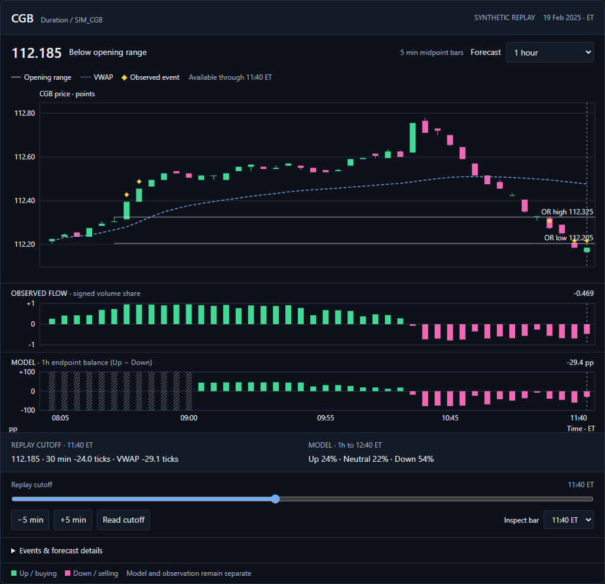
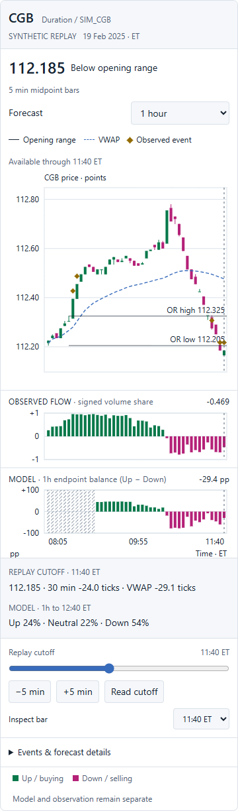
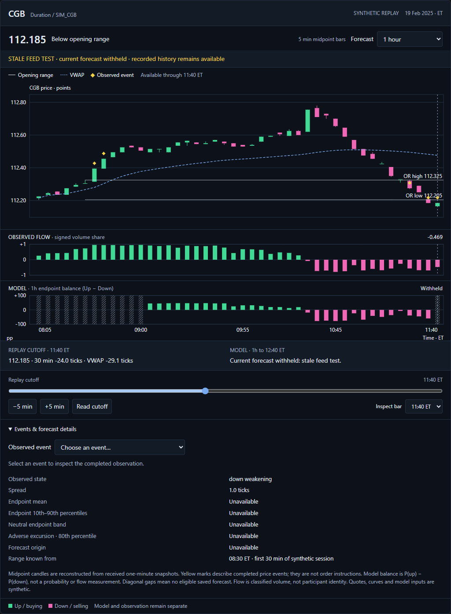

# CGB chart workspace: design, replay and iterative tests

This is a working chart-first presentation of the existing synthetic CGB study. It replaces the probability card as the primary view; forecast and path details remain available underneath. It does not change, refit or improve the saved model.

## What the trader reads

The first question is **where is CGB moving relative to something already known?** The largest pane answers it with received midpoint candles, the known opening range, session VWAP and yellow observed-event markers. Green means higher CGB prices; magenta means lower CGB prices. Yield direction runs the other way. The 30-minute opening range is an explicit demonstration reference, not an empirically selected optimal CAD session rule.

The second question is **what measured pressure accompanied that movement?** One aligned histogram shows aggressor-classified volume imbalance on a fixed minus-one to plus-one scale. Buying and selling refer to the signed classified tape. This is neither a participant-identity detector nor an absorption estimate. A large printed volume imbalance can coexist with weak price response; the UI must let that disagreement remain visible.

The third question is **what does the saved model infer about the selected horizon?** The separate MODEL pane displays the up probability minus the down probability, in percentage points. A negative bar means the down endpoint class has greater probability than the up class. It is not the probability of a down move, a confidence score or an order. The selected-time readout retains all three endpoint probabilities, including neutral. A zero balance can come from substantial uncertainty or high neutral probability, so the full distribution remains one glance away.

The fourth question is **which time am I reading?** The replay cutoff controls what exists on the chart. Inspection selects a completed historical bar without advancing that cutoff. Candles, flow, observed state and forecast share the selected bar's clock. The label changes between REPLAY CUTOFF, PINNED HISTORY and HOVER. Hovering between bars uses the preceding completed bar; clicking pins it. The native bar selector provides the same access without a mouse.

These questions provide a useful order of attention. Adding more permanent gauges would compete with that order. US duration, the CAD curve, input health and future research mechanisms can enter an explanation drilldown when a verified quantity needs explaining; they do not need a permanent coloured pane simply because they exist in the dataset.

## What came from BigShort

BigShort's public chart documentation and published screenshot show a dominant price pane, aligned indicator panes and configurable supporting information. Its navigation guide describes bar-specific readouts and saved layouts. Its FastFlow/MomoFlow documentation warns that visible-window scaling can make small bars appear large. We used that interface organisation and scaling concern to derive a smaller CGB workspace. [Main Chart](https://help.bigshort.com/docs/tabs/chart), [Charts & Navigation](https://help.bigshort.com/docs/getting-started/charts-navigation), [FastFlow & MomoFlow](https://help.bigshort.com/docs/indicators/core-flow/fastflow-momoflow).

The public screenshot was inspected in the browser. This work did not operate a paid BigShort account or recover its proprietary signal formulas. The detailed [source review and acceptance plan](UI-REVIEW.md) separates documented behaviour, our design choices and still-unrun human tests.

## Translating the sketch into precise behaviour

| Sketch element | Implemented meaning | Why this choice matters |
|---|---|---|
| Two horizontal levels | First 30 minutes' received midpoint high and low | A reproducible reference, known only after the interval closes |
| Yellow marks | Break, second close held outside, or return inside | Records an observation at its actual confirmation time |
| Green or magenta continuation | Signed candle/flow/model marks in separate panes | A coloured future arrow would imply a path prediction the saved model did not publish |
| Price oscillating then escaping | Historical candles from received observations | The displayed path is not hand-drawn to flatter the indicator |
| More detail when needed | Event selector and forecast/path disclosure | Keeps the default view small without hiding the definition |

The displayed default is 11:40 ET on the first TEST session of base-1729. This demonstration time shows both a completed upside episode and a later downside break. It was chosen to expose the interactions, not to estimate signal success. There are 96 completed bars, 168 saved forecasts across three horizons and five observed transitions in the full session.

At 10:30 the price has risen while the one-hour model favours the opposite endpoint. Inspecting that time is especially useful: the chart must represent the disagreement honestly. At 11:40 the displayed model is more aligned with the recent decline. Neither snapshot establishes incremental predictive value; the original model evaluations remain the evidence for that separate question.

## Small decisions that prevent large misunderstandings

The candle interval stays five minutes when the forecast horizon changes. The one-hour horizon is primary; the separately fitted two- and four-hour views are labelled research. No interpolation manufactures a coherent multi-horizon path. A forecast is unavailable when its target exceeds the synthetic session close.

Opening-range lines begin at the time they became known. They are not extended backwards over the forming range. Event marks use completed closes, and the held mark waits for the second close. Returning inside resets the episode. A falling price does not generate a fresh yellow alert every five minutes.

Price scaling uses only observations through the cutoff. The normal view includes known levels; an optional design control fits observed prices and visible VWAP. Flow stays on a fixed signed-share scale, and model balance stays on a fixed percentage-point scale. A quiet interval cannot acquire dramatic histogram bars merely because the viewport changed.

Missing model/flow values receive diagonal gaps. Genuine zero flow remains a measured zero. A neutral distribution retains its probabilities. Missing forecasts do not silently carry forward, and a mid-session gap is not falsely labelled warm-up.

The stale-feed design fixture withholds the cutoff forecast while keeping explicitly labelled historical records inspectable. This is a presentation test, not a deployed freshness service. Actual feed timestamps, identity validation, freshness thresholds and forecast expiry must be wired through the existing validated snapshot contract before a live version uses this display.

The desktop view avoids a permanently open sidebar. On narrow screens, the readout stacks below the chart, controls wrap and time ticks reduce. Details remain in the page; they do not cover the candles. The event list is a native keyboard/touch target, avoiding tiny mandatory diamond clicks. Tap inspection pins a bar, and Read cutoff returns to the replay endpoint.

## What was actually tested and changed

The machine-readable [test history](test-runs.json) retains failures as well as passes. These were browser and data-integrity tests, not a claim that traders completed the acceptance plan.

| Iteration | Observed result | Change or response |
|---|---|---|
| Initial browser run | Eight viewport/theme cases passed; standalone mobile render timed out | Added an explicit body mount to the test wrapper and mobile viewport metadata |
| Added between-bar timing test | Failed: a pointer between closes selected the next completed bar | Replaced nearest-time selection with preceding-completed-bar selection; disabled the pre-first-close hit region |
| Revised run | Nine cases passed, including coarse-pointer and source-only mounting | Retained the regression test |
| Expanded semantics and layout pass | Seventeen cases passed | Covered six widths in both themes, touch, and missing/zero/neutral/missing-forecast fixtures |

Review also removed height-triggered redraws that could reset an event disclosure and corrected the missing-forecast wording to distinguish warm-up from a later gap. These were review fixes; no failing test for them is invented in the history.

The [browser verification](ui-verification.json) covers 1440, 1024, 736, 390, 360 and 320 pixels in light and dark modes. Each of those twelve cases checks three horizons, eight cutoffs, known-at levels, event timing, past-only price scaling, selected-time probability identity, shared crosshairs, historical inspection, stale-current withholding, layer controls, keyboard replay, persisted state and text clipping/overlap. A separate coarse-pointer case exercises real tap input and target heights. Four fixtures distinguish missing flow, zero flow, neutral model output and absent forecasts. The committed source also mounts independently of the inline preview.

The [data verification](data-verification.json) separately checks exact causal OHLC, six prefix cutoffs, poisoned future inputs, late arrivals, original probability identity, exclusion of realised future outcomes, warm-up, missing flow and event transitions. [DATA.md](DATA.md) specifies definitions and source hashes. The original input/model artifacts remain unchanged.

## What good UI still requires us to learn

Automated correctness does not tell us whether a trader understands an unfamiliar display quickly. The next experiment should compare this chart with the earlier compact card on fixed questions: identify the selected horizon, locate an observed break, distinguish pressure from forecast, recognise a missing source, and explain a price/model disagreement. Record correctness, response time and specific misunderstandings. Counterbalance the interface order and use comparable unseen examples so memorisation does not favour the second view.

The [18-task acceptance plan](UI-REVIEW.md#manual-acceptance-tasks) is broader than this prototype. Zoom/pan, clustered dense event selection, arbitrary continuous-time forecasts, live session transitions, late-message UI replay and real trader comprehension have not been implemented or validated here. Native inspection selects completed five-minute bars. There is no order routing, market connection or fake real-time ticker. Endpoint percentiles in details are model quantiles, not guaranteed limits or a simultaneous path envelope.

The useful live version would consume one validated observation/forecast snapshot, update the same three aligned panes, and make its available-at time and health visible. Offline research changes the saved model. The interface reads its output. This boundary makes it possible to change the visual hierarchy without silently changing the quant experiment.

## Files and reproduction

| File | Role |
|---|---|
| [prepare_data.py](prepare_data.py) | Reconstruct and verify the received synthetic replay |
| [chart-data.json](chart-data.json) | Bars, events, forecast records and provenance |
| [workspace.js](workspace.js), [workspace.css](workspace.css) | Functional interface source and standalone mount |
| [verify_ui.cjs](verify_ui.cjs) | Render and interact with the committed interface in memory |
| [UI-REVIEW.md](UI-REVIEW.md), [DATA.md](DATA.md) | Source rationale, future human test plan and measurement contract |
| [test-runs.json](test-runs.json), [ui-verification.json](ui-verification.json) | Iteration history and final browser results |

Run `python prepare_data.py` from this folder to rebuild the replay. Run `node verify_ui.cjs` with Playwright available to test the committed source, or pass the absolute inline fragment path to test that exact preview. Set `BROWSER_EXECUTABLE` if the installed browser is outside Playwright's managed cache. D3 is pinned to 7.9.0 on its approved CDN. Browser tests write screenshots and verification records in this folder. No HTML deliverable is committed; the preview is shown in the conversation and the repository retains its functional source, data, reports and checks.
