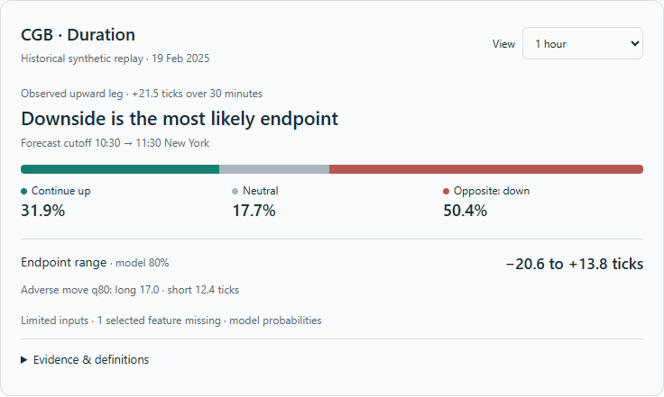
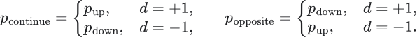

# The compact live CGB indicator

The first screen should answer four questions: what is moving now, whether the forecast supports that direction, how much movement is plausible, and whether the reading is current. One selected horizon is enough. Start at one hour; place the weaker two- and four-hour research views behind a horizon selector.

The proposed product is a small panel beside the trader's existing price chart. The research report remains a drilldown. The model still performs all its calculations; the trader sees the quantities needed to interpret one decision horizon.

This is a prototype using the same saved 19 February synthetic forecast as the previous display. It is not connected to a live market feed. The failure examples use explicitly constructed health records. The display mapper is implemented and tested; the production observation service is still to be connected.

## Decisions derived from the source

The [source dossier](source-dossier.md) contains ten exact passages with original wording, clearly labelled English translations, physical lines or notebook cell/source lines, and verified source hashes. [quotes.json](quotes.json) supplies the machine-readable register. These are selected relevant passages, not every message or a claim to know the author's private thoughts.

The source separates the observed graph at T from its predicted tag at T+1. That distinction is essential for our user: the market can be rising while the model forecasts a decline. A single arrow would conceal which of those claims it represents.

The source also organises exposures and distinguishes hidden state from measurements. Our evidence panel should therefore group CGB duration, common US duration, Canadian curve and liquidity response. A named account's unfinished inventory must not appear as a measured fact merely because the forecast is directional. Pressure, if later estimated, needs its own explicit observer.

The source's read-only presentation boundary is useful: a screen consumes the official saved forecast. It should not run another learner, invent an entry threshold, or change probabilities to match a narrative. The inspected source does contain separate display rules, and several feedback interventions are diagnostic. We must identify those distinctions instead of assuming every displayed quantity changes the strategy.

Our focused audit also found a source limitation: the latest predicted tag is displayed without checking its age. We improve that in the CGB design. The quote about an inconsistent artifact remaining invalid despite good performance directly supports treating time and identity as part of correctness.

## The default face of the indicator

| Visible item | Why it earns space | Actual origin |
|---|---|---|
| Contract, mode, forecast cutoff and target time | Establish what instrument and time interval the reading describes | Snapshot metadata and declared horizon |
| Observed leg, with a short received-price observation | Make the existing move explicit | Observed price state and past 30-minute move |
| Most likely endpoint category | Provide a literal headline without adding a conviction threshold | Largest of saved up/down/neutral probabilities; ties remain ties |
| Three probability shares | Distinguish continuation, opposition and a neutral endpoint | Existing saved class probabilities, relabelled relative to the observed leg |
| Endpoint q10–q90 range in ticks | Show plausible movement magnitude and two-sided uncertainty | Saved empirical-path quantiles |
| Long/short q80 adverse move | Reveal a potentially difficult path even when endpoint direction looks attractive | Saved directional excursion quantiles |
| Availability or missing-input reason | Prevent old, unsupported or incomplete readings from looking like new clean forecasts | Separate current health plus model/feature status |

The compact face does not need a second price chart, Sharpe, drawdown, entropy, all curve spreads, every feature, state-transition matrices or a large synthetic equity curve. Those objects still have a place in the research and reliability drilldowns.

The headline is deliberately literal. “Downside is the most likely endpoint” means that its probability is the largest of the three categories. It does not require that probability to exceed 50%, imply a calibrated strong signal, or instruct the trader to sell. Always show the probability shares beside it. A forecast with probabilities 34%, 33%, 33% should visibly look weak even though one category is technically largest.

For an observed directional leg d, continuation and opposition are derived by relabelling existing probabilities:

A balanced observed state has no directional leg to continue, so the display uses absolute up/down/neutral categories instead. The five-state observer's weakening label is based on its defined price rules. It is not itself a measured probability that the leg will end.

Continuation here means ending beyond the neutral band in the current leg's direction. It does not mean uninterrupted movement, avoiding a pullback, or surviving in the same state. The q80 adverse move can be exceeded and does not prescribe a stop. The endpoint interval is a model predictive interval, whose actual coverage must be measured separately.

## Why a single momentum dial loses necessary meaning

The current forecasting code already exports a signed orientation:

This is a probability imbalance, not a probability of success. An 80% up / 20% down forecast and a 60% up / 40% neutral forecast both have +60 percentage points of imbalance. Similarly, a 50/50 up/down forecast and a 100% neutral forecast both produce zero. Their risks differ substantially.

We can use a small directional mark for orientation, but the three shares preserve what the single number discards. Missing information gets an unavailable state, never a synthetic zero. Fresh conflicting evidence and missing evidence also remain separate in the drilldown.

## What happens to all the machine learning

The existing pipeline calculates features, the observed state, future-state and price-class forecasts, path weights, and path summaries. It then publishes an immutable record. The indicator consumes that record. The complete chain is: received observations, causal features and state, frozen model, weighted future scenarios, saved forecast, validated display mapping, screen.

Every headline number has an explicit field: `p_up`, `p_neutral`, `p_down`, `endpoint_q10_ticks`, `endpoint_q90_ticks`, `mae_long_q80_ticks`, and `mae_short_q80_ticks`. The UI does not translate twenty scientific concepts into an unexplained score.

The first version's explanation should describe observations, not fabricate feature attribution. “CGB rose 21.5 ticks while the model assigns the largest mass to a lower endpoint” is supported. “The model is bearish because dealers have inventory to liquidate” is not currently produced by the fitted model. If we later add model attribution or inferred inventory, each must be clearly named and validated separately.

The detailed view contains the neutral band, midpoint anchor, expected movement, current spread, missing features, excluded modules, model identity and relevant calibration record. Economic witnesses can be added there when they are available. Four days of swaps cannot silently become swap confirmation throughout a month of futures history.

## How it should behave during a live session

The proposed initial schedule publishes a forecast every five minutes, matching the S0 decision grid. Each forecast retains its original midpoint, cutoff and target. Moving to one-minute forecasts is a separate evaluation choice, not a cosmetic faster refresh.

Live quotes and source health may update between forecasts. They must have their own timestamp. A new quote must never silently replace the price anchor underneath an old forecast: a distribution for 10:30 to 11:30 is not automatically a forecast from 10:34 to 11:34. The selected view should show its fixed origin clearly.

The prototype expires the headline at the next five-minute boundary. Its test health record must be no more than five seconds old. Those are explicit proposed engineering settings; they are not learned alpha parameters or universal market constants. Required source ages are declared independently. The demonstration uses the existing CGB/US 30-second and benchmark 300-second limits. Optional excluded swaps do not disable a model that was explicitly fitted without them.

If a required source goes stale, the forecast expires, a run identifier disagrees, the contract is wrong, or the target crosses the session close, the primary reading is unavailable. Prior forecasts remain in history. A neutral probability is never substituted. A missing selected feature is labelled as limited inputs; whether a particular missingness pattern remains eligible ultimately depends on the deployed model policy and validation.

Numerical values should update when a new forecast arrives. Do not smooth probabilities or delay a direction flip just to make the panel look stable. If alerts are later desired, design and evaluate their persistence rules separately. A change in the most likely category alone is not yet an execution trigger.

## Logical checks performed

[indicator.py](indicator.py) is a pure mapping function for the enriched saved-snapshot schema. [test_indicator.py](test_indicator.py) runs 32 checks, recorded in [logic-verification.json](logic-verification.json).

| Case | Required behaviour | Result |
|---|---|---|
| Upward or downward observed leg | Map the correct same-direction and opposite-direction masses | Pass |
| Balanced observed state | Omit relative continuation; retain absolute endpoint probabilities | Pass |
| Equal maximum probabilities | Do not choose an arbitrary winning direction | Pass |
| Changed selected horizon | Use that horizon's own probabilities, interval and target | Pass |
| Missing/duplicate horizon or mixed cutoff | Unavailable | Pass |
| Wrong run, contract, model availability or target | Unavailable | Pass |
| Expired forecast or beyond-session target | Unavailable with explicit reason | Pass |
| Missing/stale required source or health heartbeat | Unavailable | Pass |
| Invalid probabilities, quantiles, excursions or quote anchor | Unavailable | Pass |
| Extra future outcomes inserted into the input | Display remains identical | Pass |
| Consumer called on the saved record | Record remains unchanged | Pass |

These checks establish display semantics and failure behaviour. They do not establish forecast calibration, sufficient trading edge or live service reliability. Browser checks separately cover horizon switching, collapsed details, failure displays, light/dark appearance and narrow layouts.

## What is implemented and what must still be connected

The compact mapping, source dossier, saved-data preview, failure cases and logical tests are implemented. The original trained models and their numerical forecasts are unchanged. The in-conversation preview is outside the repository; the repository retains Markdown, JSON, Python and a PNG preview.

The existing CLI live-reading output is thinner than the enriched snapshot used here. It publishes model identity and predictions but does not by itself supply the complete price anchor, neutral-band definition, session metadata and independently current health envelope. A production adapter must assemble those from the same compatible observation snapshot and model configuration. It must also supply the required-source manifest, validate contract rolls, and preserve data lineage. This prototype must not be plugged into raw CLI output while guessing those fields.

The complete production path still needs actual-feed replay, startup/restart and streaming parity, measured update latency, and calibrated usefulness during shadow operation. The next build should connect that adapter, not add another model layer merely to decorate the panel.

The trader acceptance test is practical: show a frozen reading without its future, ask what it forecasts, over which interval, what could go against the position, and whether any source is unavailable. Record the interpretation and decision before revealing the outcome. A useful compact indicator makes those answers easier and more accurate while preserving the model's uncertainty.
