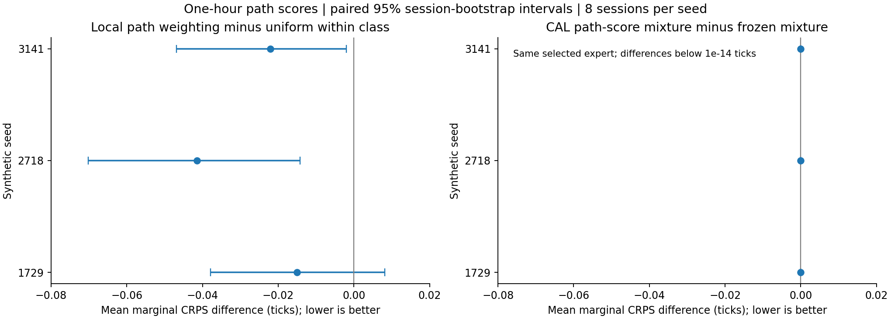
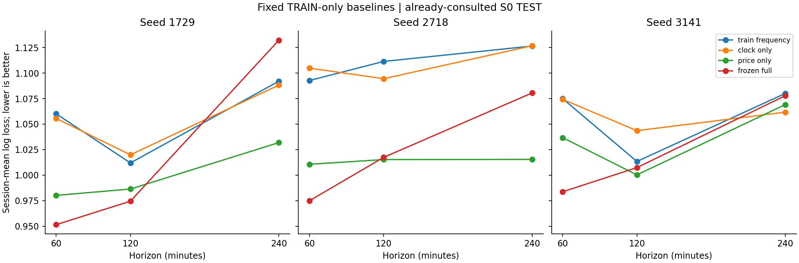

# What the existing model has earned — Phase-A experiments

The one-hour model captures useful structure in the three existing synthetic worlds. Its result is substantially stronger than a clock-only forecast, and the full observer improves on a fixed price-only classifier across the full eligible session in all three seeds. The evidence also narrows the claim: the transition expert does not earn a weight even when the calibration objective explicitly values adverse-path distributions; the local path adjustment is useful but small; and the stronger one-hour result is not uniform across time of day. Much of the saved trading activity is broader directional forecasting rather than continuation of an already established price trend.

These are **retrospective diagnostics on the already-consulted S0 TEST sample**. The protocol was fixed before this bounded run, but the sample is not newly untouched. No new trading policy was selected, and no original simulation, fit or result was changed.

## 1. What ran

E01 reconstructs every one-hour path expert for seeds 1729, 2718 and 3141: local empirical paths, future-state-conditioned paths, price-class-conditioned local paths, and the saved mixture. A new comparator retains the exact same frozen price-class forecast but gives each TRAIN path equal mass within its endpoint class. A fourth-expert mixture is fitted on CAL using the average continuous ranked probability score (CRPS) of endpoint movement, long adverse excursion and short adverse excursion, divided by the current observed volatility scale. The score is proper for those three marginal distributions; it does not identify their complete joint path law or first-passage timing.

E02 fits two fixed price classifiers on exactly the original TRAIN origins: a clock-only observer and a midpoint-price-only observer. The latter retains volatility, price-derived momentum/shape/state/age; it excludes spreads, book, signed flow, VWAP, cross-market observations and explicit clock. Both use the original fixed 100-tree, depth-two settings. CAL is not required for these fixed classifiers. The original full model remains frozen. At 120 and 240 minutes the full model also contains its CAL-fitted expert mixture, so those comparisons are architecture comparisons, not a pure feature ablation.

There are 576, 480 and 288 eligible TEST origins per seed at 60, 120 and 240 minutes, respectively. The matched-horizon sample uses the same 288 origins for each horizon. Paired uncertainty is calculated from eight session averages per seed, with 4,000 bootstrap resamples; overlapping forecast origins are not counted as independent experiments.

## 2. Directional attribution is now verified numerically

All three saved one-hour mixtures put effectively all mass on the supervised price-class expert. Reconstructed TEST class probabilities match the published ones within **1.56e-15**. Summing the supervised empirical-path weights by endpoint class recovers its classifier probabilities within **1.67e-15**.

The state-transition branch therefore contributes no separate final directional weight in these one-hour fits. Price state, age and other structured measurements still enter the classifier, and the empirical path bank still generates magnitude and excursion estimates. The useful question is which structure earns which role.

Changing the CAL objective to the three-marginal path score still selects **100% supervised-local** for every seed, to numerical precision. The resulting TEST predictions and scores remain identical. The original endpoint objective's blind spot was real, but removing this particular blind spot does not rescue the separate state expert in these worlds.

## 3. Does local weighting improve within-class paths?

Yes in the point estimates, but the improvement is small. The comparator has exactly the same directional probabilities, so all changes arise within endpoint classes.

| Seed | Local minus uniform marginal CRPS, ticks | Paired 95% session interval | Relative score improvement |
|---|---:|---:|---:|
| 1729 | -0.0150 | [-0.0378, +0.0081] | 0.27% |
| 2718 | -0.0414 | [-0.0702, -0.0142] | 0.68% |
| 3141 | -0.0220 | [-0.0469, -0.0019] | 0.35% |

Lower scores are better. A CRPS difference in ticks is a distribution-score difference, not extra ticks of profit. The first seed's interval includes zero. The other two support a small improvement within this fixed generator. This does not justify describing the local path machinery as the major source of the one-hour result. Its calibration and failure behavior remain worth retaining and challenging.

The full endpoint CRPS, separate adverse-excursion CRPS, adverse 80% quantile pinball scores and endpoint 80% interval scores appear in [path-summary.csv](path-summary.csv). [Paired differences](path-paired-differences.csv) include all components rather than only the successful comparison.

## 4. The model is doing more than reading the event clock

| Seed | One-hour TRAIN-frequency log loss | Clock-only | Price-only | Frozen full |
|---|---:|---:|---:|---:|
| 1729 | 1.0600 | 1.0555 | 0.9802 | **0.9516** |
| 2718 | 1.0927 | 1.1049 | 1.0107 | **0.9750** |
| 3141 | 1.0749 | 1.0743 | 1.0368 | **0.9838** |

Clock-only has little advantage over the class-frequency baseline. The full one-hour model improves on price-only by 0.0286, 0.0357 and 0.0530 log-loss units. The paired intervals exclude zero only for seed 3141. This supports keeping the broader environment as a research candidate; it does not isolate which external channel supplies the gain.

A weak clock-only model does not eliminate clock dependence through interactions. A model can use time to interpret current pressure without time predicting direction by itself. Fixed versus jittered event schedules remain a necessary separate experiment.

## 5. Morning and long-horizon comparisons change the interpretation

On the common morning origins that can accommodate four hours before the session ends, full-minus-price-only one-hour log-loss differences are **+0.0057, -0.0334 and +0.0137**. The full observer loses its point-estimate advantage in two seeds, and all three paired intervals include zero. Its full-session superiority should not be advertised as uniform throughout the day.

At four hours, full-minus-price-only differences are **+0.1003, +0.0651 and +0.0087**. Price-only wins in every point estimate, with the first two paired intervals entirely above zero. A more elaborate architecture is not automatically helping the longer holding window.

This is not a reason to select a favorable time-of-day rule from these eight sessions. It is a reason to preserve time-of-day and horizon diagnostics in the next untouched experiments. Raw log loss across horizons answers different classification tasks because horizon-dependent neutral bands and class frequencies differ; matched timestamps remove an eligibility difference but do not make the targets identical.

## 6. Is the successful forecast specifically a momentum forecast?

An additional [predeclared alignment diagnostic](alignment-protocol.md) classifies the forecast or saved trade direction relative to the existing 30-minute momentum definition. Absolute standardized momentum below 0.75 is a balanced origin; above that threshold, a matching direction is continuation and an opposite direction is opposing. No new alignment filter or trade was introduced.

Across all 1,728 one-hour forecasts, **661 are continuation, 261 are opposing and 806 originate in balance**. The output forecasts future direction across all three situations. A trader interface should distinguish them explicitly rather than labelling every directional prediction as continuation.

The saved model-trade groups are:

| Seed | Continuation trades / net C$ | Opposing trades / net C$ | Balanced-origin trades / net C$ |
|---|---:|---:|---:|
| 1729 | 20 / +900 | 9 / +2,094 | 12 / +662 |
| 2718 | 11 / +986 | 11 / +66 | 18 / +1,088 |
| 3141 | 18 / +808 | 7 / +752 | 16 / +646 |

Only **49 of 122 saved trades** are continuation under that definition; 27 oppose the observed trend and 46 start from balance. Continuation subtotals remain positive under the saved additional-slippage stress: +C$300, +C$656 and +C$268. Opposing trades account for most of seed 1729's saved profit, but are less reliable across seeds.

These are descriptive partitions of the existing price-touch benchmark ledger. They are **not** the P&L of separately executable filtered strategies: removing a trade could change later entry opportunities, and this diagnostic did not rerun the occupancy logic. Forecast rows overlap, and this small synthetic grouping is not a deployment claim. [All forecast groups](alignment-forecast-summary.csv), [all trade groups](alignment-trade-summary.csv) and row-level records are retained.

## 7. Decisions from this audit

Keep the one-hour full observer and the price-only observer as frozen comparators. Do not force a structural mixture weight or replace the existing fit based on these reused results. The smallest credible baseline is stronger than previously documented: a fixed price classifier plus simple class-conditioned empirical paths.

The next untouched worlds should distinguish three uses: established-trend continuation, directional emergence from balance, and reversal/opposition. Score each use without pretending that success at one establishes success at all. Keep their output labels separate for traders.

Next challenge time interactions with jittered or irregular event schedules, then build the competing unfinished-adjustment and completed-repricing worlds. The population/capacity model has to supply a distinction that this strong baseline misses. Check that the distinction becomes observable early enough to matter, and evaluate it on independent mechanism families. The one-hour result is encouraging as a synthetic decision aid; the four-hour and time-of-day findings argue against promoting one undifferentiated momentum score across the whole holding window.

## 8. Verification and scope

The run took approximately 183 seconds before output aggregation and plotting. Eighteen new restricted-information classifiers were fitted on TRAIN, and three one-hour path mixtures were fitted on CAL. No TEST tuning, policy selection or generator changes occurred. All consumed S0 sources remained hash-identical. The exact CRPS calculation was checked against a direct finite-distance matrix; probabilities were finite, nonnegative and summed to one. [verification.json](verification.json) records source hashes and reconstruction errors. The alignment diagnostic has its own [verification](alignment-verification.json).

E01 is partial relative to the wider research plan: it evaluates three marginal distributions, not first-passage timing or a new action adapter. E02 is partial: it includes clock/price baselines and matched origins, but no newly generated event schedules. E03 was not run. No fresh-world, real-data, L2 replay, live-feed, trader-use or operational-readiness claim follows from this audit.
