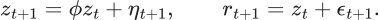
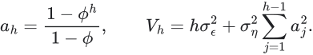
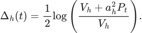
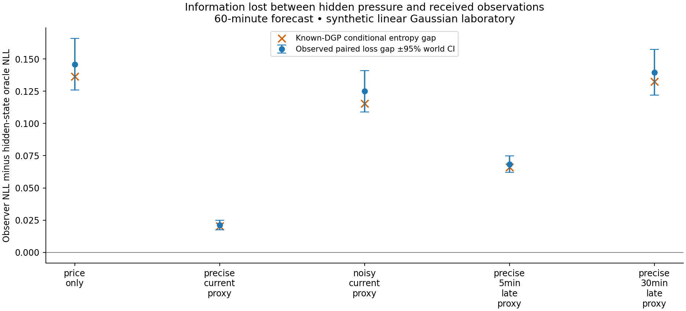
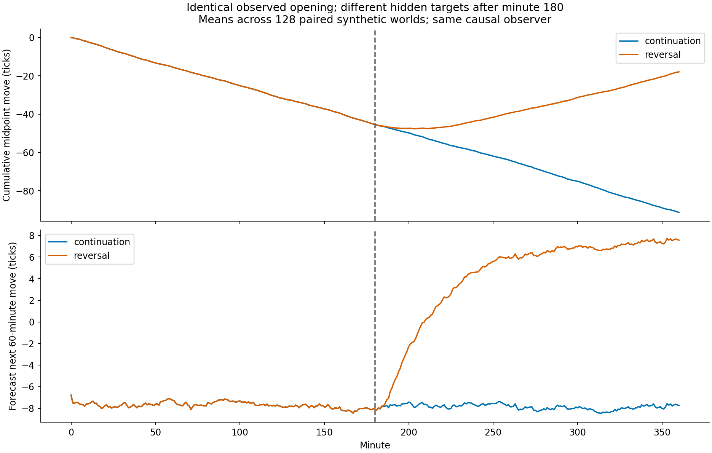
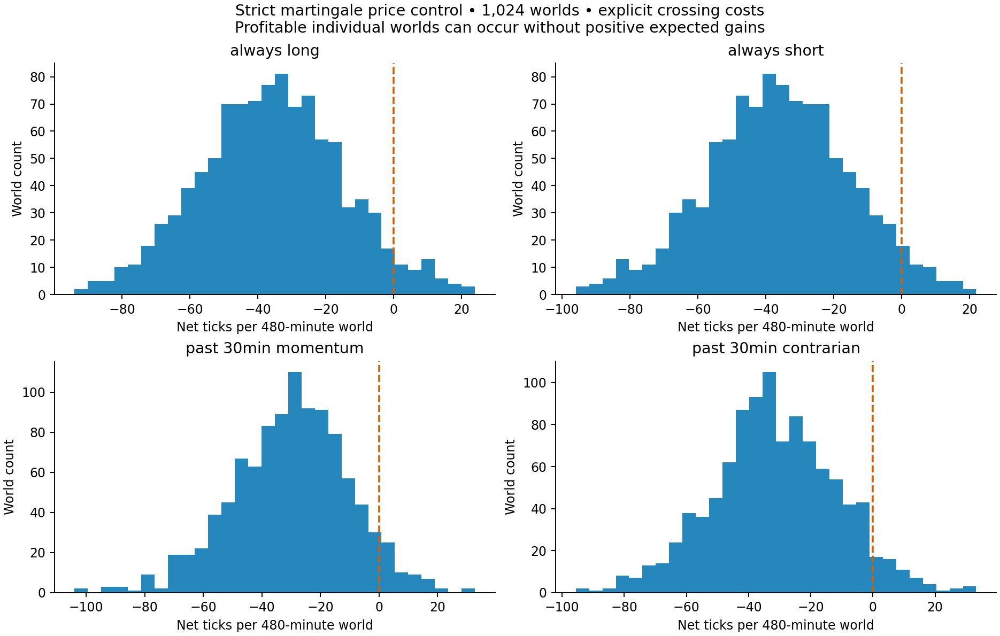

# Observability, identical histories and a strict price control

This new laboratory runs bounded versions of E04, E05 and E06 from the [research plan](../../../docs/thesis-review/research-plan.md). It studies a tractable price process separately from the full bond ecosystem. It compares information access, preserves identical observation histories in paired worlds, and checks predictable policies against a strict martingale price control. It does not fit or validate the original CGB model on these new worlds.

The [protocol](protocol.json) was saved before the run. [run.py](run.py), raw worlds, fitted ridge coefficients, origin-level forecasts, per-world scores, cost ledgers, figures and checks are included. TRAIN contains 96 independent worlds, CAL 32, and TEST 128. All five observation configurations and all three horizons were retained. No configuration was selected by its TEST result.

## 1. A world in which information loss can be measured

Let hidden pressure and the next midpoint increment obey:

The coefficient is 0.98 per minute. Pressure innovations have standard deviation 0.045 and return noise has standard deviation 0.8 ticks. Innovations are independent Gaussian variables. Pressure begins in its stationary distribution. A proxy message arriving at time t measures pressure at time t minus its declared delay, plus independent measurement noise.

The hidden-state oracle knows current pressure and the true parameters, but never future shocks. The causal Kalman observer knows the parameters and receives only price increments and arrived proxy messages. An augmented state retains the necessary lags, so late observations are attached to their correct source times. The learned comparator is a ridge model using 1-, 5-, 15- and 30-minute mean returns and the most recently received proxy. Its scaling and coefficients use TRAIN only; its Gaussian residual scale uses CAL only.

For an h-minute future sum, the current-pressure loading and future innovation variance are:

If the causal observer's current pressure estimate has mean m and variance P, its future-sum distribution is:

The oracle has mean equal to current hidden pressure times the same loading and variance equal to V. Thus the population proper-score penalty for missing current pressure information has a known expression:

This is an information benchmark in a known Gaussian world. The learned comparator is deliberately less informed about the DGP; it is not a replacement for the original CGB learner. Continuous Gaussian negative log likelihood here cannot be directly compared numerically with the original three-class log loss.

## 2. The one-hour results

Lower forecast loss is better. Uncertainty is calculated across independent world means, preserving dependence among overlapping forecast origins within a world.

| Received information | Kalman loss gap versus hidden-state oracle | 95% paired interval | Analytic information gap | Endpoint RMSE, ticks |
|---|---:|---:|---:|---:|
| Price only | 0.1459 | 0.1259 to 0.1660 | 0.1364 | 11.68 |
| Precise current proxy | 0.0213 | 0.0176 to 0.0250 | 0.0205 | 10.31 |
| Noisy current proxy | 0.1249 | 0.1089 to 0.1410 | 0.1155 | 11.44 |
| Precise proxy, five minutes late | 0.0684 | 0.0621 to 0.0748 | 0.0661 | 10.81 |
| Precise proxy, thirty minutes late | 0.1396 | 0.1218 to 0.1573 | 0.1324 | 11.61 |

The oracle RMSE is 10.10 ticks and is identical across configurations because the same underlying TEST worlds are used. The observer's nominal 80% intervals cover approximately 79.5%–80.6% of outcomes at one hour.

The result demonstrates an engineering distinction with a direct research use: a precise current observation closes most of the gap, while the same quality observation thirty minutes late adds little to prices in this world. Adding a mathematical layer cannot recover information that the observation system has discarded. A new measurement can matter more than a larger learner, but its usefulness depends on its precision and arrival time.

The ridge model is close to the optimal causal observer with price-only inputs: its additional one-hour loss is 0.0083. With the precise current proxy, that gap is 0.0284. A strong sensor can therefore leave a representation/learning gap as well as reduce the information gap. This motivates separate measurement and learner comparisons rather than attributing every error to one cause.

These numbers arise under the declared synthetic dynamics. The proxy is an abstract measurement of pressure, not a claim that an actual swap, book or inventory feed has this quality. The next data question is which available measurement could perform that role, with what latency and error.

All 45 configuration/horizon/forecaster summaries are in [forecast-summary.csv](results/forecast-summary.csv), paired comparisons in [paired-gaps.csv](results/paired-gaps.csv), and individual predictions in [forecast-rows.csv.gz](results/forecast-rows.csv.gz).

## 3. The same opening can lead to different futures

The paired construction begins with the same received price and proxy history. After minute 180, one hidden target continues downward while the other reverses. Noise draws are shared so that the controlled difference can be inspected. The same fixed causal observer runs on both branches.

The saved checks establish:

- Hidden pressure first differs at minute 181.
- A received return first differs at minute 182.
- The five-minute-late proxy first differs at minute 186.
- Forecasts remain identical until a branch-sensitive received input arrives; their first unequal value is at minute 182.

Minute 182 is **not** a statistically reliable detection time. The evaluator can subtract paired worlds with common noise; a real observer sees only one world. Reliable branch recognition requires a separate likelihood, false-alarm and delay experiment. Nor does this observer anticipate the hidden switch before evidence arrives.

There is also an explicit wording correction to the original protocol: its phrase “misspecified after the change” was too narrow. The observer is deliberately misspecified throughout this twin experiment, because the twin process has a different mean, persistence, innovation scale and initial state. The [independent audit](independent-audit.md) records the correction without changing the saved protocol or numerical artifact.

This is a target-switch observability construction, not yet a population of inventories reaching constraints. It provides a causality test and a baseline for that next construction. Raw received observations, latent evaluation truth and forecasts are stored separately as columns in [twins.csv.gz](results/twins.csv.gz); latent columns are evaluator outputs, not observer inputs.

## 4. A control in which predictable trading has no gross advantage

The martingale world has independent symmetric one-tick increments and a valid half-tick midpoint relative to integer-tick bid/ask quotes. Each action is bounded and is chosen from available history before its following 30-minute price change. Every active round trip pays one tick of spread crossing, one extra slippage tick and 0.4 fee ticks.

| Declared policy | Mean gross ticks | Gross 95% interval | Mean costs, ticks | Mean net ticks | Profitable worlds |
|---|---:|---:|---:|---:|---:|
| Always long | 0.16 | −1.14 to 1.47 | 36.00 | −35.84 | 5.3% |
| Always short | −0.16 | −1.47 to 1.14 | 36.00 | −36.16 | 5.0% |
| Past-30-minute momentum | 0.68 | −0.53 to 1.89 | 30.78 | −30.10 | 6.1% |
| Past-30-minute contrarian | −0.68 | −1.89 to 0.53 | 30.78 | −31.46 | 5.7% |

All four gross intervals include zero across 1,024 independent worlds. Net means are negative after the declared costs. Individual profitable worlds remain visible; a profitable sample alone is not an error in a no-advantage control.

Adjacent holding blocks deliberately liquidate and re-enter even when direction remains unchanged. A continuously held position would incur fewer crossings and is a different policy. The touch ledger reconciles exactly with gross movement minus costs for all 61,440 rows.

This tests the new price-control and accounting harness with four simple policies. **The full CGB forecasting pipeline has not yet been fitted and evaluated on this strict control.** That integration remains necessary before treating E06 as a false-opportunity audit of the original learner. Constructing a martingale at the traded-price level also avoids assuming that nonlinear bond repricing preserves a martingale yield.

## 5. What has actually been verified

The independent audit compares Kalman filtering with direct Gaussian conditioning, checks horizon means/variances, reconstructs every martingale action from past prices, and reconciles every touch-price ledger row. Future-message poisoning leaves all earlier filter states unchanged in all five observation configurations. TRAIN scaling, TRAIN coefficients and CAL variance remain separate. The source and protocol hashes match the completed run.

The appropriate next step is to connect a small inventory-and-capacity world to the same observer/evaluator separation, then test the actual CGB feature pipeline under that observation map. A more elaborate learner should follow evidence of a learner gap; a missing measurement should lead to a measurement requirement.

## Reproduction and artifacts

Run [run.py](run.py) from its directory with the project's NumPy, pandas and matplotlib dependencies. It refuses to overwrite a directory with a completed run marker. Use a new version folder for a new protocol. The experiment's [verification](results/verification.json) and [completion record](results/COMPLETE.json) identify what ran.

The source [protocol](protocol.json) remains unchanged. The interpretation corrections are in the independent audit. All plots were visually inspected. Equations are rendered as vector images in Markdown, with their LaTeX retained in `equations/source.json`.
