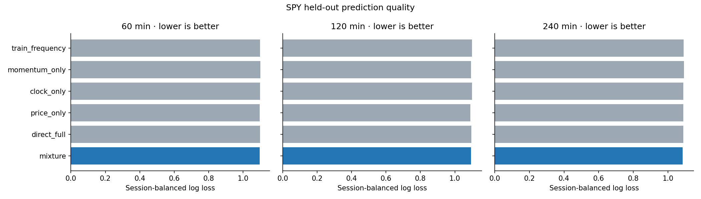
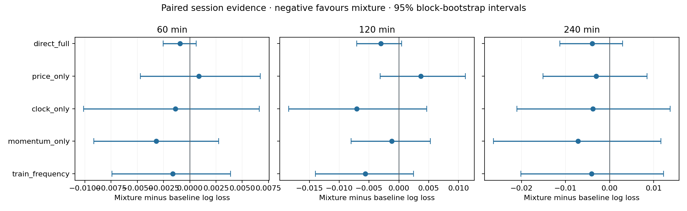
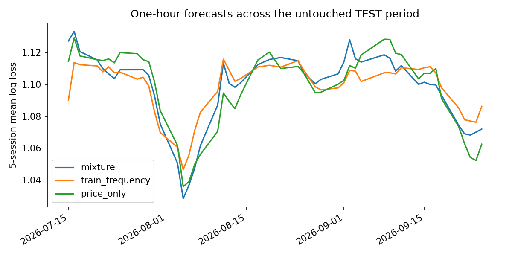
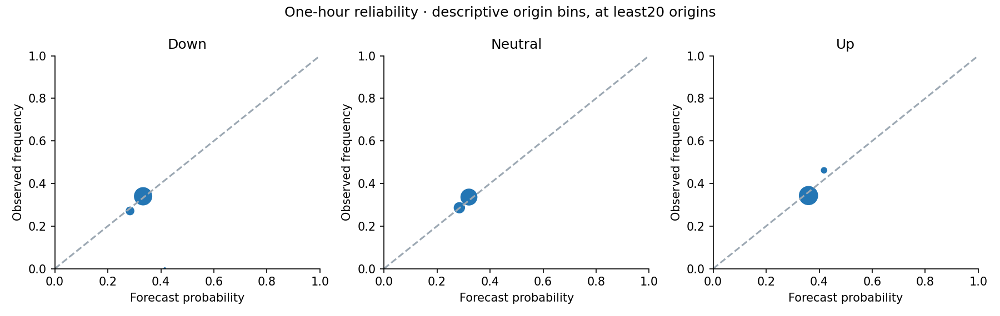

# Independent SPY real-data experiment

The existing momentum architecture runs on real SPY history, but this first held-out test does **not** establish a convincing directional forecasting advantage. Its one-hour probability score improves slightly on a constant training-frequency forecast and trails the simpler price-only learner. The paired uncertainty intervals include no improvement. This is a separate equity experiment: no CGB weights or market observations were used, and no CGB files were changed.

This run uses Fractal's existing EODHD connection as the data source. It refits the momentum observer and conditional-path architecture developed in this repository. It is not a replication of Fractal's complete six-notebook basket selection and deployment strategy.

## Data and the frozen experiment

The API returned 19,746 five-minute SPY rows from 26 September 2025 through 25 September 2026. Matching the XNYS regular-session calendar and requiring complete, valid OHLC and positive volume retained **241 sessions and 18,798 bars**. Ten sessions failed the declared quality rule, including both early-close sessions. Their counts and exclusion causes are recorded in [session-quality.csv](session-quality.csv) and the independent [data-quality-reasons.csv](data-quality-reasons.csv).

This complete-session cohort is a retrospective data-quality restriction. A live system cannot know at the open that a later feed gap will invalidate that day's research sample. The reported evidence is conditional on the retained cohort; missing observations were not forward-filled or converted to zero.

| Partition | Sessions | Dates | Allowed use |
|---|---:|---|---|
| TRAIN | 144 | 26 Sep 2025–1 May 2026 | Fit features' robust scaling, trees, transition counts and empirical scenario bank |
| CAL | 48 | 4 May–14 Jul 2026 | Fit state blending and expert-mixture weights |
| TEST | 49 | 15 Jul–25 Sep 2026 | Frozen evaluation only |

The [protocol](protocol.json) and [session split](split.json) were saved before fitting and evaluating outcomes. One hour is the primary horizon. Two and four hours are additional research views; they have fewer eligible intraday origins. Every target ends inside its origin's session and its own partition. Trees use the original fixed depth, count and learning rate. There was no TEST-driven hyperparameter search.

EODHD documents the timestamp as the **start** of each bar, so the study's decision clock is five minutes later. The endpoint supplies historical OHLCV, with delayed finalisation and possible data corrections. It does not supply the original receipt-time tape. This is a completed-bar historical experiment using an assumed bar-end observation clock, rather than an exact historical replay of what this API delivered at each instant. [EODHD intraday documentation](https://eodhd.com/financial-apis/intraday-historical-data-api).

## What was fitted

The model measures prior volatility, five-to-sixty-minute momentum, path efficiency, range position, recent volatility change and return asymmetry. The five observed states and their ages describe balance, directional response and weakening. Session time, relative bar volume and distance from a cumulative volume-weighted typical-price reference add context. That reference is labelled a **bar VWAP proxy**, because OHLCV cannot recover exact transaction-level VWAP.

The volatility denominator uses the preceding hour's five-minute return standard deviation, lagged one completed bar. Each forecast's neutral band uses that origin's known volatility and its own horizon. Price changes and adverse excursions are expressed in cents per share. No intraday bars are expanded into invented one-minute observations.

Two XGBoost heads learn future price classes and future observed states. A TRAIN transition table supplies a second future-state distribution. TRAIN scenarios contain normalized future close paths and coherent endpoint/adverse-extrema summaries from the same origins. Local feature similarity, state-conditioned scenarios and direct endpoint-class-conditioned scenarios form three probability experts. CAL selects their mixture. The numerical head, transition, neighborhood, redistribution and mixture routines are the existing shared research primitives; the OHLCV measurement layer is specific to this study.

No spread, queue, signed flow, swaps, rates or participant identity is manufactured. Volume is unsigned. Future adverse excursions use the subsequent bars' lows/highs, excluding the already completed origin bar. The five-minute close paths do not reveal the ordering of high/low events within a bar. No stop execution, fill price, slippage or net trading return is inferred.

## Held-out results

Log loss rewards accurate probability distributions and penalises confidence in the wrong outcome. Lower is better. Scores below give each TEST session equal weight.

| Forecast | One hour | Two hours | Four hours |
|---|---:|---:|---:|
| TRAIN class frequency | 1.098091 | 1.099169 | 1.089483 |
| Momentum-only learner | 1.099661 | 1.094716 | 1.092582 |
| Clock-only learner | 1.097815 | 1.100631 | 1.089180 |
| Price-only learner | **1.095584** | **1.089862** | 1.088407 |
| Full-feature direct price head | 1.097375 | 1.096544 | 1.089310 |
| Conditional-path mixture | 1.096452 | 1.093547 | **1.085388** |
| Eligible TEST origins | 2,646 | 2,058 | 882 |

The one-hour mixture's improvement over class frequency is approximately **0.15% in log loss**, not a trading return. Its mean paired loss difference is −0.001640, with a 95% five-session block-bootstrap interval of **−0.007402 to +0.003892**. Against price-only, the difference is +0.000868, with an interval of **−0.004714 to +0.006729**. Neither comparison separates a stable improvement from sampling variation.

The four-hour mixture ranks first among these listed candidates on this sample, but its advantage over price-only also has an interval crossing zero. Four-hour forecasts have a much smaller set of eligible origins and are not grounds for switching the declared primary horizon after inspection. All comparisons, including the unselected individual experts, remain in [metrics.csv](metrics.csv) and [comparisons.csv](comparisons.csv). These exploratory intervals do not include model-selection uncertainty or a correction for multiple comparisons.

## What the architecture actually contributed

| Horizon | Local path weight | State-conditioned path weight | Direct-class-conditioned path weight |
|---|---:|---:|---:|
| One hour | 32.4% | approximately 0% | 67.6% |
| Two hours | 41.2% | approximately 0% | 58.8% |
| Four hours | 29.8% | 0% | 70.2% |

The calibration sample gave the state-conditioned path expert effectively no mixture weight. That matters more than an attractive description of its structure. Observed state and age still enter the other learners; this result does not remove those features or prove them useless. It says the additional future-state-conditioned expert did not earn a separate contribution under this calibration objective. [Exact fit metadata](fit-metadata.json).

The direct full-feature head also trails price-only at one and two hours. This comparison does not identify which extra feature caused the difference: the architectures differ in several measurements and sampling variability remains substantial. A new, predeclared ablation on fresh held-out periods is needed before removing features or claiming a particular mechanism helps.

## The model knows something about scale; direction is the weaker result

| Horizon | Mean endpoint absolute error | Nominal 80% endpoint interval coverage | Long adverse 80th-percentile coverage | Short adverse 80th-percentile coverage |
|---|---:|---:|---:|---:|
| One hour | 93.9 cents | 79.4% | 81.2% | 77.7% |
| Two hours | 128.6 cents | 80.7% | 81.8% | 76.8% |
| Four hours | 192.9 cents | 78.3% | 82.8% | 75.2% |

The interval coverages are reasonably close to their stated nominal levels in this sample. That is useful descriptive evidence about uncertainty, but wide intervals can achieve coverage without useful direction forecasts. This run has not established incremental path-risk skill over a volatility-scaled unconditional baseline. The asymmetry in adverse-excursion coverage, particularly the short side at four hours, deserves checking on new data. [Full risk metrics](risk-metrics.csv).

The reliability plots use origin-level bins and are descriptive; overlapping origins are dependent. They are not confidence intervals. The session-block comparisons above carry the uncertainty assessment for the principal model comparisons.

The [observed-direction breakdown](observed-direction-breakdown.csv) also avoids treating every directional forecast as momentum. At one hour, up-observed origins had mean continuation probability 37.2% and realised continuation 37.3%. Down-observed origins had mean downward continuation probability 34.5%, but realised continuation only 28.9%. These row-weighted subsets are diagnostics, not newly selected trading filters.

## How to read the real-data chart

The replay uses **15 July 2026**, the first retained TEST session, with an initial cutoff of noon. This selection is independent of its subsequent returns. Price and yellow range events show the observed market path. Unsigned volume occupies the second pane. The lower MODEL pane shows the up probability minus the down probability; the full up/neutral/down distribution remains visible.

At the default snapshot the chart shows a price decline while the forecast is close to balanced. The short green model bars should remain small. Enlarging their vertical scale would make weak distinctions appear decisive. A visible trend and a confident continuation prediction are separate objects.

The interactive preview and market-bearing screenshots remain local in `private/`. The reusable [UI source and test contract](ui/UI.md) are versioned. There is no live connection or order routing in this experiment.

## Basket exposures and regimes

The Fractal source contains 100 unique configured identifiers across four long/short lists. They include US securities, FX, indices and crypto. The proposed first equity basket is **Q2_US_fixed_membership: 51 long-leg names and 17 short-leg names**, with the adaptation stated explicitly. This basket has been inventoried and designed, not fetched or backtested in this batch. [Exact universe](basket-universe.json), [basket experiment design](basket-design.md).

Three experiments should remain separate: forecast a fixed basket exposure through changing conditions; change risk weights using past information; and select between baskets using a lagged regime/leader rule. Comparing them separately identifies where any improvement comes from. Today's configured membership is not historical point-in-time universe membership, and weighted constituent highs are not the simultaneous high of a tradable basket.

The next meaningful test is therefore a declared basket contract and coverage audit, followed by the same simple baselines and frozen evaluation. Regime slices should be defined from lagged observations and TRAIN thresholds. They should not be chosen because this SPY TEST period makes one slice look attractive. Additional structure earns its place through measurable improvement on a new holdout.

## Reproducibility and checks

[verification.json](verification.json) records data/protocol/source hashes, prefix invariance, future-input poisoning, bar-clock checks, target containment and probability validity. The [independent audit](AUDIT.md) checks retained data, feature prefixes, target extrema and saved TRAIN bank/head identities. No synthetic quotes or signed trades are supplied. The study's raw bars, fitted artifacts, origin forecasts and credentials are excluded from Git; the local report can inspect them through the notebook.

The only rerun was an engineering verification: localise the event observer, make exclusion reasons explicit and retain the full normalized close-path vectors alongside the same outcome summaries. Hyperparameters, split, labels and mixture objective were unchanged. Its metrics and comparisons are checked against the first completed run, so this pass cannot quietly become TEST tuning. See [reproduction-check.json](reproduction-check.json).

The [notebook](SPY-real-data-study.ipynb) presents the saved results and reproduction steps. Code, protocol, aggregate scores and plots are published. Reproduction requires access to the same vendor data; later vendor corrections can change the raw hash and should create a new dataset version rather than overwrite the identity of this run.
